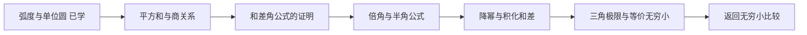

# 三角学桥接复习

## 为什么在这里暂停极限

在学习等价无穷小

\[
1-\cos x\sim\frac{x^2}{2}
\]

时，恒等式

\[
1-\cos x=2\sin^2\frac{x}{2}
\]

暴露出一个真实缺口：目前能够使用部分三角结论，但公式的几何来源、证明链条和适用条件还没有形成体系。这里插入桥接复习；完成后回到无穷小比较，不重开整个预备阶段。

## 固定教学顺序

每个新知识点都按以下顺序学习：

1. 严格定义和符号；
2. 单位圆或三角形上的几何直观；
3. 公式推导或证明，说明每一步依据；
4. 一道完整例题；
5. 一道有提示练习；
6. 一道独立变式；
7. 隔日复测后再判断是否掌握。

不会在定义、图像和例题之前直接提问。

## 课程顺序

### T1 弧度制与单位圆定义（已有基础，仅保留复测）

- 弧度的定义 \(\theta=s/r\)，以及为什么微积分必须使用弧度；
- 单位圆点 \(P=(\cos\theta,\sin\theta)\)；
- \(\tan\theta=\sin\theta/\cos\theta\) 的定义域；
- 用坐标和投影解释正弦、余弦的正负与大小。

### T2 特殊角与基本图像（已有基础，仅保留复测）

- 用 \(30^\circ\!\text{-}60^\circ\!\text{-}90^\circ\) 和 \(45^\circ\!\text{-}45^\circ\!\text{-}90^\circ\) 三角形推导特殊值；
- 象限符号、参考角、周期；
- \(\sin\)、\(\cos\)、\(\tan\) 的图像、值域、奇偶性和渐近线。

### T3 基本恒等式及证明

- 由单位圆方程证明 \(\sin^2x+\cos^2x=1\)；
- 除以 \(\cos^2x\) 推出 \(1+\tan^2x=\sec^2x\)，并检查定义域；
- 除以 \(\sin^2x\) 推出 \(1+\cot^2x=\csc^2x\)。

### T4 和差角公式及证明

- 用平面旋转或点积证明 \(\cos(a-b)\)；
- 从它推导 \(\cos(a+b)\)、\(\sin(a\pm b)\)；
- 用公式计算特殊角，并完成恒等式验证。

### T5 倍角、半角与降幂

- 令 \(a=b=x\) 推导 \(\sin2x\) 和 \(\cos2x\)；
- 由 \(\cos2x=1-2\sin^2x\) 推出
  \(1-\cos x=2\sin^2(x/2)\)；
- 推导半角和降幂公式，明确正负号何时需要由象限决定。

### T5.1 积化和差与和差化积

- 从和差角公式相加、相减推出积化和差；
- 通过变量代换推出和差化积；
- 先掌握推导逻辑和基础化简，三角积分前再做密集训练。

当前记录：四条积化和差与四条和差化积均已讲解来源并配图；部分练习由学习者明确
要求 `pass`，所以统一保持 `Developing`，留待跨日混合复测。当前已进入 T6。

### T6 返回微积分的桥

- 用单位圆面积证明 \(\lim_{x\to0}\sin x/x=1\)；
- 推导 \(\sin x\sim x\)、\(\tan x\sim x\)、
  \(1-\cos x\sim x^2/2\)；
- 练习等价替换的乘除法结构，并辨认加减抵消的风险。

## 当前状态

- [x] T1：弧度和单位圆此前已经学习，不在当前重复讲解。
- [x] T2：特殊角和基础图像已有基础，当前只保留间隔抽查。
- [ ] T3：能独立证明三个基本平方恒等式。
- [ ] T4：能说明和差角公式来自哪里并用于计算。
- [ ] T5：能从二倍角公式推出当前的半角恒等式。
- [ ] T6：当堂桥接练习已覆盖 \(\sin x\sim x\)、\(\tan x\sim x\)、
  \(1-\cos x\sim x^2/2\) 及加减抵消风险；保持 `Developing`，等待跨日复测。
- [ ] 完成一次无提示混合复测后返回无穷小比较。

## 当前起点

从 T3/T4 的证明链开始：先由单位向量点积证明 \(\cos(a-b)\)，再推出其余和差角、倍角、半角、降幂以及积化和差公式。
