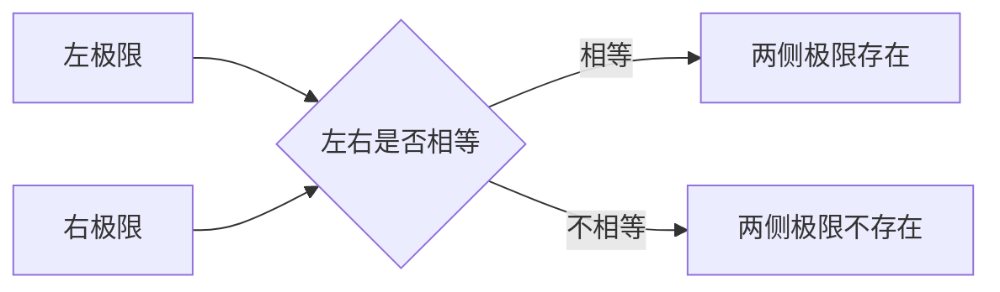

# Week 2 极限与连续

## 本章学习方式

从本章开始，新知识采用“先讲后练”；旧知识的间隔复习仍采用“先独立回忆”。

## 2026-08-11 学习记录

### 1. 极限的直觉

记号

\[
\lim_{x\to a}f(x)=L
\]

表示：当 \(x\) 越来越接近 \(a\) 时，\(f(x)\) 越来越接近 \(L\)。

极限观察的是某一点附近的变化趋势，不要求 \(x=a\)，因此 \(f(a)\) 是否存在不一定影响极限。

### 2. 例题：函数值不存在，但极限存在

求

\[
\lim_{x\to2}\frac{x^2-4}{x-2}
\]

先因式分解：

\[
x^2-4=(x-2)(x+2)
\]

当 \(x\ne2\) 时：

\[
\frac{x^2-4}{x-2}
=\frac{(x-2)(x+2)}{x-2}
=x+2
\]

所以当 \(x\to2\) 时：

\[
x+2\to4
\]

即

\[
\boxed{\lim_{x\to2}\frac{x^2-4}{x-2}=4}
\]

原式在 \(x=2\) 时分母为零，没有函数值；但图像在 \((2,4)\) 处只有一个空点，附近的函数值仍从两侧趋近 \(4\)。

### 3. 函数值与极限值

- \(f(a)\)：只看 \(x=a\) 这一个点的实际取值。
- \(\lim_{x\to a}f(x)\)：看 \(x\) 从附近接近 \(a\) 时的趋势。

例：

\[
g(x)=
\begin{cases}
x+1,&x\ne2,\\
10,&x=2
\end{cases}
\]

在 \(x=2\) 处：

\[
g(2)=10,
\qquad
\lim_{x\to2}g(x)=3
\]

图像上，\((2,3)\) 是直线上的空心点，\((2,10)\) 是表示函数值的实心点。因此函数值与极限值可以不同。

### 4. 带提示练习及结果

已知

\[
h(x)=
\begin{cases}
x^2,&x\ne1,\\
5,&x=1
\end{cases}
\]

本轮独立回答：

\[
h(1)=5,
\qquad
\lim_{x\to1}h(x)=1
\]

判断正确：函数值看 \(x=1\) 处的单独规定，极限值看附近的 \(x^2\)。

### 5. 左极限与右极限

- \(\lim_{x\to a^-}f(x)\)：\(x\) 从 \(a\) 的左侧接近，称为左极限。
- \(\lim_{x\to a^+}f(x)\)：\(x\) 从 \(a\) 的右侧接近，称为右极限。

两侧极限存在的判断关系：

例：

\[
f(x)=
\begin{cases}
0,&x<1,\\
2,&x\ge1
\end{cases}
\]

则

\[
\lim_{x\to1^-}f(x)=0,
\qquad
\lim_{x\to1^+}f(x)=2
\]

由于左右极限不相等，\(\lim_{x\to1}f(x)\) 不存在；实心点为 \((1,2)\)，所以 \(f(1)=2\)。

### 6. 连续的定义

函数 \(f(x)\) 在 \(x=a\) 处连续，需要同时满足：

1. \(f(a)\) 存在。
2. \(\lim_{x\to a}f(x)\) 存在。
3. \(\lim_{x\to a}f(x)=f(a)\)。

缺少任何一项，函数都不在该点连续。

### 7. 今日纠错

对于

\[
h(x)=
\begin{cases}
x^2,&x\ne1,\\
5,&x=1
\end{cases}
\]

曾把“不连续”的原因写成“左右极限不相等”。实际情况是：

\[
\lim_{x\to1^-}h(x)
=\lim_{x\to1^+}h(x)
=1
\]

左右极限相等，因此极限存在；不连续的真正原因是

\[
\lim_{x\to1}h(x)=1\ne h(1)=5
\]

错误类型：连续条件混淆。需要分别检查“函数值、极限是否存在、两者是否相等”，不能只检查左右极限。

### 8. 可去间断与跳跃间断

- 左右极限相等，但函数值缺失或不等于极限值：可去间断。修改一个点即可连续。
- 左右极限不相等：跳跃间断。修改单个函数值无法使两侧接起来。

本轮判断：若左极限为 \(3\)、右极限为 \(5\)，左右极限不相等，因此不能通过修改 \(f(a)\) 使函数连续。

### 9. 直接代入法

对于多项式，以及分母在目标点不为零的分式，可以直接代入目标值。

\[
\lim_{x\to3}(x^2-2x+4)=7
\]

\[
\lim_{x\to1}\frac{x^2+2}{2x+3}=\frac35
\]

### 10. 代入得到 \(\frac{0}{0}\) 时

\(\frac{0}{0}\) 不是极限答案，而是需要先化简的信号。常见方法是因式分解并约去造成分母为零的因子。

例：

\[
\lim_{x\to2}\frac{x^2-x-2}{x-2}
=\lim_{x\to2}\frac{(x-2)(x+1)}{x-2}
=\lim_{x\to2}(x+1)
=3
\]

负数目标点练习：

\[
\lim_{x\to-1}\frac{x^2+3x+2}{x+1}
=\lim_{x\to-1}(x+2)
=1
\]

本轮曾把结果写成 \(3\)，错误原因是把目标点 \(-1\) 看成了 \(1\)。随后独立完成：

\[
\lim_{x\to-2}\frac{x^2+5x+6}{x+2}
=\lim_{x\to-2}(x+3)
=1
\]

### 11. 极限的基本运算法则

若相关极限存在，则加减、常数倍、乘法可以分别计算：

\[
\lim(f+g)=\lim f+\lim g
\]

\[
\lim(cf)=c\lim f
\]

\[
\lim(fg)=(\lim f)(\lim g)
\]

除法还要求分母的极限不为零：

\[
\lim\frac{f}{g}=\frac{\lim f}{\lim g}
\]

本轮练习：

\[
\lim_{x\to-1}(2x^2+3x-4)=-5
\]

\[
\lim_{x\to1}\frac{(x+2)(2x-1)}{x+4}=\frac35
\]

### 12. 幂、根式与共轭有理化

在表达式有定义时：

\[
\lim[f(x)]^n=(\lim f(x))^n
\]

\[
\lim\sqrt{f(x)}=\sqrt{\lim f(x)}
\]

本轮曾把

\[
\lim_{x\to4}\sqrt{2x+1}
\]

写成 \(\sqrt5\)，原因是漏掉系数 \(2\)；修正结果为 \(3\)。

当含根式的分式直接代入得到 \(\frac{0}{0}\) 时，可乘以分子的共轭式。例：

\[
\lim_{x\to0}\frac{\sqrt{x+1}-1}{x}
=\lim_{x\to0}\frac{1}{\sqrt{x+1}+1}
=\frac12
\]

带提示练习：

\[
\lim_{x\to0}\frac{\sqrt{x+4}-2}{x}
=\lim_{x\to0}\frac{1}{\sqrt{x+4}+2}
=\frac14
\]

### 13. 无穷极限与竖直渐近线

以

\[
f(x)=\frac{1}{x-2}
\]

为例。分母越接近 \(0\)，分式的绝对值越大；分母的正负决定结果的方向。

- 当 \(x\to2^-\) 时，\(x-2\) 是负的极小数，所以 \(f(x)\to-\infty\)。
- 当 \(x\to2^+\) 时，\(x-2\) 是正的极小数，所以 \(f(x)\to+\infty\)。

因此 \(x=2\) 是这条曲线的竖直渐近线。这里的 \(+\infty\) 和 \(-\infty\) 描述函数值的变化趋势，不是普通实数。

对于分式函数 \(f(x)=P(x)/Q(x)\)，若 \(Q(a)=0\) 而 \(P(a)\ne0\)，则分母趋向 \(0\) 而分子仍接近非零常数，函数绝对值通常趋向无穷。

\[\Large\displaystyle Q(a)=\boldsymbol{0},\ P(a)\ne\boldsymbol{0}\quad\Longrightarrow\quad\text{竖直渐近线候选 }\boldsymbol{x=a}\]

例如 \(f(x)=(4x-1)/(2x+3)\) 的分母在 \(x=-3/2\) 时为 \(0\)，分子此时为 \(-7\ne0\)：

\[\Large\displaystyle \text{竖直渐近线为 }\boldsymbol{x=-\frac32}\]

但分母为 \(0\) 并不自动保证竖直渐近线。例如：

\[\Large\displaystyle \frac{x-1}{x-1}=1\quad(x\ne1)\]

这里相同因子被约掉，\(x=1\) 处只是空点，不是竖直渐近线。

带提示判断：

\[
\lim_{x\to-3^+}\frac{1}{x+3}=+\infty
\]

曾误答为 \(-\infty\)。纠错时分两步判断：

- 上标“\(+\)”表示从右侧靠近，即 \(x>-3\)。
- 因此 \(x+3\to0^+\)，分式趋向 \(+\infty\)。

左右方向综合练习：

\[\Large\displaystyle \lim_{x\to1^-}\frac{-1}{x-1}=\boldsymbol{+\infty}\]

\[\Large\displaystyle \lim_{x\to1^+}\frac{-1}{x-1}=\boldsymbol{-\infty}\]

左右无穷方向不同，所以 \(\lim_{x\to1}\frac{-1}{x-1}\) 不存在。

\[\Large\displaystyle \lim_{x\to2}\frac{1}{(x-2)^2}=\boldsymbol{+\infty}\]

平方分母从左右两侧都趋向 \(0^+\)，所以双侧无穷方向相同。

### 14. 自变量趋向无穷与水平渐近线

当 \(x\to+\infty\) 时，表示输入 \(x\) 不断增大，而不是靠近某个有限数字。

\[\Large\displaystyle \lim_{x\to+\infty}\frac{1}{x}=\boldsymbol{0}\]

随着 \(x\) 增大，\(1/x\) 越来越接近 \(0\)，所以 \(y=0\) 是水平渐近线。

要区分两种写法：

- \(x\to\infty\)：描述输入走向远处。
- \(f(x)\to\infty\)：描述输出越来越大。

固定常数除以不断增大的 \(x\)，结果趋向 \(0\)：

\[\Large\displaystyle \lim_{x\to+\infty}\frac{5}{x}=\boldsymbol{0}\]

本题曾误答为 \(1\)。可用 \(x=100\) 时 \(5/x=0.05\)、\(x=1000\) 时 \(5/x=0.005\) 检查趋势。

水平渐近线的定义：若函数在远处趋向某个有限数 \(L\)，则 \(y=L\) 是水平渐近线。

\[\Large\displaystyle \lim_{x\to+\infty}f(x)=\boldsymbol{L}\quad\Longrightarrow\quad\text{水平渐近线 }\boldsymbol{y=L}\]

因此“找水平渐近线”就是求 \(x\to+\infty\) 或 \(x\to-\infty\) 的有限极限。

对比：\(x\to a\) 而 \(f(x)\to\pm\infty\) 对应竖直渐近线 \(x=a\)；\(x\to\pm\infty\) 而 \(f(x)\to L\) 对应水平渐近线 \(y=L\)。

\[\Large\displaystyle \lim_{x\to\pm\infty}\frac{3x+1}{x^2+2}=\boldsymbol{0}\quad\Longrightarrow\quad\boldsymbol{y=0}\]

### 15. “抓大头”：最高次项主导

当 \(x\to\infty\) 时，最高次项增长最快，低次项相对变得可以忽略。

\[\Large\displaystyle \lim_{x\to+\infty}\frac{2x-5}{x+4}=\boldsymbol{2}\]

分子分母同时除以 \(x\)，得到 \(\frac{2-5/x}{1+4/x}\)；其中 \(5/x\to0\)、\(4/x\to0\)，所以极限是最高次项系数之比 \(2/1=2\)。

“抓大头”只用于研究 \(x\to\pm\infty\) 的增长趋势，不能在有限的 \(x\) 上直接删掉常数项。

次数比较的三种情况：

- 分子次数低于分母：极限为 \(0\)。
- 分子次数等于分母：极限为最高次项系数之比。
- 分子次数高于分母：绝对值通常趋向无穷，还要根据最高次项和方向判断正负。

\[\Large\displaystyle \lim_{x\to+\infty}\frac{-2x^2+1}{x+4}=\boldsymbol{-\infty}\]

这里抓大头后得到 \(-2x^2/x=-2x\)，所以方向为负无穷。

当 \(x\to-\infty\) 时，必须把负方向代入最高次项重新判断符号：

\[\Large\displaystyle \lim_{x\to-\infty}\frac{3x^2+1}{x-1}\sim3x=\boldsymbol{-\infty}\]

本题曾误答为 \(+\infty\)。用 \(x=-100\) 检查时，分子为正、分母为负，因此结果必须为负。

同次数纠错：

\[\Large\displaystyle \lim_{x\to-\infty}\frac{2x^2-3}{x^2+5x}=\frac{2-3/x^2}{1+5/x}=\boldsymbol{2}\]

本题曾误答为 \(0\)。应先比较分子与分母的次数；次数相同就取最高次项系数之比，而不是判为 \(0\)。

最高次项系数纠错：

\[\Large\displaystyle \lim_{x\to+\infty}\frac{-3x^2+x}{2x^2+1}=\frac{\boldsymbol{-3}}{\boldsymbol{2}}=\boldsymbol{-\frac32}\]

本题曾误答为 \(-3\)，原因是只取了分子的最高次项系数，漏掉了分母的最高次项系数 \(2\)。

### 16. 分式函数渐近线判断顺序

判断分式函数时按以下顺序进行：

1. 先因式分解并约掉公因子；被约掉的位置通常是空点。
2. 再令剩余分母等于 \(0\)；若分子不为 \(0\)，得到竖直渐近线。
3. 最后计算 \(x\to\pm\infty\) 的有限极限，得到水平渐近线。

\[\Large\displaystyle f(x)=\frac{2x+1}{x-3}\]

\[\Large\displaystyle x-3=0\quad\Longrightarrow\quad\text{竖直渐近线 }\boldsymbol{x=3}\]

\[\Large\displaystyle \lim_{x\to\pm\infty}f(x)=\frac21=2\quad\Longrightarrow\quad\text{水平渐近线 }\boldsymbol{y=2}\]

综合练习：

\[\Large\displaystyle f(x)=\frac{x^2-1}{x^2-x}\]

\[\Large\displaystyle f(x)=\frac{(x-1)(x+1)}{x(x-1)}=\frac{x+1}{x}=1+\frac1x\quad(x\ne0,1)\]

- 被约掉的 \(x=1\) 是空点。
- 剩余分母在 \(x=0\) 为零，所以竖直渐近线是 \(x=0\)。
- \(x\to\pm\infty\) 时 \(1+1/x\to1\)，所以水平渐近线是 \(y=1\)。

本题前两项独立判断正确；第三项需继续巩固“无穷远极限值 \(L\) 对应水平渐近线 \(y=L\)”的关系。

### 17. 下班前一句话总结

先看是 \(x\) 固定，还是 \(y\) 固定：

- 竖直渐近线：\(x\) 靠近一个具体数 \(a\) 后不再往远处跑，但 \(y\) 却越来越大或越来越小。图像会贴近竖着的直线 \(x=a\)。

\[\Large\displaystyle x\to a,\ f(x)\to\pm\infty\quad\Longrightarrow\quad\boldsymbol{x=a}\]

例如 \(1/(x-2)\)：\(x\) 靠近 \(2\) 时，\(y\) 爆大，所以竖直渐近线是 \(x=2\)。

- 水平渐近线：让 \(x\) 一直跑向很远的地方；如果 \(y\) 最后稳定在 \(L\) 附近，图像就会贴近横着的直线 \(y=L\)。

\[\Large\displaystyle x\to\pm\infty,\ f(x)\to L\quad\Longrightarrow\quad\boldsymbol{y=L}\]

例如 \((2x+1)/(x-3)\)：\(x\) 跑得很远时，\(y\) 稳定在 \(2\) 附近，所以水平渐近线是 \(y=2\)。

最短记忆：**\(x\) 靠近一个数、\(y\) 爆掉，是竖直；\(x\) 跑远、\(y\) 稳住，是水平。**

#### 直接求法（分式函数）

**求竖直渐近线：**

1. 先因式分解并约分。
2. 令约分后的分母等于 \(0\)。
3. 若此时分子不为 \(0\)，答案就是 \(x=a\)；被约掉的零点是空点。

**求水平渐近线：比较分子、分母的最高次数。**

- 分子次数更低：\(\boldsymbol{y=0}\)。
- 次数相同：\(\boldsymbol{y=}\) 分子最高次项系数 ÷ 分母最高次项系数。
- 分子次数更高：没有水平渐近线。

本轮最后一题 \(g(x)=(x^2+2)/(2x^2-3)\) 判断正确：水平渐近线为 \(\boldsymbol{y=1/2}\)。

## 图形复习

### 空心点与极限

### 可去间断与跳跃间断

### 无穷极限与竖直渐近线

### 自变量趋向无穷与水平渐近线

## 2026-08-12 复习记录

### 空点、竖直渐近线与水平渐近线纠错

题目：

\[\Large\displaystyle g(x)=\frac{x^2-4}{x^2-x-2}\]

先因式分解，再约分：

\[\Large\displaystyle g(x)=\frac{(x-2)(x+2)}{(x-2)(x+1)}=\frac{x+2}{x+1}\quad(x\ne2,-1)\]

- \(x=2\) 对应的因子被约掉，所以是空点；空点坐标为 \((2,4/3)\)。
- 约分后的分母在 \(x=-1\) 时为 \(0\)，所以竖直渐近线是 \(x=-1\)。
- 分子、分母次数相同，最高次项系数之比是 \(1/1\)，所以水平渐近线是 \(y=1\)。

本题错因：没有先完成约分，就开始分别判断三类对象。

复习顺序：**先约分；被约掉的是空点；剩余分母的零点是竖直渐近线；最后看无穷远极限求水平渐近线。**

### 被约掉的零点不能重复使用

\[\Large\displaystyle h(x)=\frac{x^2-9}{x^2-2x-3}\]

先因式分解并约分：

\[\Large\displaystyle h(x)=\frac{(x-3)(x+3)}{(x-3)(x+1)}=\frac{x+3}{x+1}\quad(x\ne3,-1)\]

- \(x=3\) 对应的因子被约掉，所以是空点。
- 剩余分母满足 \(x+1=0\)，所以竖直渐近线是 \(x=-1\)。
- 分子、分母次数相同，所以水平渐近线是 \(y=1\)。

本题第 1、3 项正确；第 2 项把已经判为空点的 \(x=3\) 又重复当成了竖直渐近线。

### 无定义点不一定是空点

空点确实是函数无定义的点，但无定义的点还可能对应竖直渐近线。必须通过约分来区分：

\[\Large\displaystyle p(x)=\frac{(x-4)(x+1)}{(x-4)(x-2)}=\frac{x+1}{x-2}\quad(x\ne4,2)\]

- \(x=4\) 的因子被约掉，所以 \(x=4\) 是空点。
- \(x=2\) 的因子仍留在分母，所以 \(x=2\) 是竖直渐近线。

最短判断：**能约掉的无定义点是空点；约不掉并使函数爆大的是竖直渐近线。**

### 斜渐近线：曲线与斜线的距离趋向零

若 \(x\) 跑向无穷远时，函数 \(f(x)\) 与直线 \(y=mx+b\) 的差趋向 \(0\)，则这条直线是斜渐近线：

\[\Large\displaystyle \lim_{x\to\pm\infty}\bigl[f(x)-(mx+b)\bigr]=\boldsymbol{0}\quad\Longrightarrow\quad\boldsymbol{y=mx+b}\]

例：

\[\Large\displaystyle f(x)=\frac{x^2+1}{x}=x+\frac1x\]

随着 \(x\to\pm\infty\)，\(1/x\to0\)，所以曲线与直线 \(y=x\) 的距离趋向 \(0\)：

\[\Large\displaystyle \text{斜渐近线为 }\boldsymbol{y=x}\]

练习订正：

\[\Large\displaystyle f(x)=\frac{x^2+2x+3}{x+1}=\boldsymbol{x+1}+\frac{2}{x+1}\]

当 \(x\to\pm\infty\) 时，只有 \(2/(x+1)\to0\)；必须保留完整的一次式 \(x+1\)：

\[\Large\displaystyle \text{斜渐近线为 }\boldsymbol{y=x+1}\]

错因：误把一次式中的 \(x\) 一起丢掉，只保留了常数 \(1\)。口诀：**只丢趋近于零的小尾巴，商式完整保留。**

第二道练习：

\[\Large\displaystyle f(x)=\boldsymbol{2x-3}+\frac{5}{x+4}\]

因为 \(5/(x+4)\to0\)，判断出的斜线完全正确。渐近线应规范写成：

\[\Large\displaystyle \boldsymbol{y=2x-3}\]

记号区别：\(f(x)\) 表示原函数，\(y=2x-3\) 表示它逐渐贴近的直线。

#### 如何做多项式除法

例：

\[\Large\displaystyle f(x)=\frac{x^2+3x+5}{x+1}\]

1. 先算首项：\(x^2\div x=x\)。
2. 减去 \(x(x+1)=x^2+x\)，剩下 \(2x+5\)。
3. 再算首项：\(2x\div x=2\)。
4. 减去 \(2(x+1)=2x+2\)，余数为 \(3\)。

因此：

\[\Large\displaystyle f(x)=\boldsymbol{x+2}+\frac{3}{x+1}\quad\Longrightarrow\quad\text{斜渐近线为 }\boldsymbol{y=x+2}\]

##### 卡点：不会把分式拆成“一次式＋小尾巴”

这不是斜渐近线概念的问题，而是多项式除法还不熟。先用当前题的简便方法理解：**拆项就是把分子凑成分母的倍数加余数。**

\[\Large\displaystyle f(x)=\frac{x^2+4x+7}{x+2}\]

因为：

\[\Large\displaystyle \boldsymbol{x^2+4x+7}=(x+2)^2+3\]

所以：

\[\Large\displaystyle
\begin{aligned}
f(x)
&=\frac{(x+2)^2+3}{x+2}\\[4pt]
&=\boldsymbol{x+2}+\frac{3}{x+2}
\end{aligned}
\]

其中 \(3\) 就是除不尽后剩下的余数。随着 \(x\to\pm\infty\)，小尾巴 \(3/(x+2)\to0\)，所以：

\[\Large\displaystyle \text{斜渐近线为 }\boldsymbol{y=x+2}\]

当前口诀：**先让分子出现分母，再把多出来的部分写成余数。**

最小拆项练习已独立答对：

\[\Large\displaystyle \boldsymbol{x^2+6x+11}=(x+3)^2+\boldsymbol{2}\]

把它放回分式：

\[\Large\displaystyle \frac{x^2+6x+11}{x+3}=\boldsymbol{x+3}+\frac{2}{x+3}\]

因此小尾巴趋近于 \(0\) 后，斜渐近线为 \(\boldsymbol{y=x+3}\)。

负号拆项练习：

\[\Large\displaystyle \boldsymbol{x^2-4x+7}=(x-2)^2+\boldsymbol{3}\]

余数 \(3\) 判断正确。放回分式后：

\[\Large\displaystyle
\frac{x^2-4x+7}{x-2}
=\boldsymbol{x-2}+\frac{3}{x-2}
\]

- \(x-2\) 是商式，必须完整保留。
- \(3\) 是余数，进入小尾巴 \(3/(x-2)\)。
- 当 \(x\to\pm\infty\) 时，小尾巴趋近于 \(0\)。

所以斜渐近线是：

\[\Large\displaystyle \boldsymbol{y=x-2}\]

错因：把余数 \(3\) 当成了渐近线。判断规则：**渐近线取商式，不取余数。**

即时辨认练习：

\[\Large\displaystyle f(x)=\boldsymbol{3x+4}-\frac{7}{x-1}\]

当 \(x\to\pm\infty\) 时：

\[\Large\displaystyle -\frac{7}{x-1}\to0\]

所以必须保留当前题中的一次式：

\[\Large\displaystyle \text{斜渐近线为 }\boldsymbol{y=3x+4}\]

错因：直接沿用了上一题的 \(y=x-2\)，没有重新读取当前表达式。修正步骤：**先圈出当前题中趋近于零的小尾巴，再抄下剩余的一次式。**

拆步练习：

\[\Large\displaystyle f(x)=\boldsymbol{-2x+5}+\frac{1}{x+6}\]

第一步已独立答对：小尾巴是

\[\Large\displaystyle \boldsymbol{\frac{1}{x+6}}\to0\]

下一步只需删去小尾巴，完整抄下剩余的一次式。

第二步也已独立答对：

\[\Large\displaystyle \text{斜渐近线为 }\boldsymbol{y=-2x+5}\]

结论：在拆步提示下已经能正确完成“找小尾巴 → 保留一次式”，还需要一道无拆步提示的变式来确认是否稳定。

无拆步提示的变式已独立答对：

\[\Large\displaystyle f(x)=\boldsymbol{4x-1}-\frac{6}{x+2}\]

\[\Large\displaystyle \text{斜渐近线为 }\boldsymbol{y=4x-1}\]

结论：已经能独立识别“拆好后的商式＋小尾巴”；原始分式的多项式除法仍需练习。

#### 通用拆法：多项式除法

当分子不能方便地凑成平方时，重复做“首项相除 → 乘回去 → 相减”。

\[\Large\displaystyle f(x)=\frac{2x^2+x+4}{x+1}\]

1. 首项相除：\(2x^2\div x=2x\)。
2. 乘回并相减：\((2x^2+x+4)-(2x^2+2x)=-x+4\)。
3. 再除一次：\((-x)\div x=-1\)。
4. 乘回并相减：\((-x+4)-(-x-1)=5\)，所以余数是 \(5\)。

因此：

\[\Large\displaystyle f(x)=\boldsymbol{2x-1}+\frac{5}{x+1}\]

\[\Large\displaystyle \text{斜渐近线为 }\boldsymbol{y=2x-1}\]

多项式除法练习：

\[\Large\displaystyle f(x)=\frac{x^2+x+5}{x-1}\]

已独立完成每一步：

1. 首项相除：\(x^2\div x=x\)。
2. 乘回并相减：\((x^2+x+5)-(x^2-x)=2x+5\)。
3. 再除一次：\(2x\div x=2\)。
4. 乘回并相减：\((2x+5)-(2x-2)=7\)，余数为 \(7\)。

因此：

\[\Large\displaystyle f(x)=\boldsymbol{x+2}+\frac{7}{x-1}\]

\[\Large\displaystyle \text{斜渐近线为 }\boldsymbol{y=x+2}\]

##### 与 Euclidean algorithm 的关系

多项式除法遵循：

\[\Large\displaystyle \boldsymbol{A(x)=B(x)Q(x)+R(x)},\qquad \deg R<\deg B\]

本题只是完成了一次除法，得到商式 \(Q(x)\) 和余数 \(R(x)\)。

Euclidean algorithm（欧几里得算法）会不断重复这种除法，用上一轮的除数和余数继续相除，直到余数为 \(0\)，目的是求最大公因式。

所以：**当前使用的是多项式欧几里得除法，也是欧几里得算法反复使用的基本步骤；但不是完整的欧几里得算法。**

##### 照片练习：计算已经完成，卡在结果的重新组合

\[\Large\displaystyle f(x)=\frac{2x^2-3x+4}{x-2}\]

照片中的计算全部正确：

1. \(2x^2\div x=2x\)，得到商的第一项 \(2x\)。
2. 相减后得到 \(x+4\)。
3. \(x\div x=1\)，得到商的第二项 \(1\)。
4. 最后相减得到余数 \(6\)。

把两轮得到的商合并：

\[\Large\displaystyle \boldsymbol{Q(x)=2x+1},\qquad\boldsymbol{R(x)=6}\]

先写成除法恒等式：

\[\Large\displaystyle \boldsymbol{2x^2-3x+4=(x-2)(2x+1)+6}\]

再除以 \(x-2\)：

\[\Large\displaystyle f(x)=\boldsymbol{2x+1}+\frac{6}{x-2}\]

因此斜渐近线为：

\[\Large\displaystyle \boldsymbol{y=2x+1}\]

卡点判断：不是不会做多项式除法，而是不熟悉最后的格式。记住：**原分式＝商＋余数／原分母。**

##### 负号订正：减去负式子时括号内全部变号

练习：

\[\Large\displaystyle f(x)=\frac{x^2-2x+5}{x+1}\]

前两轮正确得到商式 \(x-3\)，最后需要计算：

\[\Large\displaystyle (-3x+5)-(-3x-3)\]

括号前是减号，因此括号内两项都要变号：

\[\Large\displaystyle
\begin{aligned}
(-3x+5)-(-3x-3)
&=-3x+5+3x+3\\[4pt]
&=\boldsymbol{8}
\end{aligned}
\]

错答 \(-6x+8\) 的原因：没有正确处理 \(-(-3x)=+3x\)。口诀：**减去一个括号，括号内每一项都变号。**

所以完整拆式为：

\[\Large\displaystyle f(x)=\boldsymbol{x-3}+\frac{8}{x+1}\]

订正后已正确判断：

\[\Large\displaystyle \text{斜渐近线为 }\boldsymbol{y=x-3}\]

##### 无拆步提示的多项式除法通过

\[\Large\displaystyle f(x)=\frac{2x^2+5x+1}{x+2}\]

独立计算过程正确：

1. \(2x^2\div x=2x\)。
2. 相减得到 \(x+1\)。
3. \(x\div x=1\)。
4. 最后相减得到余数 \(-1\)。

因此商和余数分别是：

\[\Large\displaystyle \boldsymbol{Q(x)=2x+1},\qquad\boldsymbol{R(x)=-1}\]

完整拆式：

\[\Large\displaystyle f(x)=\boldsymbol{2x+1}-\frac{1}{x+2}\]

小尾巴趋近于 \(0\)，所以：

\[\Large\displaystyle \text{斜渐近线为 }\boldsymbol{y=2x+1}\]

结论：已经能在无拆步提示下完成一次二次式除以一次式，并正确处理负余数；仍需间隔复测确认是否稳定。

##### 无穷小的准确表述

回答“\(-1\) 被无穷小了”意思接近，但对象不准确：常数 \(-1\) 始终是 \(-1\)，不会变小。趋近于 \(0\) 的是整个分式：

\[\Large\displaystyle \boldsymbol{-\frac{1}{x+2}\to0}\qquad(x\to\pm\infty)\]

原因是分子固定为 \(-1\)，而分母的绝对值越来越大，所以整个分式越来越接近 \(0\)。

准确说法：**余数仍为 \(-1\)，但“余数除以原分母”形成的小尾巴是无穷小。**

符号辨认练习：

\[\Large\displaystyle 5-\frac{3}{x-4}\]

回答 \(3/(x-4)\) 已经找对了分式部分，但漏掉了原式中属于这一项的负号。完整的小尾巴是：

\[\Large\displaystyle \boldsymbol{-\frac{3}{x-4}}\to0\]

注意：\(3/(x-4)\) 和 \(-3/(x-4)\) 的极限都为 \(0\)，但抄写“原式中的完整一项”时必须保留正负号。

再次辨认：

\[\Large\displaystyle -2x+7+\frac4{x+1}\]

已经正确指出完整小尾巴为：

\[\Large\displaystyle \boldsymbol{+\frac4{x+1}}\to0\]

删去小尾巴后，已正确判断：

\[\Large\displaystyle \text{斜渐近线为 }\boldsymbol{y=-2x+7}\]

结论：已经能独立完成“辨认带符号的小尾巴 → 完整保留一次式”两步。

##### 斜渐近线综合复测通过

\[\Large\displaystyle f(x)=\frac{3x^2-x+5}{x+1}\]

无拆步提示下独立完成：

1. 首项相除得到 \(3x\)，相减后得到 \(-4x+5\)。
2. 第二次相除得到 \(-4\)，最后余数为 \(9\)。
3. 商、余数和完整拆式均正确：

\[\Large\displaystyle \boldsymbol{Q(x)=3x-4},\qquad\boldsymbol{R(x)=9}\]

\[\Large\displaystyle f(x)=\boldsymbol{3x-4}+\frac9{x+1}\]

因此：

\[\Large\displaystyle \text{斜渐近线为 }\boldsymbol{y=3x-4}\]

反向验算：

\[\Large\displaystyle (x+1)(3x-4)+9=3x^2-x+5\]

结论：本次已经能无提示完成“多项式除法 → 商余式 → 小尾巴趋零 → 斜渐近线”，但需要间隔复测后再判断是否长期掌握。

分式函数的直接求法：当分子次数恰好比分母次数高 \(1\) 时，做多项式除法；所得商式通常就是斜渐近线，余式除以分母的部分会趋向 \(0\)。

### 三种渐近线的统一理解

三种渐近线不是三个互不相干的公式。它们都在回答同一个问题：**当 \(x\) 按指定方向移动时，函数图像越来越贴近哪一条直线？**

#### 第一步：先看 \(x\) 往哪里走

**竖直渐近线：\(x\) 靠近一个具体数 \(a\)。**

\[\Large\displaystyle x\to a,\quad |f(x)|\to\infty
\quad\Longrightarrow\quad
\text{竖直渐近线 }\boldsymbol{x=a}\]

记忆：**输入卡在某个数附近，输出爆掉。**

**水平渐近线：\(x\) 跑向正无穷或负无穷。**

\[\Large\displaystyle x\to\pm\infty,\quad f(x)\to L
\quad\Longrightarrow\quad
\text{水平渐近线 }\boldsymbol{y=L}\]

记忆：**输入跑得很远，输出稳定在一个数附近。**

**斜渐近线：\(x\) 也跑向正无穷或负无穷，但图像贴近一条斜线。**

\[\Large\displaystyle x\to\pm\infty,\quad f(x)-(mx+b)\to0
\quad\Longrightarrow\quad
\text{斜渐近线 }\boldsymbol{y=mx+b}\]

记忆：**输入跑得很远，曲线与斜线的差变成 \(0\)。**

#### 分式函数的直接求法

- 竖直：**先约分**；令约分后仍留在分母中的因式等于 \(0\)，并确认分子不为 \(0\)。
- 水平：比较分子与分母的最高次数。
  - 分子次数较低：\(\boldsymbol{y=0}\)。
  - 次数相同：\(\boldsymbol{y=\text{最高次项系数之比}}\)。
  - 分子次数较高：没有水平渐近线。
- 斜线：分子次数恰好比分母高 \(1\) 时做多项式除法，**商式就是斜渐近线**。

统一检查顺序：**先约分排除空点 → 看有限位置是否爆掉 → 再看无穷远处贴近横线还是斜线。**

#### 竖直渐近线的分母为什么看 \(0\)

以

\[\Large\displaystyle \boldsymbol{f(x)=\frac{1}{x-3}}\]

为例。当 \(x\to3\) 时：

\[\Large\displaystyle \boldsymbol{x-3\to0}\]

这一步已经独立回答正确。它表示分母会变成一个**绝对值越来越小、但不等于 \(0\)** 的数。

从左边接近 \(3\)：

\[\Large\displaystyle \boldsymbol{f(2.9)=\frac{1}{-0.1}=-10},\qquad
\boldsymbol{f(2.99)=\frac{1}{-0.01}=-100}\]

所以：

\[\Large\displaystyle \boldsymbol{x\to3^-\quad\Longrightarrow\quad f(x)\to-\infty}\]

从右边接近 \(3\)：

\[\Large\displaystyle \boldsymbol{f(3.01)=\frac{1}{0.01}=100}\]

因此右侧会趋向正无穷：

\[\Large\displaystyle \boldsymbol{x\to3^+\quad\Longrightarrow\quad f(x)\to+\infty}\]

结论：分母从两侧趋近 \(0\) 时，函数值的绝对值不断变大，图像会贴近竖线：

\[\Large\displaystyle \boxed{\boldsymbol{x=3}}\]

这就是“令约分后仍留在分母中的因式等于 \(0\)”能够找到竖直渐近线的原因。注意：**分母等于 \(0\) 只是候选位置；还要先约分，并确认函数确实爆大。**

即时迁移练习：

\[\Large\displaystyle \boldsymbol{g(x)=\frac{1}{x+2}}\]

能够独立判断竖直渐近线为 \(\boldsymbol{x=-2}\)。

反例：

\[\Large\displaystyle \boldsymbol{h(x)=\frac{x+2}{x+2}=1\quad(x\ne-2)}\]

能够判断 \(x=-2\) 处是空点，图像其余部分为 \(y=1\)，不是竖直渐近线。

综合迁移：

\[\Large\displaystyle \boldsymbol{p(x)=\frac{x+2}{(x+2)(x-4)}=\frac{1}{x-4}\quad(x\ne-2,4)}\]

- 空点：\(\boldsymbol{x=-2}\)。
- 竖直渐近线：\(\boldsymbol{x=4}\)。
- 作答时曾把 \(-2\) 输入成 \(-1\)，本人说明原计算正确，属于键盘转录错误，不记为概念或计算错误。

#### 水平渐近线为什么看无穷远

以

\[\Large\displaystyle \boldsymbol{f(x)=\frac{2x+1}{x-3}=2+\frac{7}{x-3}}\]

为例。当 \(x\to+\infty\) 时，已经独立判断：

\[\Large\displaystyle \boldsymbol{\frac{7}{x-3}\to0}\]

因此原函数中只有“小尾巴”消失，稳定的主体 \(2\) 留下来：

\[\Large\displaystyle \boldsymbol{f(x)=2+\frac{7}{x-3}\to2}\]

所以图像在无穷远处越来越贴近水平直线：

\[\Large\displaystyle \boxed{\boldsymbol{y=2}}\]

记忆：**求水平渐近线，是看 \(x\) 跑得很远以后，整个函数最终稳定在哪个 \(y\) 值附近。**

即时迁移：

\[\Large\displaystyle \boldsymbol{g(x)=3+\frac{5}{x+1}}\]

无论 \(x\to+\infty\) 还是 \(x\to-\infty\)，都有：

\[\Large\displaystyle \boldsymbol{\frac{5}{x+1}\to0},\qquad \boldsymbol{g(x)\to3}\]

所以两个方向的水平渐近线都是 \(\boldsymbol{y=3}\)。小尾巴从正侧还是负侧趋近 \(0\)，不会改变最后稳定在 \(3\) 的结论。

同次数时“最高次项系数之比”的来源也可以直接看出来。把分子、分母同时除以最高次幂 \(x\)：

\[\Large\displaystyle
\boldsymbol{\frac{2x+1}{x-3}
=\frac{2+\frac1x}{1-\frac3x}
\to\frac21=2}}
\]

因为 \(1/x\) 和 \(3/x\) 都会消失，最后留下的正是分子、分母最高次项的系数之比。

水平渐近线的三种次数关系已经逐步验证：

- 同次数：\(\frac{4x-5}{2x+7}\to\frac42=2\)，所以 \(\boldsymbol{y=2}\)。
- 分母次数更高：\(\frac{3x+1}{x^2+4}\to0\)，所以 \(\boldsymbol{y=0}\)。
- 分子次数更高：通常没有水平渐近线；若恰好高一次，应检查斜渐近线。

斜渐近线即时提取复习：

\[\Large\displaystyle \boldsymbol{\frac{x^2+1}{x+3}}\]

起初忘记了分子次数高一次时应做多项式除法。经过逐步提示后，能够正确完成：

\[\Large\displaystyle
\boldsymbol{x^2\div x=x},\qquad
\boldsymbol{(x^2+1)-(x^2+3x)=-3x+1}
\]

\[\Large\displaystyle
\boldsymbol{-3x\div x=-3},\qquad
\boldsymbol{(-3x+1)-(-3x-9)=10}
\]

因此：

\[\Large\displaystyle \boldsymbol{\frac{x^2+1}{x+3}=x-3+\frac{10}{x+3}}\]

小尾巴趋近 \(0\)，斜渐近线为 \(\boldsymbol{y=x-3}\)。本知识点能在提示下恢复，但仍需安排无提示间隔复习。

### 闭卷综合复测通过

\[\Large\displaystyle g(x)=\frac{x^2+x-6}{x^2-4}=\frac{(x+3)(x-2)}{(x-2)(x+2)}=\frac{x+3}{x+2}\quad(x\ne2,-2)\]

独立判断结果全部正确：

- 空点：\(x=2\)。
- 竖直渐近线：\(x=-2\)。
- 水平渐近线：\(y=1\)。

结论：已经能在无提示条件下按“因式分解 → 约分 → 分类”的顺序完成基础综合题。

## 2026-08-13 学习记录

### 同时求竖直渐近线与斜渐近线的顺序

题目：

\[\Large\displaystyle \boldsymbol{f(x)=\frac{2x^2+1}{x-1}}\]

观察正确：这道题需要做多项式除法，但多项式除法只用于求**斜渐近线**。完整顺序是：

1. 先看约分后的分母，求竖直渐近线。
2. 再比较次数；分子次数恰好比分母高 \(1\)，做多项式除法求斜渐近线。

\[\Large\displaystyle \boldsymbol{\text{竖直：看分母}\qquad\text{斜线：做除法}}\]

### 多项式竖式除法独立完成

前一晚通过视频自学多项式竖式除法后，独立完成本题：

计算过程正确：

\[\Large\displaystyle
\boldsymbol{\frac{2x^2+1}{x-1}=2x+2+\frac{3}{x-1}}
\]

其中商为 \(\boldsymbol{2x+2}\)，余数为 \(\boldsymbol{3}\)。反向验算：

\[\Large\displaystyle
\boldsymbol{(x-1)(2x+2)+3=2x^2+1}
\]

因此本题的斜渐近线为：

\[\Large\displaystyle \boxed{\boldsymbol{y=2x+2}}\]

掌握证据：能够在没有逐步提示的情况下正确使用竖式除法。后续仍需间隔复测，确认能长期提取。

### 竖式除法符号复测

复测题：

\[\Large\displaystyle \boldsymbol{f(x)=\frac{3x^2+2x-1}{x+2}}\]

- 竖直渐近线 \(\boldsymbol{x=-2}\) 判断正确。
- 商的第一项 \(\boldsymbol{3x}\) 以及乘回得到 \(\boldsymbol{3x^2+6x}\) 均正确。
- 第一次相减时把 \(\boldsymbol{2x-6x}\) 写成了正数，导致后续商与余数一起出错。

正确的第一次相减是：

\[\Large\displaystyle
\boldsymbol{(3x^2+2x-1)-(3x^2+6x)}
\]

\[\Large\displaystyle
\boldsymbol{=3x^2+2x-1-3x^2-6x=-4x-1}
\]

错因类型：**符号运算不熟练**。修正动作：每次竖式相减都先把整行写进括号，再把减号分配给下一行的每一项。

继续订正时，\(-4x\div x\) 曾再次写成 \(4\)，说明负号仍容易在“系数相除”这一步丢失。修正后正确完成：

\[\Large\displaystyle
\boldsymbol{-4x\div x=-4},\qquad
\boldsymbol{-4(x+2)=-4x-8}
\]

最后的余数独立计算正确：

\[\Large\displaystyle
\boldsymbol{(-4x-1)-(-4x-8)=7}
\]

所以完整结果是：

\[\Large\displaystyle
\boldsymbol{\frac{3x^2+2x-1}{x+2}=3x-4+\frac7{x+2}}
\]

- 商：\(\boldsymbol{3x-4}\)。
- 余数：\(\boldsymbol{7}\)。
- 竖直渐近线：\(\boldsymbol{x=-2}\)。
- 斜渐近线：\(\boldsymbol{y=3x-4}\)。

本轮已经能完成方法订正，但单次订正不能证明长期掌握。当前真正的薄弱点是负号转录与运算稳定性；后续复测需要刻意保留负系数。

## 当前掌握状态

- [x] 能区分函数值与极限值。
- [x] 能从图像判断空心点和实心点的含义。
- [x] 知道左右极限相等是两侧极限存在的必要条件。
- [ ] 能稳定区分“左右极限不相等”和“极限值不等于函数值”两类间断。
- [ ] 能从数值、图像和代数三个角度解释同一个极限。
- [ ] 能独立完成常见代数型极限计算。
- [x] 能使用直接代入和基本运算法则计算基础极限。
- [ ] 能在无提示时稳定完成因式分解与共轭有理化。
- [x] 能在当前练习中区分空点、竖直渐近线与水平渐近线。
- [ ] 能在间隔复习后仍独立算出竖直渐近线与水平渐近线。
- [x] 能在当前练习中用多项式除法求斜渐近线。
- [ ] 能在间隔复习后仍独立求出斜渐近线。

## 下次学习起点

- [ ] 用含负系数的新题做一次无提示多项式除法，重点检查“相减整行变号”和“负系数相除”。
- [ ] 完成一道空点、竖直渐近线、水平或斜渐近线混合分类题，不沿用上一题结论。
- [ ] 闭卷复述三类渐近线的对象、求法与成立条件。
- [ ] 无提示复习一道因式分解或共轭有理化极限题。
- [ ] 完成连续与间断的迁移题，再进入介值定理。
- [ ] 通过三角函数最小前置复测后，学习基本三角极限与夹逼定理。
- [ ] 用直觉和语言说明 ε-δ 定义解决的问题，不在本阶段追求复杂证明。
- [ ] 2026-08-19：间隔复测空点、三类渐近线与负号运算稳定性。

## 教材配合

- 主教材：斯图尔特微积分（第 9 版），按极限与连续相关章节推进。
- 辅助教材：普林斯顿微积分读本，用于补充直觉和处理卡点。
- 暂不绑定具体页码；待确认中文版目录或 ISBN 后再精确对应。
