# Week 2 极限与连续

## 本章学习方式

从本章开始，新知识采用“先讲后练”；旧知识的间隔复习仍采用“先独立回忆”。

```mermaid
flowchart LR
    A[定义与直觉] --> B[图形观察]
    B --> C[完整例题]
    C --> D[带提示练习]
    D --> E[独立变式]
    E --> F[纠错与间隔复习]
```

## 2026-08-11 学习记录

### 1. 极限的直觉

记号

\[
\lim_{x\to a}f(x)=L
\]

表示：当 \(x\) 越来越接近 \(a\) 时，\(f(x)\) 越来越接近 \(L\)。

极限观察的是某一点附近的变化趋势，不要求 \(x=a\)，因此 \(f(a)\) 是否存在不一定影响极限。

### 2. 例题：函数值不存在，但极限存在

求

\[
\lim_{x\to2}\frac{x^2-4}{x-2}
\]

先因式分解：

\[
x^2-4=(x-2)(x+2)
\]

当 \(x\ne2\) 时：

\[
\frac{x^2-4}{x-2}
=\frac{(x-2)(x+2)}{x-2}
=x+2
\]

所以当 \(x\to2\) 时：

\[
x+2\to4
\]

即

\[
\boxed{\lim_{x\to2}\frac{x^2-4}{x-2}=4}
\]

原式在 \(x=2\) 时分母为零，没有函数值；但图像在 \((2,4)\) 处只有一个空点，附近的函数值仍从两侧趋近 \(4\)。

### 3. 函数值与极限值

- \(f(a)\)：只看 \(x=a\) 这一个点的实际取值。
- \(\lim_{x\to a}f(x)\)：看 \(x\) 从附近接近 \(a\) 时的趋势。

例：

\[
g(x)=
\begin{cases}
x+1,&x\ne2,\\
10,&x=2
\end{cases}
\]

在 \(x=2\) 处：

\[
g(2)=10,
\qquad
\lim_{x\to2}g(x)=3
\]

图像上，\((2,3)\) 是直线上的空心点，\((2,10)\) 是表示函数值的实心点。因此函数值与极限值可以不同。

### 4. 带提示练习及结果

已知

\[
h(x)=
\begin{cases}
x^2,&x\ne1,\\
5,&x=1
\end{cases}
\]

本轮独立回答：

\[
h(1)=5,
\qquad
\lim_{x\to1}h(x)=1
\]

判断正确：函数值看 \(x=1\) 处的单独规定，极限值看附近的 \(x^2\)。

### 5. 左极限与右极限

- \(\lim_{x\to a^-}f(x)\)：\(x\) 从 \(a\) 的左侧接近，称为左极限。
- \(\lim_{x\to a^+}f(x)\)：\(x\) 从 \(a\) 的右侧接近，称为右极限。

两侧极限存在的判断关系：

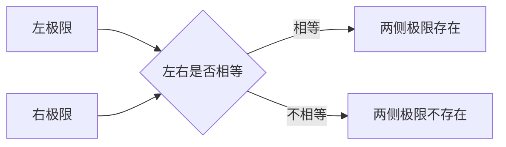
```mermaid
flowchart LR
    A[左极限] --> C{左右是否相等}
    B[右极限] --> C
    C -->|相等| D[两侧极限存在]
    C -->|不相等| E[两侧极限不存在]
```

例：

\[
f(x)=
\begin{cases}
0,&x<1,\\
2,&x\ge1
\end{cases}
\]

则

\[
\lim_{x\to1^-}f(x)=0,
\qquad
\lim_{x\to1^+}f(x)=2
\]

由于左右极限不相等，\(\lim_{x\to1}f(x)\) 不存在；实心点为 \((1,2)\)，所以 \(f(1)=2\)。

### 6. 连续的定义

函数 \(f(x)\) 在 \(x=a\) 处连续，需要同时满足：

1. \(f(a)\) 存在。
2. \(\lim_{x\to a}f(x)\) 存在。
3. \(\lim_{x\to a}f(x)=f(a)\)。

缺少任何一项，函数都不在该点连续。

### 7. 今日纠错

对于

\[
h(x)=
\begin{cases}
x^2,&x\ne1,\\
5,&x=1
\end{cases}
\]

曾把“不连续”的原因写成“左右极限不相等”。实际情况是：

\[
\lim_{x\to1^-}h(x)
=\lim_{x\to1^+}h(x)
=1
\]

左右极限相等，因此极限存在；不连续的真正原因是

\[
\lim_{x\to1}h(x)=1\ne h(1)=5
\]

错误类型：连续条件混淆。需要分别检查“函数值、极限是否存在、两者是否相等”，不能只检查左右极限。

### 8. 可去间断与跳跃间断

- 左右极限相等，但函数值缺失或不等于极限值：可去间断。修改一个点即可连续。
- 左右极限不相等：跳跃间断。修改单个函数值无法使两侧接起来。

本轮判断：若左极限为 \(3\)、右极限为 \(5\)，左右极限不相等，因此不能通过修改 \(f(a)\) 使函数连续。

### 8.1 介值定理：连续曲线不会跳过中间高度

若函数 \(f\) 在闭区间 \([a,b]\) 上连续，并且 \(N\) 位于 \(f(a)\) 与 \(f(b)\) 之间，则至少存在一个 \(c\in[a,b]\)，使得：

\[
\boxed{f(c)=N}
\]

几何上，从 \((a,f(a))\) 连续走到 \((b,f(b))\) 时，图像必须经过端点函数值之间的每一个高度。定理只保证“至少存在”，不保证解唯一，也不直接给出解的位置。

例：\(g(x)=x^2-3\) 在 \([1,2]\) 上连续，并且：

\[
g(1)=-2<0<1=g(2)
\]

因此至少存在一个 \(c\in(1,2)\)，使得 \(g(c)=0\)。

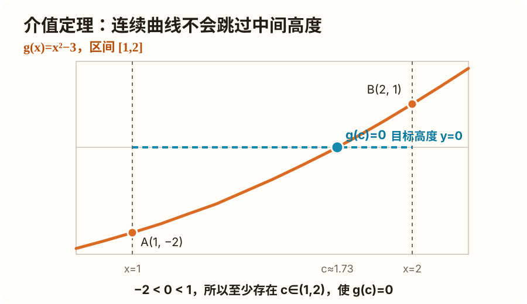

符号角色：\(1<c<2\) 描述输入 \(c\) 的位置；\(g(c)=0\) 描述函数输出达到的目标高度，不能把横坐标区间与函数值混在一起。

### 9. 直接代入法

对于多项式，以及分母在目标点不为零的分式，可以直接代入目标值。

\[
\lim_{x\to3}(x^2-2x+4)=7
\]

\[
\lim_{x\to1}\frac{x^2+2}{2x+3}=\frac35
\]

### 10. 代入得到 \(\frac{0}{0}\) 时

\(\frac{0}{0}\) 不是极限答案，而是需要先化简的信号。常见方法是因式分解并约去造成分母为零的因子。

例：

\[
\lim_{x\to2}\frac{x^2-x-2}{x-2}
=\lim_{x\to2}\frac{(x-2)(x+1)}{x-2}
=\lim_{x\to2}(x+1)
=3
\]

负数目标点练习：

\[
\lim_{x\to-1}\frac{x^2+3x+2}{x+1}
=\lim_{x\to-1}(x+2)
=1
\]

本轮曾把结果写成 \(3\)，错误原因是把目标点 \(-1\) 看成了 \(1\)。随后独立完成：

\[
\lim_{x\to-2}\frac{x^2+5x+6}{x+2}
=\lim_{x\to-2}(x+3)
=1
\]

### 11. 极限的基本运算法则

若相关极限存在，则加减、常数倍、乘法可以分别计算：

\[
\lim(f+g)=\lim f+\lim g
\]

\[
\lim(cf)=c\lim f
\]

\[
\lim(fg)=(\lim f)(\lim g)
\]

除法还要求分母的极限不为零：

\[
\lim\frac{f}{g}=\frac{\lim f}{\lim g}
\]

本轮练习：

\[
\lim_{x\to-1}(2x^2+3x-4)=-5
\]

\[
\lim_{x\to1}\frac{(x+2)(2x-1)}{x+4}=\frac35
\]

### 12. 幂、根式与共轭有理化

在表达式有定义时：

\[
\lim[f(x)]^n=(\lim f(x))^n
\]

\[
\lim\sqrt{f(x)}=\sqrt{\lim f(x)}
\]

本轮曾把

\[
\lim_{x\to4}\sqrt{2x+1}
\]

写成 \(\sqrt5\)，原因是漏掉系数 \(2\)；修正结果为 \(3\)。

当含根式的分式直接代入得到 \(\frac{0}{0}\) 时，可乘以分子的共轭式。例：

\[
\lim_{x\to0}\frac{\sqrt{x+1}-1}{x}
=\lim_{x\to0}\frac{1}{\sqrt{x+1}+1}
=\frac12
\]

带提示练习：

\[
\lim_{x\to0}\frac{\sqrt{x+4}-2}{x}
=\lim_{x\to0}\frac{1}{\sqrt{x+4}+2}
=\frac14
\]

### 13. 无穷极限与竖直渐近线

以

\[
f(x)=\frac{1}{x-2}
\]

为例。分母越接近 \(0\)，分式的绝对值越大；分母的正负决定结果的方向。

- 当 \(x\to2^-\) 时，\(x-2\) 是负的极小数，所以 \(f(x)\to-\infty\)。
- 当 \(x\to2^+\) 时，\(x-2\) 是正的极小数，所以 \(f(x)\to+\infty\)。

因此 \(x=2\) 是这条曲线的竖直渐近线。这里的 \(+\infty\) 和 \(-\infty\) 描述函数值的变化趋势，不是普通实数。

对于分式函数 \(f(x)=P(x)/Q(x)\)，若 \(Q(a)=0\) 而 \(P(a)\ne0\)，则分母趋向 \(0\) 而分子仍接近非零常数，函数绝对值通常趋向无穷。

\[\Large\displaystyle Q(a)=\boldsymbol{0},\ P(a)\ne\boldsymbol{0}\quad\Longrightarrow\quad\text{竖直渐近线候选 }\boldsymbol{x=a}\]

例如 \(f(x)=(4x-1)/(2x+3)\) 的分母在 \(x=-3/2\) 时为 \(0\)，分子此时为 \(-7\ne0\)：

\[\Large\displaystyle \text{竖直渐近线为 }\boldsymbol{x=-\frac32}\]

但分母为 \(0\) 并不自动保证竖直渐近线。例如：

\[\Large\displaystyle \frac{x-1}{x-1}=1\quad(x\ne1)\]

这里相同因子被约掉，\(x=1\) 处只是空点，不是竖直渐近线。

带提示判断：

\[
\lim_{x\to-3^+}\frac{1}{x+3}=+\infty
\]

曾误答为 \(-\infty\)。纠错时分两步判断：

- 上标“\(+\)”表示从右侧靠近，即 \(x>-3\)。
- 因此 \(x+3\to0^+\)，分式趋向 \(+\infty\)。

左右方向综合练习：

\[\Large\displaystyle \lim_{x\to1^-}\frac{-1}{x-1}=\boldsymbol{+\infty}\]

\[\Large\displaystyle \lim_{x\to1^+}\frac{-1}{x-1}=\boldsymbol{-\infty}\]

左右无穷方向不同，所以 \(\lim_{x\to1}\frac{-1}{x-1}\) 不存在。

\[\Large\displaystyle \lim_{x\to2}\frac{1}{(x-2)^2}=\boldsymbol{+\infty}\]

平方分母从左右两侧都趋向 \(0^+\)，所以双侧无穷方向相同。

### 14. 自变量趋向无穷与水平渐近线

当 \(x\to+\infty\) 时，表示输入 \(x\) 不断增大，而不是靠近某个有限数字。

\[\Large\displaystyle \lim_{x\to+\infty}\frac{1}{x}=\boldsymbol{0}\]

随着 \(x\) 增大，\(1/x\) 越来越接近 \(0\)，所以 \(y=0\) 是水平渐近线。

要区分两种写法：

- \(x\to\infty\)：描述输入走向远处。
- \(f(x)\to\infty\)：描述输出越来越大。

固定常数除以不断增大的 \(x\)，结果趋向 \(0\)：

\[\Large\displaystyle \lim_{x\to+\infty}\frac{5}{x}=\boldsymbol{0}\]

本题曾误答为 \(1\)。可用 \(x=100\) 时 \(5/x=0.05\)、\(x=1000\) 时 \(5/x=0.005\) 检查趋势。

水平渐近线的定义：若函数在远处趋向某个有限数 \(L\)，则 \(y=L\) 是水平渐近线。

\[\Large\displaystyle \lim_{x\to+\infty}f(x)=\boldsymbol{L}\quad\Longrightarrow\quad\text{水平渐近线 }\boldsymbol{y=L}\]

因此“找水平渐近线”就是求 \(x\to+\infty\) 或 \(x\to-\infty\) 的有限极限。

对比：\(x\to a\) 而 \(f(x)\to\pm\infty\) 对应竖直渐近线 \(x=a\)；\(x\to\pm\infty\) 而 \(f(x)\to L\) 对应水平渐近线 \(y=L\)。

\[\Large\displaystyle \lim_{x\to\pm\infty}\frac{3x+1}{x^2+2}=\boldsymbol{0}\quad\Longrightarrow\quad\boldsymbol{y=0}\]

### 15. “抓大头”：最高次项主导

当 \(x\to\infty\) 时，最高次项增长最快，低次项相对变得可以忽略。

\[\Large\displaystyle \lim_{x\to+\infty}\frac{2x-5}{x+4}=\boldsymbol{2}\]

分子分母同时除以 \(x\)，得到 \(\frac{2-5/x}{1+4/x}\)；其中 \(5/x\to0\)、\(4/x\to0\)，所以极限是最高次项系数之比 \(2/1=2\)。

“抓大头”只用于研究 \(x\to\pm\infty\) 的增长趋势，不能在有限的 \(x\) 上直接删掉常数项。

次数比较的三种情况：

- 分子次数低于分母：极限为 \(0\)。
- 分子次数等于分母：极限为最高次项系数之比。
- 分子次数高于分母：绝对值通常趋向无穷，还要根据最高次项和方向判断正负。

\[\Large\displaystyle \lim_{x\to+\infty}\frac{-2x^2+1}{x+4}=\boldsymbol{-\infty}\]

这里抓大头后得到 \(-2x^2/x=-2x\)，所以方向为负无穷。

当 \(x\to-\infty\) 时，必须把负方向代入最高次项重新判断符号：

\[\Large\displaystyle \lim_{x\to-\infty}\frac{3x^2+1}{x-1}\sim3x=\boldsymbol{-\infty}\]

本题曾误答为 \(+\infty\)。用 \(x=-100\) 检查时，分子为正、分母为负，因此结果必须为负。

同次数纠错：

\[\Large\displaystyle \lim_{x\to-\infty}\frac{2x^2-3}{x^2+5x}=\frac{2-3/x^2}{1+5/x}=\boldsymbol{2}\]

本题曾误答为 \(0\)。应先比较分子与分母的次数；次数相同就取最高次项系数之比，而不是判为 \(0\)。

最高次项系数纠错：

\[\Large\displaystyle \lim_{x\to+\infty}\frac{-3x^2+x}{2x^2+1}=\frac{\boldsymbol{-3}}{\boldsymbol{2}}=\boldsymbol{-\frac32}\]

本题曾误答为 \(-3\)，原因是只取了分子的最高次项系数，漏掉了分母的最高次项系数 \(2\)。

### 16. 分式函数渐近线判断顺序

判断分式函数时按以下顺序进行：

1. 先因式分解并约掉公因子；被约掉的位置通常是空点。
2. 再令剩余分母等于 \(0\)；若分子不为 \(0\)，得到竖直渐近线。
3. 最后计算 \(x\to\pm\infty\) 的有限极限，得到水平渐近线。

\[\Large\displaystyle f(x)=\frac{2x+1}{x-3}\]

\[\Large\displaystyle x-3=0\quad\Longrightarrow\quad\text{竖直渐近线 }\boldsymbol{x=3}\]

\[\Large\displaystyle \lim_{x\to\pm\infty}f(x)=\frac21=2\quad\Longrightarrow\quad\text{水平渐近线 }\boldsymbol{y=2}\]

综合练习：

\[\Large\displaystyle f(x)=\frac{x^2-1}{x^2-x}\]

\[\Large\displaystyle f(x)=\frac{(x-1)(x+1)}{x(x-1)}=\frac{x+1}{x}=1+\frac1x\quad(x\ne0,1)\]

- 被约掉的 \(x=1\) 是空点。
- 剩余分母在 \(x=0\) 为零，所以竖直渐近线是 \(x=0\)。
- \(x\to\pm\infty\) 时 \(1+1/x\to1\)，所以水平渐近线是 \(y=1\)。

本题前两项独立判断正确；第三项需继续巩固“无穷远极限值 \(L\) 对应水平渐近线 \(y=L\)”的关系。

### 17. 下班前一句话总结

先看是 \(x\) 固定，还是 \(y\) 固定：

- 竖直渐近线：\(x\) 靠近一个具体数 \(a\) 后不再往远处跑，但 \(y\) 却越来越大或越来越小。图像会贴近竖着的直线 \(x=a\)。

\[\Large\displaystyle x\to a,\ f(x)\to\pm\infty\quad\Longrightarrow\quad\boldsymbol{x=a}\]

例如 \(1/(x-2)\)：\(x\) 靠近 \(2\) 时，\(y\) 爆大，所以竖直渐近线是 \(x=2\)。

- 水平渐近线：让 \(x\) 一直跑向很远的地方；如果 \(y\) 最后稳定在 \(L\) 附近，图像就会贴近横着的直线 \(y=L\)。

\[\Large\displaystyle x\to\pm\infty,\ f(x)\to L\quad\Longrightarrow\quad\boldsymbol{y=L}\]

例如 \((2x+1)/(x-3)\)：\(x\) 跑得很远时，\(y\) 稳定在 \(2\) 附近，所以水平渐近线是 \(y=2\)。

最短记忆：**\(x\) 靠近一个数、\(y\) 爆掉，是竖直；\(x\) 跑远、\(y\) 稳住，是水平。**

#### 直接求法（分式函数）

**求竖直渐近线：**

1. 先因式分解并约分。
2. 令约分后的分母等于 \(0\)。
3. 若此时分子不为 \(0\)，答案就是 \(x=a\)；被约掉的零点是空点。

**求水平渐近线：比较分子、分母的最高次数。**

- 分子次数更低：\(\boldsymbol{y=0}\)。
- 次数相同：\(\boldsymbol{y=}\) 分子最高次项系数 ÷ 分母最高次项系数。
- 分子次数更高：没有水平渐近线。

本轮最后一题 \(g(x)=(x^2+2)/(2x^2-3)\) 判断正确：水平渐近线为 \(\boldsymbol{y=1/2}\)。

## 图形复习

### 空心点与极限

### 可去间断与跳跃间断

### 无穷极限与竖直渐近线

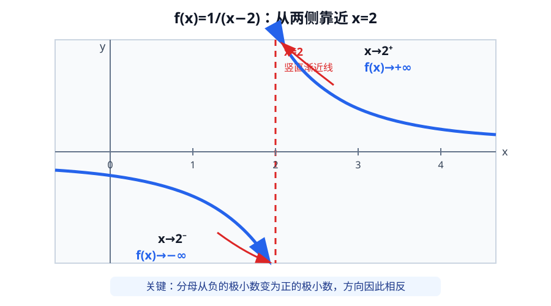

### 自变量趋向无穷与水平渐近线

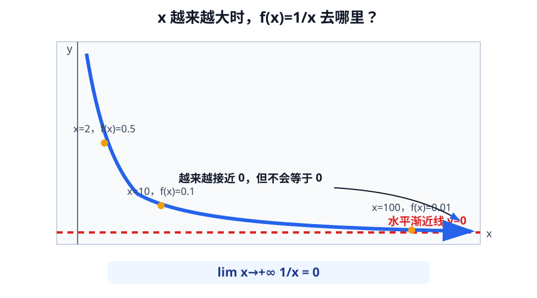

## 2026-08-12 复习记录

### 空点、竖直渐近线与水平渐近线纠错

题目：

\[\Large\displaystyle g(x)=\frac{x^2-4}{x^2-x-2}\]

先因式分解，再约分：

\[\Large\displaystyle g(x)=\frac{(x-2)(x+2)}{(x-2)(x+1)}=\frac{x+2}{x+1}\quad(x\ne2,-1)\]

- \(x=2\) 对应的因子被约掉，所以是空点；空点坐标为 \((2,4/3)\)。
- 约分后的分母在 \(x=-1\) 时为 \(0\)，所以竖直渐近线是 \(x=-1\)。
- 分子、分母次数相同，最高次项系数之比是 \(1/1\)，所以水平渐近线是 \(y=1\)。

本题错因：没有先完成约分，就开始分别判断三类对象。

复习顺序：**先约分；被约掉的是空点；剩余分母的零点是竖直渐近线；最后看无穷远极限求水平渐近线。**

### 被约掉的零点不能重复使用

\[\Large\displaystyle h(x)=\frac{x^2-9}{x^2-2x-3}\]

先因式分解并约分：

\[\Large\displaystyle h(x)=\frac{(x-3)(x+3)}{(x-3)(x+1)}=\frac{x+3}{x+1}\quad(x\ne3,-1)\]

- \(x=3\) 对应的因子被约掉，所以是空点。
- 剩余分母满足 \(x+1=0\)，所以竖直渐近线是 \(x=-1\)。
- 分子、分母次数相同，所以水平渐近线是 \(y=1\)。

本题第 1、3 项正确；第 2 项把已经判为空点的 \(x=3\) 又重复当成了竖直渐近线。

### 无定义点不一定是空点

空点确实是函数无定义的点，但无定义的点还可能对应竖直渐近线。必须通过约分来区分：

\[\Large\displaystyle p(x)=\frac{(x-4)(x+1)}{(x-4)(x-2)}=\frac{x+1}{x-2}\quad(x\ne4,2)\]

- \(x=4\) 的因子被约掉，所以 \(x=4\) 是空点。
- \(x=2\) 的因子仍留在分母，所以 \(x=2\) 是竖直渐近线。

最短判断：**能约掉的无定义点是空点；约不掉并使函数爆大的是竖直渐近线。**

### 斜渐近线：曲线与斜线的距离趋向零

若 \(x\) 跑向无穷远时，函数 \(f(x)\) 与直线 \(y=mx+b\) 的差趋向 \(0\)，则这条直线是斜渐近线：

\[\Large\displaystyle \lim_{x\to\pm\infty}\bigl[f(x)-(mx+b)\bigr]=\boldsymbol{0}\quad\Longrightarrow\quad\boldsymbol{y=mx+b}\]

例：

\[\Large\displaystyle f(x)=\frac{x^2+1}{x}=x+\frac1x\]

随着 \(x\to\pm\infty\)，\(1/x\to0\)，所以曲线与直线 \(y=x\) 的距离趋向 \(0\)：

\[\Large\displaystyle \text{斜渐近线为 }\boldsymbol{y=x}\]

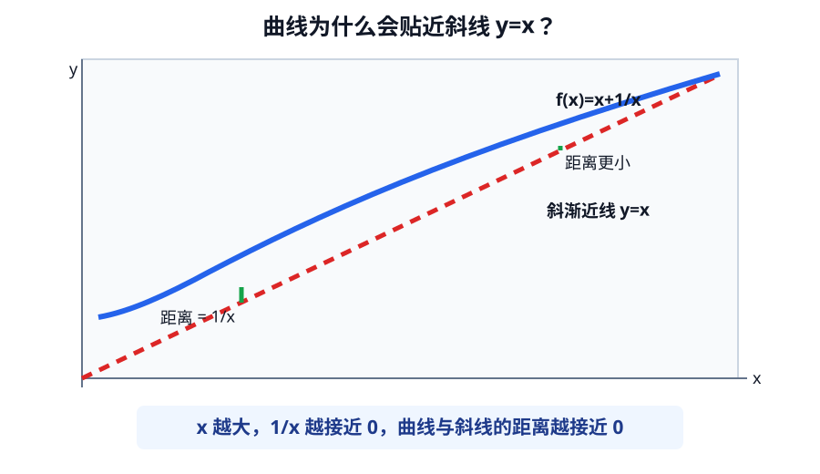

练习订正：

\[\Large\displaystyle f(x)=\frac{x^2+2x+3}{x+1}=\boldsymbol{x+1}+\frac{2}{x+1}\]

当 \(x\to\pm\infty\) 时，只有 \(2/(x+1)\to0\)；必须保留完整的一次式 \(x+1\)：

\[\Large\displaystyle \text{斜渐近线为 }\boldsymbol{y=x+1}\]

错因：误把一次式中的 \(x\) 一起丢掉，只保留了常数 \(1\)。口诀：**只丢趋近于零的小尾巴，商式完整保留。**

第二道练习：

\[\Large\displaystyle f(x)=\boldsymbol{2x-3}+\frac{5}{x+4}\]

因为 \(5/(x+4)\to0\)，判断出的斜线完全正确。渐近线应规范写成：

\[\Large\displaystyle \boldsymbol{y=2x-3}\]

记号区别：\(f(x)\) 表示原函数，\(y=2x-3\) 表示它逐渐贴近的直线。

#### 如何做多项式除法

例：

\[\Large\displaystyle f(x)=\frac{x^2+3x+5}{x+1}\]

1. 先算首项：\(x^2\div x=x\)。
2. 减去 \(x(x+1)=x^2+x\)，剩下 \(2x+5\)。
3. 再算首项：\(2x\div x=2\)。
4. 减去 \(2(x+1)=2x+2\)，余数为 \(3\)。

因此：

\[\Large\displaystyle f(x)=\boldsymbol{x+2}+\frac{3}{x+1}\quad\Longrightarrow\quad\text{斜渐近线为 }\boldsymbol{y=x+2}\]

##### 卡点：不会把分式拆成“一次式＋小尾巴”

这不是斜渐近线概念的问题，而是多项式除法还不熟。先用当前题的简便方法理解：**拆项就是把分子凑成分母的倍数加余数。**

\[\Large\displaystyle f(x)=\frac{x^2+4x+7}{x+2}\]

因为：

\[\Large\displaystyle \boldsymbol{x^2+4x+7}=(x+2)^2+3\]

所以：

\[\Large\displaystyle
\begin{aligned}
f(x)
&=\frac{(x+2)^2+3}{x+2}\\[4pt]
&=\boldsymbol{x+2}+\frac{3}{x+2}
\end{aligned}
\]

其中 \(3\) 就是除不尽后剩下的余数。随着 \(x\to\pm\infty\)，小尾巴 \(3/(x+2)\to0\)，所以：

\[\Large\displaystyle \text{斜渐近线为 }\boldsymbol{y=x+2}\]

当前口诀：**先让分子出现分母，再把多出来的部分写成余数。**

最小拆项练习已独立答对：

\[\Large\displaystyle \boldsymbol{x^2+6x+11}=(x+3)^2+\boldsymbol{2}\]

把它放回分式：

\[\Large\displaystyle \frac{x^2+6x+11}{x+3}=\boldsymbol{x+3}+\frac{2}{x+3}\]

因此小尾巴趋近于 \(0\) 后，斜渐近线为 \(\boldsymbol{y=x+3}\)。

负号拆项练习：

\[\Large\displaystyle \boldsymbol{x^2-4x+7}=(x-2)^2+\boldsymbol{3}\]

余数 \(3\) 判断正确。放回分式后：

\[\Large\displaystyle
\frac{x^2-4x+7}{x-2}
=\boldsymbol{x-2}+\frac{3}{x-2}
\]

- \(x-2\) 是商式，必须完整保留。
- \(3\) 是余数，进入小尾巴 \(3/(x-2)\)。
- 当 \(x\to\pm\infty\) 时，小尾巴趋近于 \(0\)。

所以斜渐近线是：

\[\Large\displaystyle \boldsymbol{y=x-2}\]

错因：把余数 \(3\) 当成了渐近线。判断规则：**渐近线取商式，不取余数。**

即时辨认练习：

\[\Large\displaystyle f(x)=\boldsymbol{3x+4}-\frac{7}{x-1}\]

当 \(x\to\pm\infty\) 时：

\[\Large\displaystyle -\frac{7}{x-1}\to0\]

所以必须保留当前题中的一次式：

\[\Large\displaystyle \text{斜渐近线为 }\boldsymbol{y=3x+4}\]

错因：直接沿用了上一题的 \(y=x-2\)，没有重新读取当前表达式。修正步骤：**先圈出当前题中趋近于零的小尾巴，再抄下剩余的一次式。**

拆步练习：

\[\Large\displaystyle f(x)=\boldsymbol{-2x+5}+\frac{1}{x+6}\]

第一步已独立答对：小尾巴是

\[\Large\displaystyle \boldsymbol{\frac{1}{x+6}}\to0\]

下一步只需删去小尾巴，完整抄下剩余的一次式。

第二步也已独立答对：

\[\Large\displaystyle \text{斜渐近线为 }\boldsymbol{y=-2x+5}\]

结论：在拆步提示下已经能正确完成“找小尾巴 → 保留一次式”，还需要一道无拆步提示的变式来确认是否稳定。

无拆步提示的变式已独立答对：

\[\Large\displaystyle f(x)=\boldsymbol{4x-1}-\frac{6}{x+2}\]

\[\Large\displaystyle \text{斜渐近线为 }\boldsymbol{y=4x-1}\]

结论：已经能独立识别“拆好后的商式＋小尾巴”；原始分式的多项式除法仍需练习。

#### 通用拆法：多项式除法

当分子不能方便地凑成平方时，重复做“首项相除 → 乘回去 → 相减”。

\[\Large\displaystyle f(x)=\frac{2x^2+x+4}{x+1}\]

1. 首项相除：\(2x^2\div x=2x\)。
2. 乘回并相减：\((2x^2+x+4)-(2x^2+2x)=-x+4\)。
3. 再除一次：\((-x)\div x=-1\)。
4. 乘回并相减：\((-x+4)-(-x-1)=5\)，所以余数是 \(5\)。

因此：

\[\Large\displaystyle f(x)=\boldsymbol{2x-1}+\frac{5}{x+1}\]

\[\Large\displaystyle \text{斜渐近线为 }\boldsymbol{y=2x-1}\]

多项式除法练习：

\[\Large\displaystyle f(x)=\frac{x^2+x+5}{x-1}\]

已独立完成每一步：

1. 首项相除：\(x^2\div x=x\)。
2. 乘回并相减：\((x^2+x+5)-(x^2-x)=2x+5\)。
3. 再除一次：\(2x\div x=2\)。
4. 乘回并相减：\((2x+5)-(2x-2)=7\)，余数为 \(7\)。

因此：

\[\Large\displaystyle f(x)=\boldsymbol{x+2}+\frac{7}{x-1}\]

\[\Large\displaystyle \text{斜渐近线为 }\boldsymbol{y=x+2}\]

##### 与 Euclidean algorithm 的关系

多项式除法遵循：

\[\Large\displaystyle \boldsymbol{A(x)=B(x)Q(x)+R(x)},\qquad \deg R<\deg B\]

本题只是完成了一次除法，得到商式 \(Q(x)\) 和余数 \(R(x)\)。

Euclidean algorithm（欧几里得算法）会不断重复这种除法，用上一轮的除数和余数继续相除，直到余数为 \(0\)，目的是求最大公因式。

所以：**当前使用的是多项式欧几里得除法，也是欧几里得算法反复使用的基本步骤；但不是完整的欧几里得算法。**

##### 照片练习：计算已经完成，卡在结果的重新组合

\[\Large\displaystyle f(x)=\frac{2x^2-3x+4}{x-2}\]

照片中的计算全部正确：

1. \(2x^2\div x=2x\)，得到商的第一项 \(2x\)。
2. 相减后得到 \(x+4\)。
3. \(x\div x=1\)，得到商的第二项 \(1\)。
4. 最后相减得到余数 \(6\)。

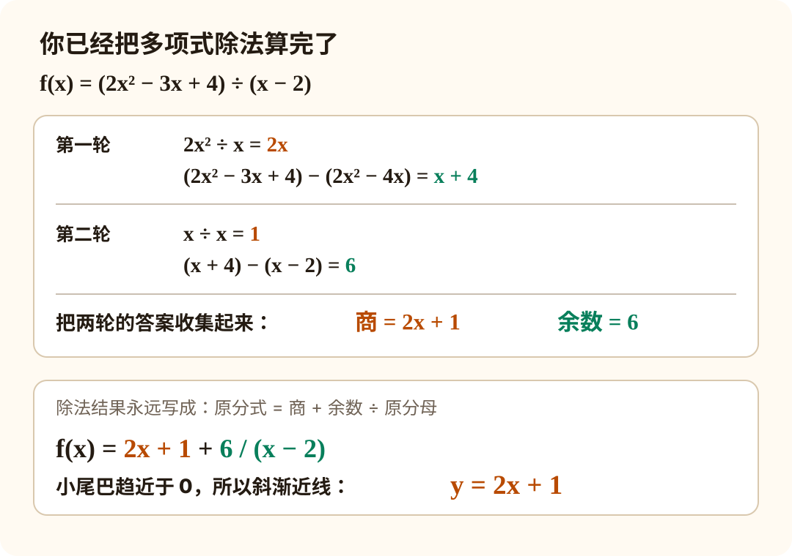

把两轮得到的商合并：

\[\Large\displaystyle \boldsymbol{Q(x)=2x+1},\qquad\boldsymbol{R(x)=6}\]

先写成除法恒等式：

\[\Large\displaystyle \boldsymbol{2x^2-3x+4=(x-2)(2x+1)+6}\]

再除以 \(x-2\)：

\[\Large\displaystyle f(x)=\boldsymbol{2x+1}+\frac{6}{x-2}\]

因此斜渐近线为：

\[\Large\displaystyle \boldsymbol{y=2x+1}\]

卡点判断：不是不会做多项式除法，而是不熟悉最后的格式。记住：**原分式＝商＋余数／原分母。**

##### 负号订正：减去负式子时括号内全部变号

练习：

\[\Large\displaystyle f(x)=\frac{x^2-2x+5}{x+1}\]

前两轮正确得到商式 \(x-3\)，最后需要计算：

\[\Large\displaystyle (-3x+5)-(-3x-3)\]

括号前是减号，因此括号内两项都要变号：

\[\Large\displaystyle
\begin{aligned}
(-3x+5)-(-3x-3)
&=-3x+5+3x+3\\[4pt]
&=\boldsymbol{8}
\end{aligned}
\]

错答 \(-6x+8\) 的原因：没有正确处理 \(-(-3x)=+3x\)。口诀：**减去一个括号，括号内每一项都变号。**

所以完整拆式为：

\[\Large\displaystyle f(x)=\boldsymbol{x-3}+\frac{8}{x+1}\]

订正后已正确判断：

\[\Large\displaystyle \text{斜渐近线为 }\boldsymbol{y=x-3}\]

##### 无拆步提示的多项式除法通过

\[\Large\displaystyle f(x)=\frac{2x^2+5x+1}{x+2}\]

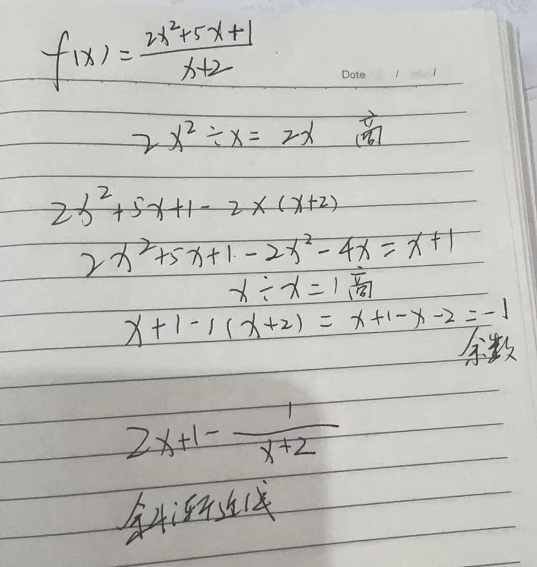

独立计算过程正确：

1. \(2x^2\div x=2x\)。
2. 相减得到 \(x+1\)。
3. \(x\div x=1\)。
4. 最后相减得到余数 \(-1\)。

因此商和余数分别是：

\[\Large\displaystyle \boldsymbol{Q(x)=2x+1},\qquad\boldsymbol{R(x)=-1}\]

完整拆式：

\[\Large\displaystyle f(x)=\boldsymbol{2x+1}-\frac{1}{x+2}\]

小尾巴趋近于 \(0\)，所以：

\[\Large\displaystyle \text{斜渐近线为 }\boldsymbol{y=2x+1}\]

结论：已经能在无拆步提示下完成一次二次式除以一次式，并正确处理负余数；仍需间隔复测确认是否稳定。

##### 无穷小的准确表述

回答“\(-1\) 被无穷小了”意思接近，但对象不准确：常数 \(-1\) 始终是 \(-1\)，不会变小。趋近于 \(0\) 的是整个分式：

\[\Large\displaystyle \boldsymbol{-\frac{1}{x+2}\to0}\qquad(x\to\pm\infty)\]

原因是分子固定为 \(-1\)，而分母的绝对值越来越大，所以整个分式越来越接近 \(0\)。

准确说法：**余数仍为 \(-1\)，但“余数除以原分母”形成的小尾巴是无穷小。**

符号辨认练习：

\[\Large\displaystyle 5-\frac{3}{x-4}\]

回答 \(3/(x-4)\) 已经找对了分式部分，但漏掉了原式中属于这一项的负号。完整的小尾巴是：

\[\Large\displaystyle \boldsymbol{-\frac{3}{x-4}}\to0\]

注意：\(3/(x-4)\) 和 \(-3/(x-4)\) 的极限都为 \(0\)，但抄写“原式中的完整一项”时必须保留正负号。

再次辨认：

\[\Large\displaystyle -2x+7+\frac4{x+1}\]

已经正确指出完整小尾巴为：

\[\Large\displaystyle \boldsymbol{+\frac4{x+1}}\to0\]

删去小尾巴后，已正确判断：

\[\Large\displaystyle \text{斜渐近线为 }\boldsymbol{y=-2x+7}\]

结论：已经能独立完成“辨认带符号的小尾巴 → 完整保留一次式”两步。

##### 斜渐近线综合复测通过

\[\Large\displaystyle f(x)=\frac{3x^2-x+5}{x+1}\]

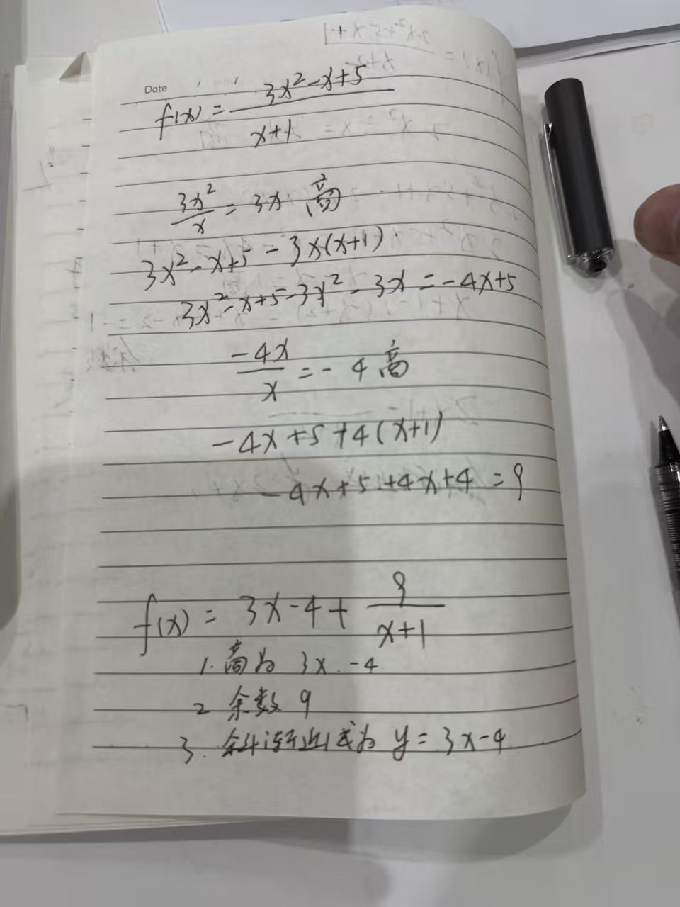

无拆步提示下独立完成：

1. 首项相除得到 \(3x\)，相减后得到 \(-4x+5\)。
2. 第二次相除得到 \(-4\)，最后余数为 \(9\)。
3. 商、余数和完整拆式均正确：

\[\Large\displaystyle \boldsymbol{Q(x)=3x-4},\qquad\boldsymbol{R(x)=9}\]

\[\Large\displaystyle f(x)=\boldsymbol{3x-4}+\frac9{x+1}\]

因此：

\[\Large\displaystyle \text{斜渐近线为 }\boldsymbol{y=3x-4}\]

反向验算：

\[\Large\displaystyle (x+1)(3x-4)+9=3x^2-x+5\]

结论：本次已经能无提示完成“多项式除法 → 商余式 → 小尾巴趋零 → 斜渐近线”，但需要间隔复测后再判断是否长期掌握。

分式函数的直接求法：当分子次数恰好比分母次数高 \(1\) 时，做多项式除法；所得商式通常就是斜渐近线，余式除以分母的部分会趋向 \(0\)。

### 三种渐近线的统一理解

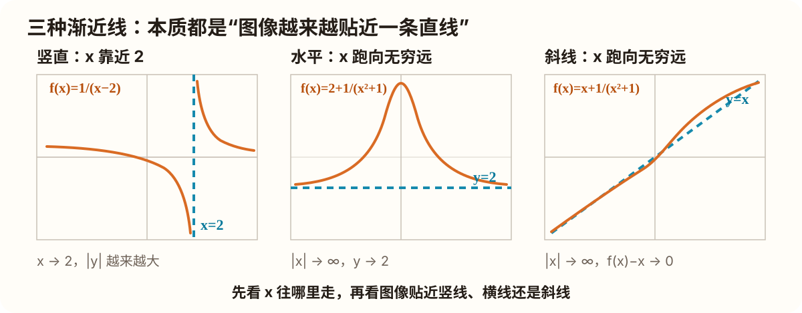

三种渐近线不是三个互不相干的公式。它们都在回答同一个问题：**当 \(x\) 按指定方向移动时，函数图像越来越贴近哪一条直线？**

#### 第一步：先看 \(x\) 往哪里走

**竖直渐近线：\(x\) 靠近一个具体数 \(a\)。**

\[\Large\displaystyle x\to a,\quad |f(x)|\to\infty
\quad\Longrightarrow\quad
\text{竖直渐近线 }\boldsymbol{x=a}\]

记忆：**输入卡在某个数附近，输出爆掉。**

**水平渐近线：\(x\) 跑向正无穷或负无穷。**

\[\Large\displaystyle x\to\pm\infty,\quad f(x)\to L
\quad\Longrightarrow\quad
\text{水平渐近线 }\boldsymbol{y=L}\]

记忆：**输入跑得很远，输出稳定在一个数附近。**

**斜渐近线：\(x\) 也跑向正无穷或负无穷，但图像贴近一条斜线。**

\[\Large\displaystyle x\to\pm\infty,\quad f(x)-(mx+b)\to0
\quad\Longrightarrow\quad
\text{斜渐近线 }\boldsymbol{y=mx+b}\]

记忆：**输入跑得很远，曲线与斜线的差变成 \(0\)。**

#### 分式函数的直接求法

- 竖直：**先约分**；令约分后仍留在分母中的因式等于 \(0\)，并确认分子不为 \(0\)。
- 水平：比较分子与分母的最高次数。
  - 分子次数较低：\(\boldsymbol{y=0}\)。
  - 次数相同：\(\boldsymbol{y=\text{最高次项系数之比}}\)。
  - 分子次数较高：没有水平渐近线。
- 斜线：分子次数恰好比分母高 \(1\) 时做多项式除法，**商式就是斜渐近线**。

统一检查顺序：**先约分排除空点 → 看有限位置是否爆掉 → 再看无穷远处贴近横线还是斜线。**

#### 竖直渐近线的分母为什么看 \(0\)

以

\[\Large\displaystyle \boldsymbol{f(x)=\frac{1}{x-3}}\]

为例。当 \(x\to3\) 时：

\[\Large\displaystyle \boldsymbol{x-3\to0}\]

这一步已经独立回答正确。它表示分母会变成一个**绝对值越来越小、但不等于 \(0\)** 的数。

从左边接近 \(3\)：

\[\Large\displaystyle \boldsymbol{f(2.9)=\frac{1}{-0.1}=-10},\qquad
\boldsymbol{f(2.99)=\frac{1}{-0.01}=-100}\]

所以：

\[\Large\displaystyle \boldsymbol{x\to3^-\quad\Longrightarrow\quad f(x)\to-\infty}\]

从右边接近 \(3\)：

\[\Large\displaystyle \boldsymbol{f(3.01)=\frac{1}{0.01}=100}\]

因此右侧会趋向正无穷：

\[\Large\displaystyle \boldsymbol{x\to3^+\quad\Longrightarrow\quad f(x)\to+\infty}\]

结论：分母从两侧趋近 \(0\) 时，函数值的绝对值不断变大，图像会贴近竖线：

\[\Large\displaystyle \boxed{\boldsymbol{x=3}}\]

这就是“令约分后仍留在分母中的因式等于 \(0\)”能够找到竖直渐近线的原因。注意：**分母等于 \(0\) 只是候选位置；还要先约分，并确认函数确实爆大。**

即时迁移练习：

\[\Large\displaystyle \boldsymbol{g(x)=\frac{1}{x+2}}\]

能够独立判断竖直渐近线为 \(\boldsymbol{x=-2}\)。

反例：

\[\Large\displaystyle \boldsymbol{h(x)=\frac{x+2}{x+2}=1\quad(x\ne-2)}\]

能够判断 \(x=-2\) 处是空点，图像其余部分为 \(y=1\)，不是竖直渐近线。

综合迁移：

\[\Large\displaystyle \boldsymbol{p(x)=\frac{x+2}{(x+2)(x-4)}=\frac{1}{x-4}\quad(x\ne-2,4)}\]

- 空点：\(\boldsymbol{x=-2}\)。
- 竖直渐近线：\(\boldsymbol{x=4}\)。
- 作答时曾把 \(-2\) 输入成 \(-1\)，本人说明原计算正确，属于键盘转录错误，不记为概念或计算错误。

#### 水平渐近线为什么看无穷远

以

\[\Large\displaystyle \boldsymbol{f(x)=\frac{2x+1}{x-3}=2+\frac{7}{x-3}}\]

为例。当 \(x\to+\infty\) 时，已经独立判断：

\[\Large\displaystyle \boldsymbol{\frac{7}{x-3}\to0}\]

因此原函数中只有“小尾巴”消失，稳定的主体 \(2\) 留下来：

\[\Large\displaystyle \boldsymbol{f(x)=2+\frac{7}{x-3}\to2}\]

所以图像在无穷远处越来越贴近水平直线：

\[\Large\displaystyle \boxed{\boldsymbol{y=2}}\]

记忆：**求水平渐近线，是看 \(x\) 跑得很远以后，整个函数最终稳定在哪个 \(y\) 值附近。**

即时迁移：

\[\Large\displaystyle \boldsymbol{g(x)=3+\frac{5}{x+1}}\]

无论 \(x\to+\infty\) 还是 \(x\to-\infty\)，都有：

\[\Large\displaystyle \boldsymbol{\frac{5}{x+1}\to0},\qquad \boldsymbol{g(x)\to3}\]

所以两个方向的水平渐近线都是 \(\boldsymbol{y=3}\)。小尾巴从正侧还是负侧趋近 \(0\)，不会改变最后稳定在 \(3\) 的结论。

同次数时“最高次项系数之比”的来源也可以直接看出来。把分子、分母同时除以最高次幂 \(x\)：

\[\Large\displaystyle
\boldsymbol{\frac{2x+1}{x-3}
=\frac{2+\frac1x}{1-\frac3x}
\to\frac21=2}}
\]

因为 \(1/x\) 和 \(3/x\) 都会消失，最后留下的正是分子、分母最高次项的系数之比。

水平渐近线的三种次数关系已经逐步验证：

- 同次数：\(\frac{4x-5}{2x+7}\to\frac42=2\)，所以 \(\boldsymbol{y=2}\)。
- 分母次数更高：\(\frac{3x+1}{x^2+4}\to0\)，所以 \(\boldsymbol{y=0}\)。
- 分子次数更高：通常没有水平渐近线；若恰好高一次，应检查斜渐近线。

斜渐近线即时提取复习：

\[\Large\displaystyle \boldsymbol{\frac{x^2+1}{x+3}}\]

起初忘记了分子次数高一次时应做多项式除法。经过逐步提示后，能够正确完成：

\[\Large\displaystyle
\boldsymbol{x^2\div x=x},\qquad
\boldsymbol{(x^2+1)-(x^2+3x)=-3x+1}
\]

\[\Large\displaystyle
\boldsymbol{-3x\div x=-3},\qquad
\boldsymbol{(-3x+1)-(-3x-9)=10}
\]

因此：

\[\Large\displaystyle \boldsymbol{\frac{x^2+1}{x+3}=x-3+\frac{10}{x+3}}\]

小尾巴趋近 \(0\)，斜渐近线为 \(\boldsymbol{y=x-3}\)。本知识点能在提示下恢复，但仍需安排无提示间隔复习。

### 闭卷综合复测通过

\[\Large\displaystyle g(x)=\frac{x^2+x-6}{x^2-4}=\frac{(x+3)(x-2)}{(x-2)(x+2)}=\frac{x+3}{x+2}\quad(x\ne2,-2)\]

独立判断结果全部正确：

- 空点：\(x=2\)。
- 竖直渐近线：\(x=-2\)。
- 水平渐近线：\(y=1\)。

结论：已经能在无提示条件下按“因式分解 → 约分 → 分类”的顺序完成基础综合题。

## 2026-08-13 学习记录

### 同时求竖直渐近线与斜渐近线的顺序

题目：

\[\Large\displaystyle \boldsymbol{f(x)=\frac{2x^2+1}{x-1}}\]

观察正确：这道题需要做多项式除法，但多项式除法只用于求**斜渐近线**。完整顺序是：

1. 先看约分后的分母，求竖直渐近线。
2. 再比较次数；分子次数恰好比分母高 \(1\)，做多项式除法求斜渐近线。

\[\Large\displaystyle \boldsymbol{\text{竖直：看分母}\qquad\text{斜线：做除法}}\]

### 多项式竖式除法独立完成

前一晚通过视频自学多项式竖式除法后，独立完成本题：

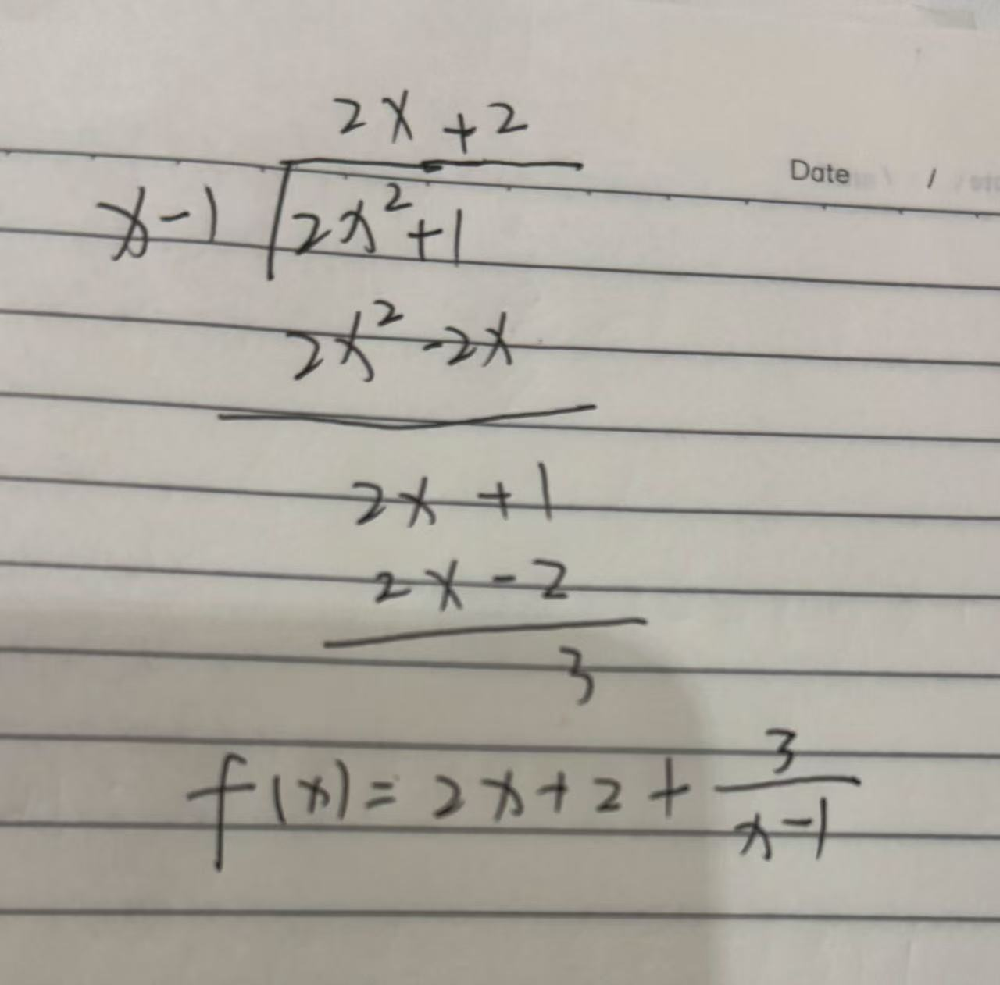

计算过程正确：

\[\Large\displaystyle
\boldsymbol{\frac{2x^2+1}{x-1}=2x+2+\frac{3}{x-1}}
\]

其中商为 \(\boldsymbol{2x+2}\)，余数为 \(\boldsymbol{3}\)。反向验算：

\[\Large\displaystyle
\boldsymbol{(x-1)(2x+2)+3=2x^2+1}
\]

因此本题的斜渐近线为：

\[\Large\displaystyle \boxed{\boldsymbol{y=2x+2}}\]

掌握证据：能够在没有逐步提示的情况下正确使用竖式除法。后续仍需间隔复测，确认能长期提取。

### 竖式除法符号复测

复测题：

\[\Large\displaystyle \boldsymbol{f(x)=\frac{3x^2+2x-1}{x+2}}\]

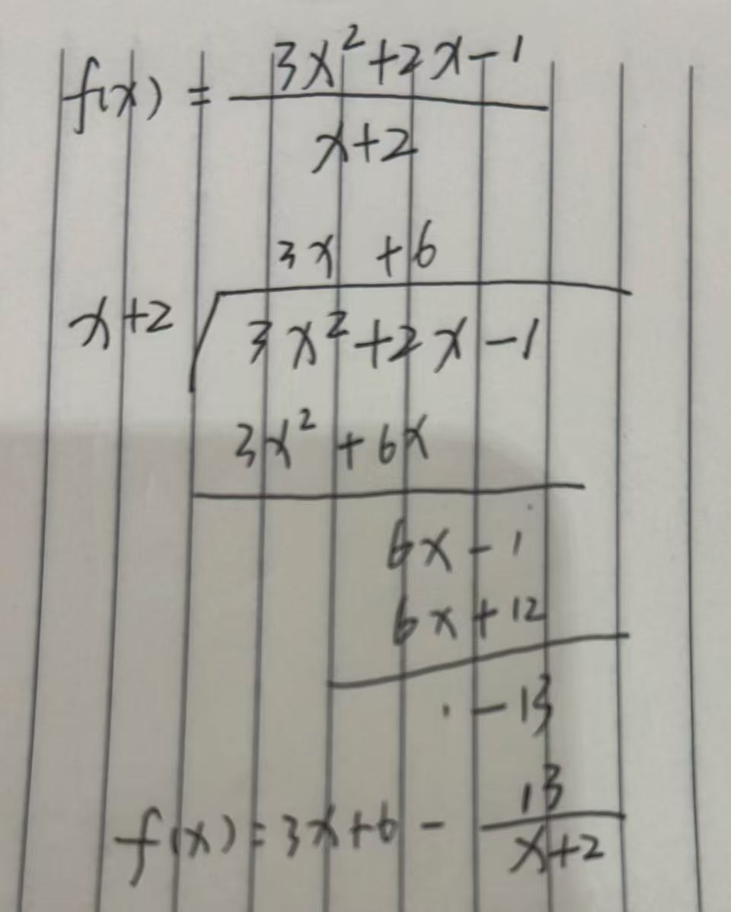

- 竖直渐近线 \(\boldsymbol{x=-2}\) 判断正确。
- 商的第一项 \(\boldsymbol{3x}\) 以及乘回得到 \(\boldsymbol{3x^2+6x}\) 均正确。
- 第一次相减时把 \(\boldsymbol{2x-6x}\) 写成了正数，导致后续商与余数一起出错。

正确的第一次相减是：

\[\Large\displaystyle
\boldsymbol{(3x^2+2x-1)-(3x^2+6x)}
\]

\[\Large\displaystyle
\boldsymbol{=3x^2+2x-1-3x^2-6x=-4x-1}
\]

错因类型：**符号运算不熟练**。修正动作：每次竖式相减都先把整行写进括号，再把减号分配给下一行的每一项。

继续订正时，\(-4x\div x\) 曾再次写成 \(4\)，说明负号仍容易在“系数相除”这一步丢失。修正后正确完成：

\[\Large\displaystyle
\boldsymbol{-4x\div x=-4},\qquad
\boldsymbol{-4(x+2)=-4x-8}
\]

最后的余数独立计算正确：

\[\Large\displaystyle
\boldsymbol{(-4x-1)-(-4x-8)=7}
\]

所以完整结果是：

\[\Large\displaystyle
\boldsymbol{\frac{3x^2+2x-1}{x+2}=3x-4+\frac7{x+2}}
\]

- 商：\(\boldsymbol{3x-4}\)。
- 余数：\(\boldsymbol{7}\)。
- 竖直渐近线：\(\boldsymbol{x=-2}\)。
- 斜渐近线：\(\boldsymbol{y=3x-4}\)。

本轮已经能完成方法订正，但单次订正不能证明长期掌握。当前真正的薄弱点是负号转录与运算稳定性；后续复测需要刻意保留负系数。

## 2026-08-15 学习记录

### 夹逼定理：上下界共同决定中间函数的极限

设在 \(x=a\) 附近（可以不包含 \(a\) 点本身）恒有：

\[
g(x)\le f(x)\le h(x)
\]

如果：

\[
\lim_{x\to a}g(x)=\lim_{x\to a}h(x)=L
\]

那么夹逼定理保证：

\[
\boxed{\lim_{x\to a}f(x)=L}
\]

几何上，中间曲线 \(f(x)\) 不能越过上下两条曲线；当上下曲线同时靠近同一个高度 \(L\) 时，中间曲线也只能靠近 \(L\)。

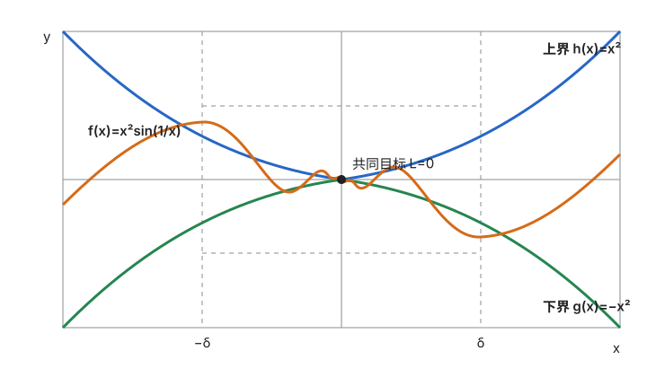

完整例题：当 \(x\ne0\) 时，

\[
f(x)=x^2\sin\frac1x
\]

因为：

\[
-1\le\sin\frac1x\le1
\]

并且 \(x^2\ge0\)，所以同时乘以 \(x^2\) 后不等号方向不变：

\[
-x^2\le x^2\sin\frac1x\le x^2
\]

上下界的极限都是：

\[
\lim_{x\to0}(-x^2)=\lim_{x\to0}x^2=0
\]

因此由夹逼定理：

\[
\boxed{\lim_{x\to0}x^2\sin\frac1x=0}
\]

### 第一个重要极限：\(\sin x/x\)

当 \(x\) 使用弧度时：

\[
\boxed{\lim_{x\to0}\frac{\sin x}{x}=1}
\]

在单位圆中取 \(0<x<\frac{\pi}{2}\)。内接三角形、扇形、外接三角形的面积依次增大：

\[
\frac12\sin x<\frac12x<\frac12\tan x
\]

因此：

\[
\sin x<x<\tan x
\]

由左半边 \(\sin x<x\) 可得：

\[
\frac{\sin x}{x}<1
\]

由右半边 \(x<\tan x=\frac{\sin x}{\cos x}\) 可得：

\[
\cos x<\frac{\sin x}{x}
\]

于是：

\[
\cos x<\frac{\sin x}{x}<1
\]

当 \(x\to0^+\) 时，左右两边都趋近 \(1\)，所以由夹逼定理：

\[
\lim_{x\to0^+}\frac{\sin x}{x}=1
\]

又因为 \(\frac{\sin(-x)}{-x}=\frac{\sin x}{x}\)，负数一侧相同，最终得到双侧极限：

\[
\boxed{\lim_{x\to0}\frac{\sin x}{x}=1}
\]

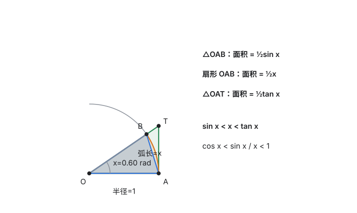

完整计算例题：

\[
\lim_{x\to0}\frac{\sin 3x}{x}
=3\lim_{x\to0}\frac{\sin 3x}{3x}
=3
\]

### 第二个重要极限：自然常数 \(e\)

把本金设为 \(1\)，年增长率设为 \(100\%\)。如果一年分成 \(n\) 次复利，每次增长率为 \(1/n\)，一年后的结果为：

\[
\left(1+\frac1n\right)^n
\]

当复利次数不断增加时，这个数趋近一个固定常数。这个常数定义为：

\[
\boxed{e=\lim_{n\to\infty}\left(1+\frac1n\right)^n\approx2.71828}
\]

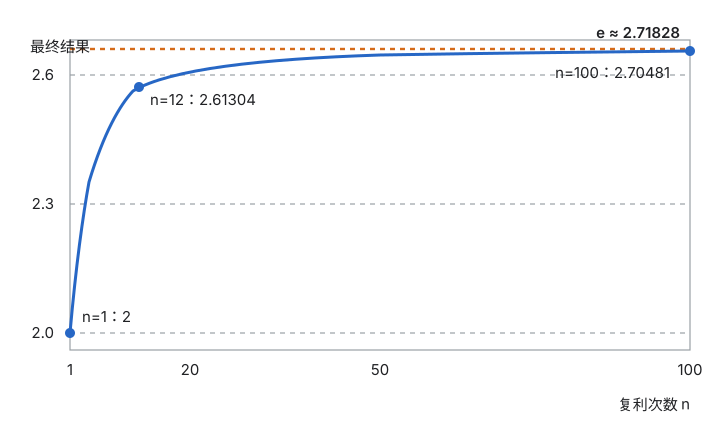

令 \(x=1/n\)。当 \(n\to\infty\) 时，\(x\to0\)，因此得到第二个重要极限的常用形式：

\[
\boxed{\lim_{x\to0}(1+x)^{1/x}=e}
\]

完整计算例题：

\[
\lim_{x\to0}(1+3x)^{1/x}
\]

令 \(u=3x\)，则 \(u\to0\)，并且 \(1/x=3/u\)。所以：

\[
(1+3x)^{1/x}
=(1+u)^{3/u}
=\left((1+u)^{1/u}\right)^3
\]

由第二个重要极限：

\[
\boxed{\lim_{x\to0}(1+3x)^{1/x}=e^3}
\]

### \(\varepsilon\)-\(\delta\) 定义：把“无限接近”写成严格保证

\[
\lim_{x\to a}f(x)=L
\]

的严格含义是：对任意 \(\varepsilon>0\)，都存在一个 \(\delta>0\)，使得只要：

\[
0<|x-a|<\delta
\]

就一定有：

\[
|f(x)-L|<\varepsilon
\]

其中：

- \(\varepsilon\) 控制输出 \(f(x)\) 与目标 \(L\) 的允许误差。
- \(\delta\) 控制输入 \(x\) 与目标点 \(a\) 的允许距离。
- \(0<|x-a|\) 排除了 \(x=a\) 本身，因为极限只研究附近的行为。
- 顺序是先给任意 \(\varepsilon\)，再选择可能依赖于它的 \(\delta\)。

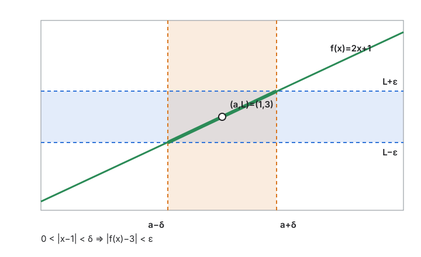

完整证明例题：

\[
\lim_{x\to1}(2x+1)=3
\]

任给 \(\varepsilon>0\)，选择：

\[
\delta=\frac{\varepsilon}{2}
\]

如果 \(0<|x-1|<\delta\)，那么：

\[
\begin{aligned}
|(2x+1)-3|
&=|2x-2|\\
&=2|x-1|\\
&<2\delta\\
&=\varepsilon
\end{aligned}
\]

因此这个极限满足严格的 \(\varepsilon\)-\(\delta\) 定义。

## 2026-08-16 课程目录核对与补全队列

对照学习者提供的一元微积分教材目录，第一章还需补齐下列小单元；它们是回补缺口，不代表重新开始极限章节：

1. 数列极限的定义与收敛数列的基本性质。
2. 无穷小的比较与常用等价无穷小。
3. 连续函数的和、差、积、商、复合与反函数。
4. 闭区间上连续函数的性质：有界性、最大值最小值定理、介值定理、零点定理和一致连续性。

零点定理是介值定理取目标高度 \(N=0\) 的推论。此前 \(g(x)=x^2-3\) 在 \([1,2]\) 上的例题已经实际使用该结论，但需要补充正式名称、条件和反例辨认。

补全依赖顺序：

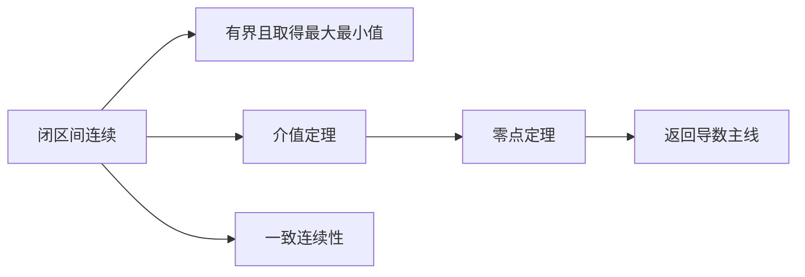
```mermaid
flowchart LR
    A[闭区间连续] --> B[有界且取得最大最小值]
    A --> C[介值定理]
    C --> D[零点定理]
    A --> E[一致连续性]
    D --> F[返回导数主线]
```

### 补全第一讲：有界性与最大值最小值定理

#### 有界的严格定义

函数 \(f\) 在区间 \(I\) 上有界，是指存在两个有限实数 \(m\)、\(M\)，使得对每一个 \(x\in I\)，都有：

\[
\boxed{m\le f(x)\le M}
\]

这里的 \(m\)、\(M\) 只需要把所有函数值夹住，不要求等于函数真正取得的最小值和最大值。

#### 最大值最小值的严格定义

如果存在 \(x_{\max}\in I\)，使得对所有 \(x\in I\)：

\[
f(x)\le f(x_{\max})
\]

那么 \(f(x_{\max})\) 是 \(f\) 在 \(I\) 上的最大值。

如果存在 \(x_{\min}\in I\)，使得对所有 \(x\in I\)：

\[
f(x)\ge f(x_{\min})
\]

那么 \(f(x_{\min})\) 是 \(f\) 在 \(I\) 上的最小值。

#### 闭区间连续函数定理

如果函数 \(f\) 在闭区间 \([a,b]\) 上连续，那么：

1. \(f\) 在 \([a,b]\) 上一定有界。
2. \(f\) 一定能在 \([a,b]\) 内某些点真正取得最大值和最小值。

\[
\boxed{
f\text{ 在 }[a,b]\text{ 上连续}
\Longrightarrow
f\text{ 有界且取得最大值、最小值}
}
\]

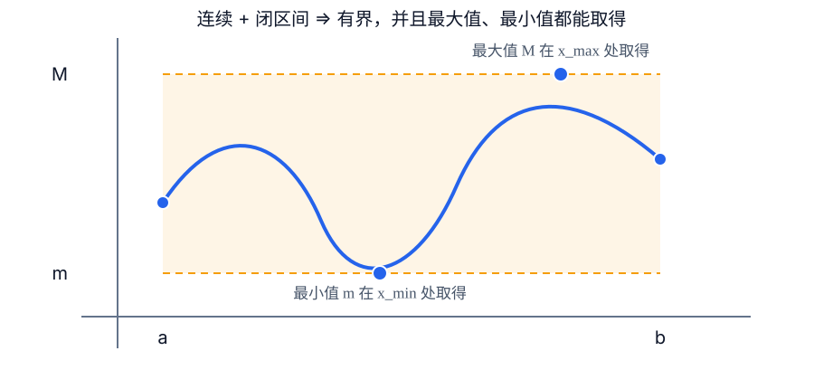

“连续”防止函数在区间内部突然炸向无穷；“闭区间”把两个端点包含进来，防止最大值或最小值只在缺失的端点附近无限接近却永远取不到。

#### 完整例题

求函数：

\[
f(x)=x^2-2x
\]

在闭区间 \([-1,3]\) 上的最大值与最小值。

先配方：

\[
f(x)=(x-1)^2-1
\]

因为 \((x-1)^2\ge0\)，所以当 \(x=1\) 时取得最小值：

\[
\boxed{f(1)=-1}
\]

在 \([-1,3]\) 中，离 \(1\) 最远的是两个端点 \(-1\) 和 \(3\)，距离都是 \(2\)：

\[
f(-1)=f(3)=2^2-1=3
\]

因此：

\[
\boxed{\min f=-1,\qquad \max f=3}
\]

这个例子中，多项式在整个实数轴上连续，区间 \([-1,3]\) 又是闭区间，所以定理先保证最大值和最小值一定存在；配方计算负责找出它们的具体数值和取得位置。

#### 第一讲练习纠错

对于：

\[
f(x)=(x+1)^2-1,\qquad x\in[-2,1]
\]

已正确找到最小值 \(-1\) 和最大值 \(3\)，但曾把最大值的取得位置写成 \(x=3\)。这里必须先检查候选横坐标是否属于题目区间；\(3\notin[-2,1]\)，正确位置是：

\[
\boxed{f(1)=3}
\]

### 补全第二讲：介值定理与零点定理

#### 介值定理的严格表述

设函数 \(f\) 在闭区间 \([a,b]\) 上连续。对于任意一个位于 \(f(a)\) 与 \(f(b)\) 之间的实数 \(N\)，至少存在一点 \(c\in[a,b]\)，使得：

\[
\boxed{f(c)=N}
\]

“至少存在”不等于“只有一个”；定理保证经过目标高度，却不负责给出 \(c\) 的具体位置。

#### 零点定理

设函数 \(f\) 在闭区间 \([a,b]\) 上连续，并且两个端点的函数值异号：

\[
f(a)f(b)<0
\]

那么至少存在一点 \(c\in(a,b)\)，使得：

\[
\boxed{f(c)=0}
\]

因为 \(0\) 位于一正一负的两个端点函数值之间，所以零点定理就是介值定理取目标高度 \(N=0\) 的特殊情况。

```mermaid
flowchart LR
    A[在闭区间上连续] --> B[不跳过端点之间的任何高度]
    B --> C[介值定理]
    C -->|目标高度 N=0| D[零点定理]
```

#### 完整例题

证明方程 \(x^3+x-1=0\) 在 \((0,1)\) 内至少有一个实根。

令：

\[
f(x)=x^3+x-1
\]

它是多项式，因此在闭区间 \([0,1]\) 上连续。再计算端点：

\[
f(0)=-1<0,
\qquad
f(1)=1>0
\]

所以：

\[
f(0)f(1)<0
\]

根据零点定理，至少存在 \(c\in(0,1)\)，使得 \(f(c)=0\)。这就证明了原方程在 \((0,1)\) 内至少有一个实根。

注意：零点定理只证明根存在；它没有计算根，也没有保证根只有一个。

#### 连续条件不能省略

如果函数从 \(-1\) 直接跳到 \(1\)，即使端点函数值异号，也可能完全没有取到 \(0\)。所以只检查“端点异号”不够，还必须先确认函数在整个闭区间上连续。

#### 第二讲练习记录

已独立证明方程：

\[
x^3+x-3=0
\]

在 \((1,2)\) 内至少有一个实根。解答正确包含了三个必要步骤：

1. 说明多项式 \(f(x)=x^3+x-3\) 在 \([1,2]\) 上连续。
2. 算出 \(f(1)=-1\)、\(f(2)=7\)，从而 \(f(1)f(2)<0\)。
3. 得出至少存在 \(c\in(1,2)\)，使得 \(f(c)=0\)。

这是零点定理首次独立应用通过；当前记为 Developing，待条件辨认变式与间隔复测后再判断是否 Mastered。

#### 条件辨认纠错

对于分段函数：

\[
f(x)=
\begin{cases}
-1,&x<0,\\
1,&x\ge0,
\end{cases}
\qquad x\in[-1,1]
\]

第一次只根据 \(f(-1)f(1)<0\) 就推出存在零点，遗漏了连续条件。检查后能够指出：必须先保证函数在闭区间上连续；本题在 \(x=0\) 处发生跳跃，因此不能使用零点定理。

当前已完成“存在性证明 + 缺失条件辨认”两种题型，保留一次无提示间隔复测后再升级为 Mastered。

### 补全第三讲：一致连续性

#### 严格定义

函数 \(f\) 在集合 \(D\) 上一致连续，是指：对于任意 \(\varepsilon>0\)，都存在 \(\delta>0\)，使得对所有 \(x_1,x_2\in D\)，只要：

\[
|x_1-x_2|<\delta
\]

就一定有：

\[
\boxed{|f(x_1)-f(x_2)|<\varepsilon}
\]

完整量词写法为：

\[
\boxed{
\forall\varepsilon>0,
\ \exists\delta>0,
\ \forall x_1,x_2\in D,
\quad
|x_1-x_2|<\delta
\Rightarrow
|f(x_1)-f(x_2)|<\varepsilon
}
\]

普通连续允许 \(\delta\) 随检查位置 \(x_0\) 改变；一致连续要求选定 \(\varepsilon\) 后，同一个 \(\delta\) 能同时管住整个集合 \(D\)。

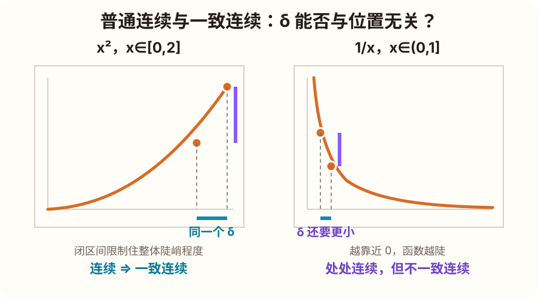

#### 闭区间上一致连续定理

如果函数 \(f\) 在闭区间 \([a,b]\) 上连续，那么 \(f\) 在 \([a,b]\) 上一致连续：

\[
\boxed{
f\text{ 在 }[a,b]\text{ 上连续}
\Longrightarrow
f\text{ 在 }[a,b]\text{ 上一致连续}
}
\]

闭区间既包含端点，又不会无限延伸；它把函数限制在一个完整而有限的范围内。因此连续函数不会出现“越走到某个缺失边界附近，就必须把 \(\delta\) 无限缩小”的情况。

#### 完整例题

证明 \(f(x)=2x+1\) 在整个实数轴上是一致连续函数。

任取 \(\varepsilon>0\)。选择：

\[
\delta=\frac{\varepsilon}{2}
\]

对于任意 \(x_1,x_2\in\mathbb R\)，如果 \(|x_1-x_2|<\delta\)，那么：

\[
\begin{aligned}
|f(x_1)-f(x_2)|
&=|(2x_1+1)-(2x_2+1)|\\
&=2|x_1-x_2|\\
&<2\delta\\
&=\varepsilon
\end{aligned}
\]

所以 \(f(x)=2x+1\) 在 \(\mathbb R\) 上一致连续。关键是 \(\delta=\varepsilon/2\) 只依赖 \(\varepsilon\)，不依赖 \(x_1\)、\(x_2\) 的位置。

#### 连续但不一致连续的例子

\(f(x)=1/x\) 在 \((0,1]\) 的每一点都连续，但它不一致连续。靠近缺失的端点 \(0\) 时图像越来越陡；无论给出多小的统一 \(\delta\)，都能在更靠近 \(0\) 的位置找到输入距离小于 \(\delta\)、输出距离却仍然很大的两个点。

#### 第三讲练习记录

已完成线性函数一致连续性的选择 \(\delta\) 练习：

- 对 \(f(x)=3x-4\)，能够由 \(|f(x_1)-f(x_2)|=3|x_1-x_2|\) 得出 \(\delta=\varepsilon/3\)。
- 对负斜率 \(f(x)=-2x+5\)，第一次误答 \(\delta=0\)；订正后明确 \(|-2|=2\)，所以 \(\delta=\varepsilon/2\)。
- 在独立变式 \(f(x)=-5x+1\) 中，能够无提示给出 \(\delta=\varepsilon/5\)。

当前结论：已经理解常数项在函数值相减时消失、负斜率需要取绝对值，并能应用：

\[
f(x)=ax+b,\quad a\ne0
\qquad\Longrightarrow\qquad
\delta=\frac{\varepsilon}{|a|}
\]

本知识点当前记为 Developing；待无提示间隔复测后再升级为 Mastered。

### 补全第四讲：数列极限

#### 数列是什么

数列是一串按照正整数编号排列的数：

\[
a_1,a_2,a_3,\ldots,a_n,\ldots
\]

例如：

\[
a_n=\frac1n
\]

对应：

\[
1,\frac12,\frac13,\frac14,\ldots
\]

数列可以看成定义域为正整数的函数。它的输入 \(n\) 只能取 \(1,2,3,\ldots\)，所以图像是一串离散的点，而不是连续曲线。

#### 数列极限的严格定义

如果对于任意 \(\varepsilon>0\)，都存在一个正整数 \(N\)，使得只要 \(n\ge N\)，就有：

\[
|a_n-A|<\varepsilon
\]

那么称数列 \(\{a_n\}\) 收敛于 \(A\)，记作：

\[
\boxed{\lim_{n\to\infty}a_n=A}
\]

完整量词写法为：

\[
\boxed{
\forall\varepsilon>0,
\ \exists N\in\mathbb N^+,
\ \forall n\ge N,
\quad
|a_n-A|<\varepsilon
}
\]

这里的 \(N\) 是“从第几项开始”的门槛。前面有限多项允许离极限很远；关键是从第 \(N\) 项开始，后面所有项都必须进入极限周围的 \(\varepsilon\) 误差带，并且不再跑出去。

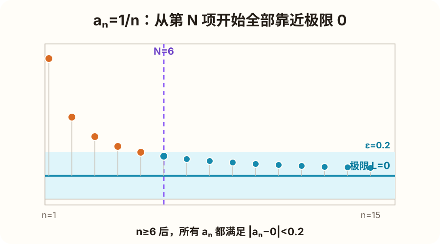

#### 完整例题

证明：

\[
\lim_{n\to\infty}\frac1n=0
\]

任取 \(\varepsilon>0\)。我们希望：

\[
\left|\frac1n-0\right|<\varepsilon
\]

因为 \(n>0\)，所以这等价于：

\[
\frac1n<\varepsilon
\qquad\Longleftrightarrow\qquad
n>\frac1\varepsilon
\]

选择：

\[
N=\left\lfloor\frac1\varepsilon\right\rfloor+1
\]

那么对所有 \(n\ge N\)，都有 \(n>1/\varepsilon\)，从而：

\[
\left|\frac1n-0\right|=\frac1n<\varepsilon
\]

因此：

\[
\boxed{\lim_{n\to\infty}\frac1n=0}
\]

#### 最重要的直觉

数列收敛不要求每一项都靠近极限，也不要求数列单调。它只要求：无论误差带缩得多窄，总能找到一个门槛 \(N\)，使得此后的所有项都留在误差带内。

#### 收敛、振荡与发散

判断数列时，不能只看它是否上下摆动，而要看摆动幅度是否最终缩小。

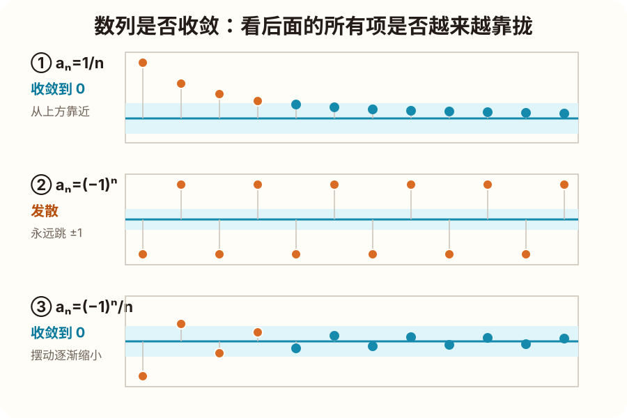

第一种：

\[
a_n=\frac1n
\]

所有项都在 \(0\) 上方，并逐渐靠近 \(0\)，因此收敛于 \(0\)。

第二种：

\[
a_n=(-1)^n=-1,1,-1,1,\ldots
\]

它永远在 \(-1\) 和 \(1\) 之间来回跳，摆动幅度没有缩小。无论选择多大的门槛 \(N\)，后面仍然同时出现 \(-1\) 和 \(1\)，所以它不收敛，称为发散。

第三种：

\[
a_n=\frac{(-1)^n}{n}
\]

它也正负交替，但距离 \(0\) 的大小是：

\[
|a_n|=\frac1n
\]

因为 \(1/n\to0\)，摆动幅度会不断缩小，所以：

\[
\boxed{\lim_{n\to\infty}\frac{(-1)^n}{n}=0}
\]

结论：单调不是收敛的必要条件；数列可以一边摆动，一边收敛。真正的标准是从某一项开始，后面所有项能否同时留在任意小的误差带中。

## 2026-08-16 三角学桥接复习决定

学习等价无穷小 \(1-\cos x\sim x^2/2\) 时，公式

\[
1-\cos x=2\sin^2\frac{x}{2}
\]

虽然能够代数推导，但对学习者而言出现得过于突然。这说明当前需要补的不是更多极限题，而是三角学定义、几何来源和恒等式证明。

因此暂时停在这里，按
[三角学桥接复习](../00_preparation/trigonometry_bridge_review.md)
完成弧度制、单位圆、特殊角、基本恒等式、和差角、倍角与半角公式的证明、例题和练习，然后返回本节继续无穷小比较。

## 2026-08-21 返回：证明 \(1-\cos x\sim x^2/2\)

三角学桥接已经覆盖和差角、倍角、半角、降幂、积化和差与和差化积的来源和基础练习；
现在回到此前暂停的等价无穷小。

### 1. 等价无穷小的定义

当 \(x\to0\) 时，如果

\[
\lim_{x\to0}\frac{f(x)}{g(x)}=1,
\]

就记作 \(f(x)\sim g(x)\)。这表示两者都趋于 \(0\) 时，它们的比值越来越接近
\(1\)，即主导大小相同。

### 2. 证明链

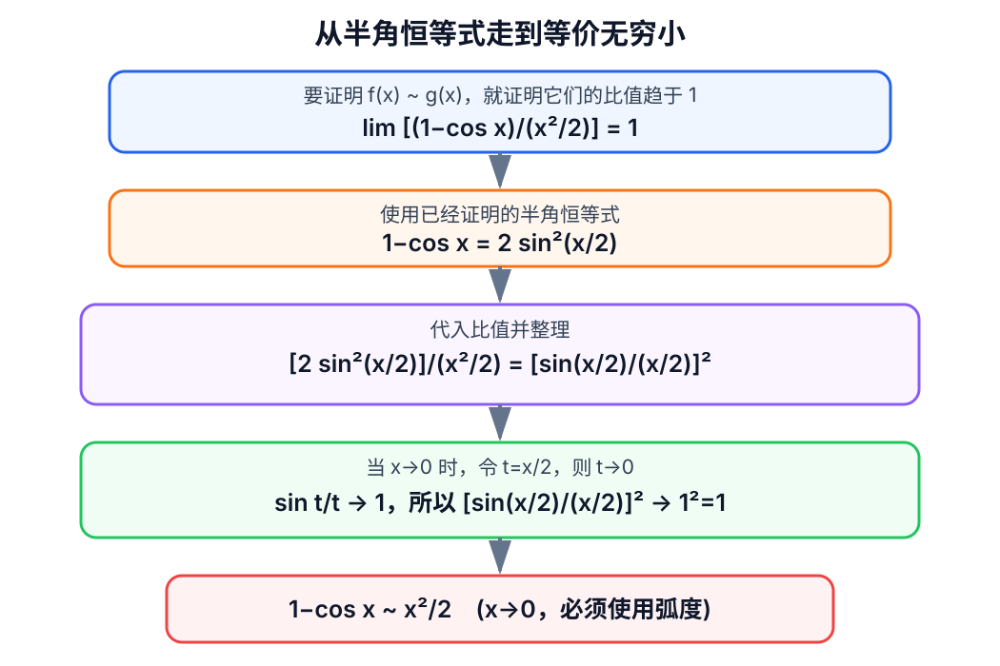

使用已经证明的恒等式：

\[
1-\cos x=2\sin^2\frac{x}{2}.
\]

于是：

\[
\begin{aligned}
\frac{1-\cos x}{x^2/2}
&=\frac{2\sin^2(x/2)}{x^2/2}\\
&=\frac{4\sin^2(x/2)}{x^2}\\
&=\left(\frac{\sin(x/2)}{x/2}\right)^2.
\end{aligned}
\]

当 \(x\to0\) 时，\(x/2\to0\)。由第一个重要极限

\[
\lim_{t\to0}\frac{\sin t}{t}=1
\]

可得：

\[
\lim_{x\to0}\frac{1-\cos x}{x^2/2}=1.
\]

所以：

\[
\boxed{1-\cos x\sim\frac{x^2}{2}\qquad(x\to0)}.
\]

这里的角必须使用弧度；\(\sin t/t\to1\) 在角度制下不成立为这个数值。

### 3. 完整例题

\[
\begin{aligned}
\lim_{x\to0}\frac{1-\cos x}{x^2}
&=\lim_{x\to0}
\frac{1-\cos x}{x^2/2}\cdot\frac12\\
&=1\cdot\frac12\\
&=\boxed{\frac12}.
\end{aligned}
\]

### 4. 当前带提示练习

先不用等价替换，直接使用恒等式，把

\[
\frac{1-\cos x}{x^2/2}
\]

中的 \(1-\cos x\) 换成含 \(\sin(x/2)\) 的表达式；第一步只写代换后的分式，
暂不继续化简。

学习者通过截图正确填写分子 \(2\sin^2(x/2)\)，即：

\[
\frac{1-\cos x}{x^2/2}
=\frac{2\sin^2(x/2)}{x^2/2}.
\]

当前下一步只处理“除以 \(x^2/2\)”并写成单个分式，暂不改写为平方比值。

学习者首次将
\(2\sin^2(x/2)\cdot 2/x^2\) 回答为 \(2\)。该回答同时漏掉了
\(\sin^2(x/2)\)、分母 \(x^2\)，并没有完成系数 \(2\times2\)。当前拆成最小一步：
只计算系数 \(2\times2\)，其余因子原样保留。

学习者已正确订正数字系数为 \(4\)。当前把 \(\sin^2(x/2)\) 与分母 \(x^2\)
原样放回，写成完整单分式。

学习者随后明确表示“lost”。暂停继续追问，改用占位符
\(A=\sin^2(x/2)\) 和保存的流程图重建整体结构：

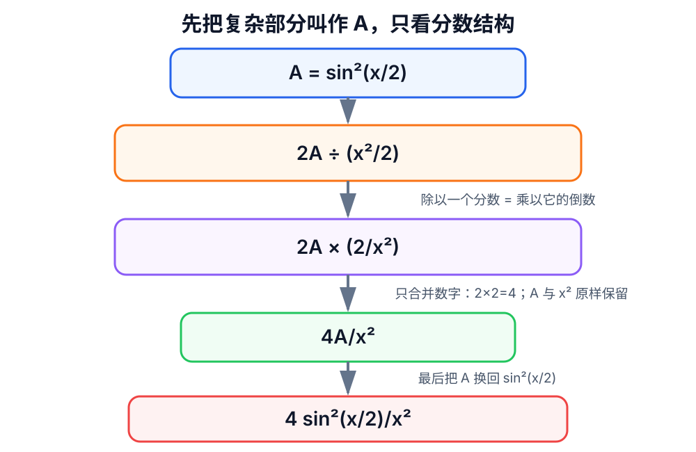

\[
\frac{2A}{x^2/2}
=2A\div\frac{x^2}{2}
=2A\cdot\frac{2}{x^2}
=\frac{4A}{x^2}.
\]

再把 \(A\) 换回去，得到 \(4\sin^2(x/2)/x^2\)。当前先不要求继续极限证明，只
检查“除以 \(x^2/2\)”为什么要乘以 \(2/x^2\)。

学习者已正确回答 \(x^2/2\) 的倒数是 \(2/x^2\)。当前继续保留占位符 \(A\)，只把
\(2A\cdot2/x^2\) 合并为一个分式。

学习者正确合并为 \(4A/x^2\)，系数、占位符和分母均完整保留。当前只把
\(A=\sin^2(x/2)\) 换回，暂不继续下一种等价形式。

学习者通过手写图片正确换回：

\[
\frac{4\sin^2(x/2)}{x^2}.
\]

复合分数整理已完成。下一步继续拆小：先确认 \(x^2/4=(x/2)^2\)，再把整个分式
写成 \([\sin(x/2)/(x/2)]^2\)。

学习者首次把 \(x^2/4\) 的平方底数回答为 \(2/x\)。这是倒数方向混淆；因为

\[
\left(\frac2x\right)^2=\frac4{x^2}\ne\frac{x^2}{4}.
\]

当前按分子、分母分别开平方：\(\sqrt{x^2}\) 对应 \(x\)（此处作为代数平方结构），
\(\sqrt4=2\)，所以等待订正为 \((x/2)^2\)。

学习者已正确订正方框为 \(x/2\)，即
\(x^2/4=(x/2)^2\)。当前把
\(\sin^2(x/2)/(x/2)^2\) 合并成一个比值的平方。

学习者正确填写分子 \(\sin(x/2)\)、分母 \(x/2\)，得到

\[
\left(\frac{\sin(x/2)}{x/2}\right)^2.
\]

代数整理链已经完成。当前只确认 \(x\to0\) 时 \(x/2\to0\)，再应用
\(\sin t/t\to1\)。

学习者正确回答：当 \(x\to0\) 时，\(t=x/2\to0\)。因此可以对
\(\sin(x/2)/(x/2)\) 使用第一个重要极限；当前只求该括号内比值的极限。

学习者正确回答
\(\lim_{x\to0}\sin(x/2)/(x/2)=1\)。当前只把该结果平方，完成原比值极限与等价
无穷小结论。

学习者首次把 \(1^2\) 回答为 \(4\)。这不是平方算术本身的新规则，而是把前面
\(4\sin^2(x/2)/x^2\) 中出现过的系数 \(4\) 再次带入最后一步。该系数已经通过

\[
\frac{4\sin^2(x/2)}{x^2}
=\left(\frac{\sin(x/2)}{x/2}\right)^2
\]

完整吸收到平方比值中，不能重复计算。当前只检查 \(1^2=1\times1\)。

学习者已正确订正 \(1^2=1\)。因此整条证明完成：

\[
\lim_{x\to0}\frac{1-\cos x}{x^2/2}
=\lim_{x\to0}\left(\frac{\sin(x/2)}{x/2}\right)^2
=1,
\]

所以 \(1-\cos x\sim x^2/2\)。当前进入第一道直接应用：求
\(\lim_{x\to0}(1-\cos x)/x^2\)。

学习者正确得到该极限为 \(1/2\)。当前无提示变式：

\[
\lim_{x\to0}\frac{1-\cos(2x)}{x^2},
\]

要求把等价式中的整个角 \(2x\) 平方后再化简。

学习者正确写出
\(1-\cos(2x)\sim\tfrac12(2x)^2\)，说明能够把整个复合角平方。当前只化简
\(\tfrac12(2x)^2\)，再除以原分母 \(x^2\)。

学习者正确展开 \((2x)^2=4x^2\)。当前只计算
\(\tfrac12\cdot4x^2\)，暂不与原分母约分。

学习者正确得到 \(\tfrac12\cdot4x^2=2x^2\)，即
\(1-\cos(2x)\sim2x^2\)。当前代回原极限并约去 \(x^2\)。

学习者最终正确得到

\[
\lim_{x\to0}\frac{1-\cos(2x)}{x^2}=2.
\]

本题各局部步骤均正确，但在 Tutor 分步引导下完成，仍保持 `Developing`。当前换为
\(3x\) 做完整无提示变式：求
\(\lim_{x\to0}[1-\cos(3x)]/x^2\)。

学习者无提示给出最终值 \(9/2\)，结果正确，但未写要求中的等价替换行。当前只补写
\(1-\cos(3x)\sim(3x)^2/2=9x^2/2\)，以确认复合角平方依据。

学习者明确表示“pass，已经掌握了”。按要求结束当堂补写，不再追问；由于等价替换行
未实际提交且此前证明需要多次分步提示，本知识点保持 `Developing`，留待跨日无提示
复测。

## 2026-08-21 推导 \(\tan x\sim x\)

当 \(x\to0\) 且使用弧度时：

\[
\boxed{\tan x\sim x}.
\]

按等价无穷小定义，需要证明 \(\tan x/x\to1\)。证明链如下：

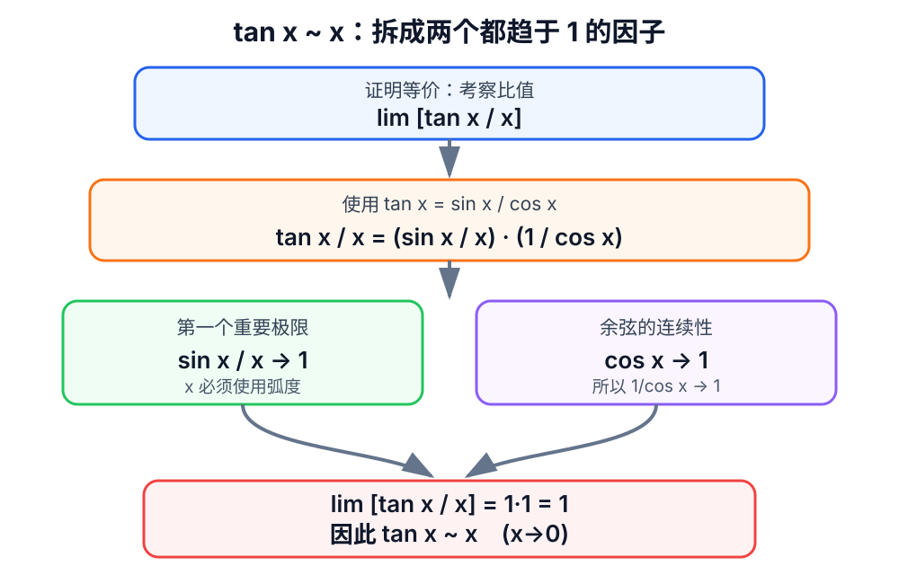

由 \(\tan x=\sin x/\cos x\)：

\[
\frac{\tan x}{x}
=\frac{\sin x}{x}\cdot\frac1{\cos x}.
\]

当 \(x\to0\) 时，\(\sin x/x\to1\)，同时 \(\cos x\to1\)，所以
\(1/\cos x\to1\)。因此：

\[
\lim_{x\to0}\frac{\tan x}{x}=1\cdot1=1.
\]

### 完整例题

\[
\begin{aligned}
\lim_{x\to0}\frac{\tan(3x)}{x}
&=3\lim_{x\to0}\frac{\tan(3x)}{3x}\\
&=3\cdot1\\
&=\boxed{3}.
\end{aligned}
\]

### 当前带提示练习

\[
\boxed{\lim_{x\to0}\frac{\tan(5x)}{2x}}
\]

先把它整理成“常数乘以 \(\tan(5x)/(5x)\)”的形式。

学习者正确填写常数 \(5/2\)：

\[
\frac{\tan(5x)}{2x}
=\frac52\cdot\frac{\tan(5x)}{5x}.
\]

当前只使用 \(\tan(5x)/(5x)\to1\) 完成最终值。

学习者正确得到最终极限 \(5/2\)。带提示练习完成；当前无提示变式：

\[
\lim_{x\to0}\frac{\tan(4x)}{3x}.
\]

要求直接写出标准极限因子与最终值。

学习者无提示直接回答 \(4/3\)，结果正确；该数同时是提取出的常数，完整依据为：

\[
\frac{\tan(4x)}{3x}
=\frac43\frac{\tan(4x)}{4x}
\longrightarrow\frac43.
\]

\(\tan x\sim x\) 的带提示练习与独立变式当堂完成，保持 `Developing`，等待跨日复测。

## 2026-08-21 等价无穷小替换的结构规则

等价无穷小描述相对误差趋于零。若 \(f\sim F\)、\(g\sim G\)，那么在分母合法的
条件下，乘积和商通常可以替换主要因子：

\[
fg\sim FG,
\qquad
\frac fg\sim\frac FG.
\]

但加法、减法不能只凭逐项等价直接替换，因为主要项可能抵消：

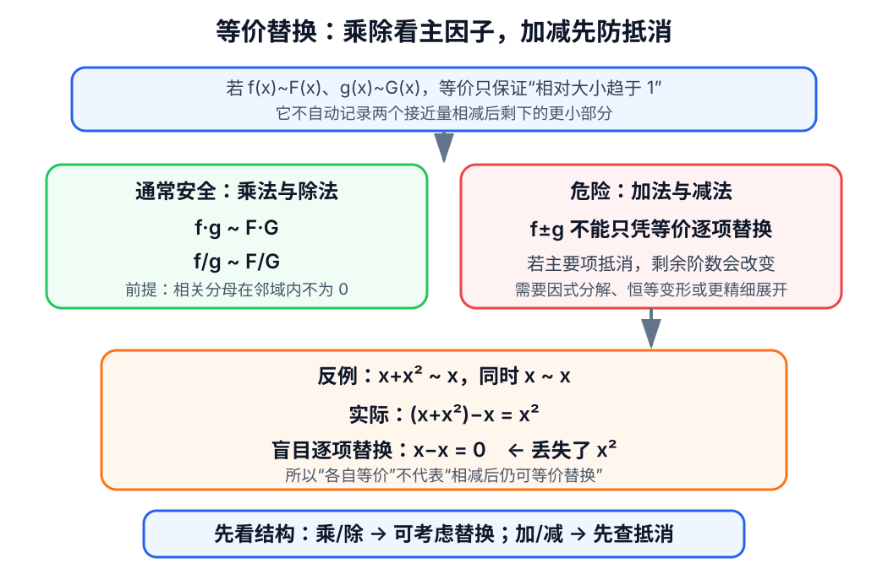

反例：当 \(x\to0\) 时，\(x+x^2\sim x\)，而另一个 \(x\sim x\)。实际相减为

\[
(x+x^2)-x=x^2,
\]

如果盲目把第一项替换为 \(x\)，只会得到 \(x-x=0\)，从而把真正剩余的 \(x^2\)
完全丢掉。

### 完整例题：安全的商结构

\[
\begin{aligned}
\lim_{x\to0}\frac{\sin(3x)}{\tan(2x)}
&=\lim_{x\to0}\frac{3x}{2x}\\
&=\boxed{\frac32}.
\end{aligned}
\]

这里分子、分母分别作为商的完整因子，使用
\(\sin(3x)\sim3x\)、\(\tan(2x)\sim2x\) 是安全的。

### 当前带提示练习

计算：

\[
\boxed{\lim_{x\to0}\frac{\sin(5x)}{\tan(3x)}}.
\]

第一步只分别写出分子和分母的等价无穷小。

学习者表示此类题已经比较熟练，要求后续省略分步，并直接正确回答 \(5/3\)：

\[
\lim_{x\to0}\frac{\sin(5x)}{\tan(3x)}
=\frac53.
\]

后续对“线性复合角 + 乘除结构”直接要求完整答案；仅在新概念或实际错误处恢复分步。
当前转入加减抵消风险判断：只判断能否在
\((\sin x-x)/x^3\) 中直接用 \(\sin x\sim x\) 把分子替换为 \(0\)，不要求计算
该极限的真实值。

学习者正确回答“不能，减法不适用直接等价无穷小替换”。加减抵消风险判断通过。

### 从危险差式转换为安全乘积

以

\[
\lim_{x\to0}\frac{\tan x-\sin x}{x^3}
\]

为例，不能直接把 \(\tan x\) 与 \(\sin x\) 都替换为 \(x\)。先做精确恒等变形：

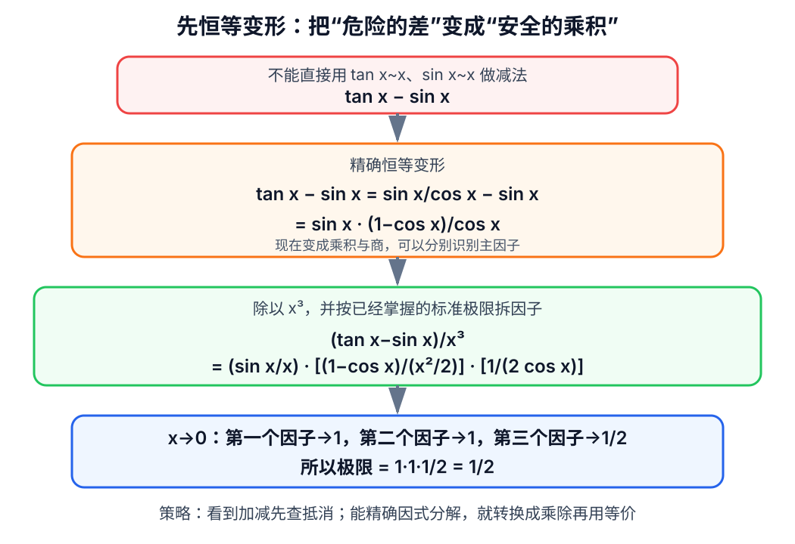

\[
\begin{aligned}
\tan x-\sin x
&=\frac{\sin x}{\cos x}-\sin x\\
&=\sin x\left(\frac1{\cos x}-1\right)\\
&=\frac{\sin x(1-\cos x)}{\cos x}.
\end{aligned}
\]

于是：

\[
\begin{aligned}
\frac{\tan x-\sin x}{x^3}
&=\frac{\sin x}{x}
  \cdot\frac{1-\cos x}{x^2/2}
  \cdot\frac1{2\cos x}\\
&\longrightarrow1\cdot1\cdot\frac12\\
&=\boxed{\frac12}.
\end{aligned}
\]

这里没有在减法中直接替换，而是先用恒等变形把它改成乘除结构。

### 当前变式

直接计算：

\[
\boxed{\lim_{x\to0}\frac{\tan(2x)-\sin(2x)}{x^3}}.
\]

这是新结构，可以写关键变形；不要求拆成 Tutor 的逐步问答。

学习者在作答变式前追问：如何想到把

\[
\frac{\sin x(1-\cos x)}{x^3\cos x}
\]

拆成三个标准因子。关键不是猜，而是从已知标准极限倒推分母配对：看到 \(\sin x\)
就配 \(x\)，看到 \(1-\cos x\) 就配 \(x^2/2\)。原分母可精确拆为：

\[
x^3\cos x=x\cdot\frac{x^2}{2}\cdot2\cos x.
\]

因此第三块必然剩下 \(2\cos x\)：

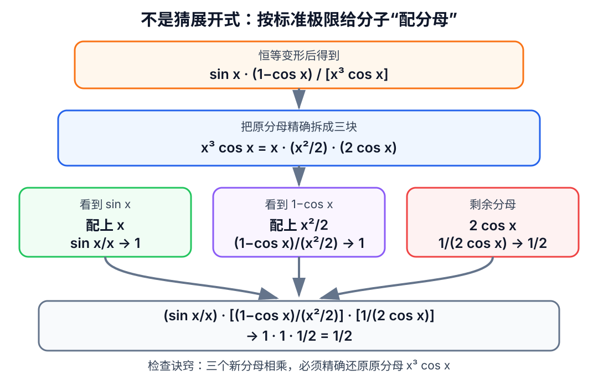

\[
\frac{\sin x(1-\cos x)}{x^3\cos x}
=\frac{\sin x}{x}
 \cdot\frac{1-\cos x}{x^2/2}
 \cdot\frac1{2\cos x}.
\]

也可以使用更快的等价替换写成
\(\sin x(1-\cos x)/(x^3\cos x)\sim x(x^2/2)/(x^3\cdot1)=1/2\)；上面的
拆因子形式只是把每一个依据显式展示出来。

学习者正确验证
\(x\cdot(x^2/2)\cdot(2\cos x)=x^3\cos x\)，说明已理解三个标准因子的分母如何
精确还原原分母。当前返回先前暂停的
\(\lim_{x\to0}[\tan(2x)-\sin(2x)]/x^3\)，直接完整作答。

学习者首次回答 \(1/2\)。该值只对应基础变量 \(u=x\) 时
\((\tan u-\sin u)/u^3\to1/2\)，没有处理复合角 \(u=2x\) 的三次缩放。由基础结论

\[
\tan u-\sin u\sim\frac{u^3}{2}
\]

令 \(u=2x\) 时，整个 \(2x\) 必须立方：

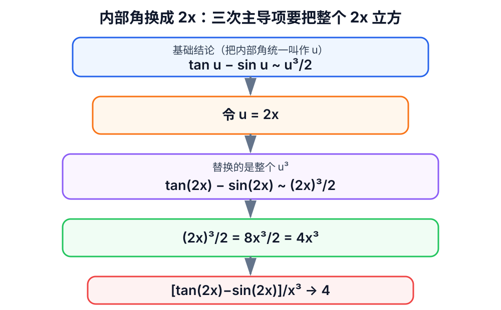

\[
\tan(2x)-\sin(2x)
\sim\frac{(2x)^3}{2}
=4x^3.
\]

因此目标极限应为 \(4\)。当前只先订正 \((2x)^3\) 的展开，再重写最终值。

会话在此暂停：学习者要求先 push 后下班。当前精确续学点是回答
\((2x)^3\)；正确展开应保留整个复合角的三次缩放，完成后再把目标极限从首次误答
\(1/2\) 订正为 \(4\)。该订正尚未由学习者亲自完成，下一台设备从这里继续。

续学后，学习者已正确回答 \((2x)^3=8x^3\)。当前只计算
\((2x)^3/2=8x^3/2\)，再完成最终极限订正。

学习者已正确得到 \(8x^3/2=4x^3\)，即
\(\tan(2x)-\sin(2x)\sim4x^3\)。当前只将其除以原分母 \(x^3\)，完成最终值。

学习者最终正确订正：

\[
\lim_{x\to0}\frac{\tan(2x)-\sin(2x)}{x^3}=4.
\]

复合角三次缩放的当堂订正完成。当前不分步复测：
\(\lim_{x\to0}[\tan(3x)-\sin(3x)]/x^3\)。

学习者无提示正确回答 \(27/2\)。复合角三次缩放的换题复测通过；该知识点保持
`Developing`，等待跨日复测。

## 2026-08-21 连续函数的运算规则

若 \(f\)、\(g\) 都在 \(x=a\) 处连续，则：

\[
f+g,\qquad f-g,\qquad fg
\]

都在 \(a\) 处连续。商还需要额外条件：

\[
\frac fg\quad\text{在 }a\text{ 处连续，前提是 }g(a)\ne0.
\]

复合函数的条件是：\(g\) 在 \(a\) 处连续，并且外层函数 \(f\) 在 \(g(a)\) 处
连续，则 \(f(g(x))\) 在 \(a\) 处连续。

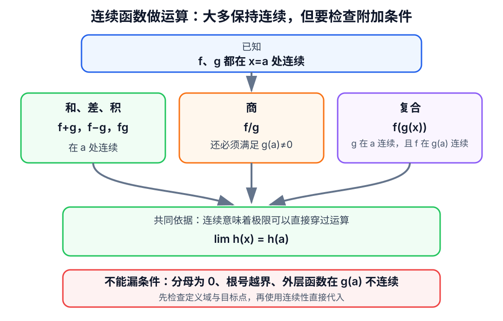

这些结论都来自极限运算法则。例如：

\[
\lim_{x\to a}[f(x)+g(x)]
=\lim_{x\to a}f(x)+\lim_{x\to a}g(x)
=f(a)+g(a).
\]

商的分母条件不能省略，因为只有 \(g(a)\ne0\) 时，极限的商法则才能直接使用。

### 完整例题

设

\[
h(x)=\frac{x^2+\cos x}{2+\sin x}.
\]

多项式、正弦和余弦处处连续，并且 \(2+\sin x\in[1,3]\)，分母处处不为零，所以
\(h\) 在全体实数上连续。特别地：

\[
\lim_{x\to0}h(x)=h(0)=\frac{0^2+1}{2+0}=\frac12.
\]

### 当前判断题

函数

\[
p(x)=\frac{\sqrt{x+1}}{x-2}
\]

是否在 \(x=0\) 处连续？直接给出判断和条件检查，不做分步问答。

学习者判断“连续”，结论正确，但没有写条件检查。当前只补充：根号内
\(0+1=1\) 在定义域内，且分母 \(0-2=-2\ne0\)。两项都确认后，本题才完整通过。

学习者已正确复述：“在目标点有定义且分母不为 \(0\)”。当前独立变式仍使用
\(p(x)=\sqrt{x+1}/(x-2)\)，改为判断它在 \(x=2\) 是否连续并说明原因。

学习者正确回答“不连续，分母为 \(0\)”。连续函数的商与复合条件检查完成，保持
`Developing`，等待跨日复测；按计划返回导数主线，从商法则继续。

## 当前掌握状态

- [x] 能区分函数值与极限值。
- [x] 能从图像判断空心点和实心点的含义。
- [x] 知道左右极限相等是两侧极限存在的必要条件。
- [ ] 能稳定区分“左右极限不相等”和“极限值不等于函数值”两类间断。
- [ ] 能从数值、图像和代数三个角度解释同一个极限。
- [ ] 能独立完成常见代数型极限计算。
- [x] 能使用直接代入和基本运算法则计算基础极限。
- [ ] 能在无提示时稳定完成因式分解与共轭有理化。
- [x] 能在当前练习中区分空点、竖直渐近线与水平渐近线。
- [ ] 能在间隔复习后仍独立算出竖直渐近线与水平渐近线。
- [x] 能在当前练习中用多项式除法求斜渐近线。
- [ ] 能在间隔复习后仍独立求出斜渐近线。
- [x] 能在基础不等式中识别夹逼定理的共同极限。
- [x] 能在当前练习中使用两个重要极限完成基础变式。
- [x] 能为线性函数的基础极限选择 \(\delta\)。
- [ ] 能在间隔复测中稳定区分 \(\varepsilon\) 是输出误差、\(\delta\) 是输入距离。
- [x] 能在当前存在性题中检查连续、端点异号，并正确写出开区间内的零点结论。
- [ ] 能准确写出闭区间连续函数的性质和零点定理全部条件。
- [x] 能在当前练习中区分普通连续与一致连续，并为线性函数选择统一的 \(\delta\)。
- [x] 能解释数列极限中 \(\varepsilon\) 和 \(N\) 的角色，并为 \(1/n\) 找到门槛项。
- [ ] 能从余弦二倍角公式推出 \(1-\cos x=2\sin^2(x/2)\)，而不是孤立背诵。

## 下次学习起点

- [x] 先学习闭区间连续函数的有界性与最大值最小值定理。
- [x] 正式学习零点定理，明确它与介值定理的从属关系和全部条件。
- [x] 学习一致连续性的定义、闭区间定理和基础证明。
- [x] 学习数列极限的严格定义、离散图像直觉和基础 \(N\) 选择。
- [ ] 用短单元补数列极限、无穷小比较和连续函数运算。
- [ ] 先完成三角学桥接复习，再返回 \(1-\cos x\) 的等价无穷小。
- [ ] 补全后返回导数主线，从商法则继续。
- [ ] 跨日复测导数函数与指定点斜率、\(\varepsilon\)/\(\delta\) 角色以及渐近线负号稳定性。
- [ ] 2026-08-19：间隔复测空点、三类渐近线与负号运算稳定性。

## 教材配合

- 主教材：斯图尔特微积分（第 9 版），按极限与连续相关章节推进。
- 辅助教材：普林斯顿微积分读本，用于补充直觉和处理卡点。
- 暂不绑定具体页码；待确认中文版目录或 ISBN 后再精确对应。
