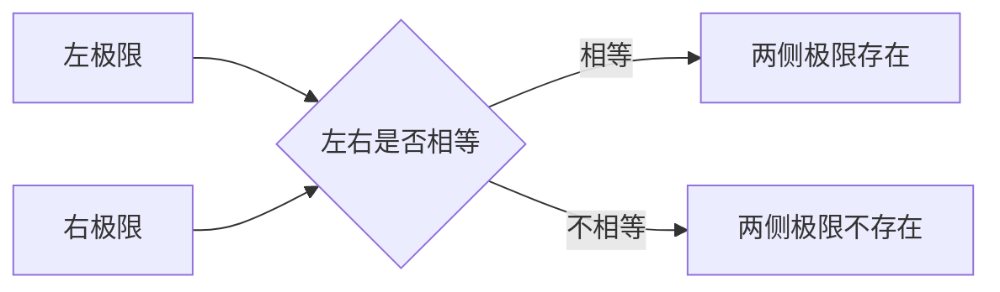

# Week 2 极限与连续

## 本章学习方式

从本章开始，新知识采用“先讲后练”；旧知识的间隔复习仍采用“先独立回忆”。

## 2026-08-11 学习记录

### 1. 极限的直觉

记号

\[
\lim_{x\to a}f(x)=L
\]

表示：当 \(x\) 越来越接近 \(a\) 时，\(f(x)\) 越来越接近 \(L\)。

极限观察的是某一点附近的变化趋势，不要求 \(x=a\)，因此 \(f(a)\) 是否存在不一定影响极限。

### 2. 例题：函数值不存在，但极限存在

求

\[
\lim_{x\to2}\frac{x^2-4}{x-2}
\]

先因式分解：

\[
x^2-4=(x-2)(x+2)
\]

当 \(x\ne2\) 时：

\[
\frac{x^2-4}{x-2}
=\frac{(x-2)(x+2)}{x-2}
=x+2
\]

所以当 \(x\to2\) 时：

\[
x+2\to4
\]

即

\[
\boxed{\lim_{x\to2}\frac{x^2-4}{x-2}=4}
\]

原式在 \(x=2\) 时分母为零，没有函数值；但图像在 \((2,4)\) 处只有一个空点，附近的函数值仍从两侧趋近 \(4\)。

### 3. 函数值与极限值

- \(f(a)\)：只看 \(x=a\) 这一个点的实际取值。
- \(\lim_{x\to a}f(x)\)：看 \(x\) 从附近接近 \(a\) 时的趋势。

例：

\[
g(x)=
\begin{cases}
x+1,&x\ne2,\\
10,&x=2
\end{cases}
\]

在 \(x=2\) 处：

\[
g(2)=10,
\qquad
\lim_{x\to2}g(x)=3
\]

图像上，\((2,3)\) 是直线上的空心点，\((2,10)\) 是表示函数值的实心点。因此函数值与极限值可以不同。

### 4. 带提示练习及结果

已知

\[
h(x)=
\begin{cases}
x^2,&x\ne1,\\
5,&x=1
\end{cases}
\]

本轮独立回答：

\[
h(1)=5,
\qquad
\lim_{x\to1}h(x)=1
\]

判断正确：函数值看 \(x=1\) 处的单独规定，极限值看附近的 \(x^2\)。

### 5. 左极限与右极限

- \(\lim_{x\to a^-}f(x)\)：\(x\) 从 \(a\) 的左侧接近，称为左极限。
- \(\lim_{x\to a^+}f(x)\)：\(x\) 从 \(a\) 的右侧接近，称为右极限。

两侧极限存在的判断关系：

例：

\[
f(x)=
\begin{cases}
0,&x<1,\\
2,&x\ge1
\end{cases}
\]

则

\[
\lim_{x\to1^-}f(x)=0,
\qquad
\lim_{x\to1^+}f(x)=2
\]

由于左右极限不相等，\(\lim_{x\to1}f(x)\) 不存在；实心点为 \((1,2)\)，所以 \(f(1)=2\)。

### 6. 连续的定义

函数 \(f(x)\) 在 \(x=a\) 处连续，需要同时满足：

1. \(f(a)\) 存在。
2. \(\lim_{x\to a}f(x)\) 存在。
3. \(\lim_{x\to a}f(x)=f(a)\)。

缺少任何一项，函数都不在该点连续。

### 7. 今日纠错

对于

\[
h(x)=
\begin{cases}
x^2,&x\ne1,\\
5,&x=1
\end{cases}
\]

曾把“不连续”的原因写成“左右极限不相等”。实际情况是：

\[
\lim_{x\to1^-}h(x)
=\lim_{x\to1^+}h(x)
=1
\]

左右极限相等，因此极限存在；不连续的真正原因是

\[
\lim_{x\to1}h(x)=1\ne h(1)=5
\]

错误类型：连续条件混淆。需要分别检查“函数值、极限是否存在、两者是否相等”，不能只检查左右极限。

## 图形复习

### 空心点与极限

### 可去间断与跳跃间断

## 当前掌握状态

- [x] 能区分函数值与极限值。
- [x] 能从图像判断空心点和实心点的含义。
- [x] 知道左右极限相等是两侧极限存在的必要条件。
- [ ] 能稳定区分“左右极限不相等”和“极限值不等于函数值”两类间断。
- [ ] 能从数值、图像和代数三个角度解释同一个极限。
- [ ] 能独立完成常见代数型极限计算。

## 下次学习起点

- 先用一个例子区分两类间断：跳跃间断与可去间断。
- 再学习极限的直接代入与基本运算法则。
- 完成一道带提示练习和一道独立变式。

## 教材配合

- 主教材：斯图尔特微积分（第 9 版），按极限与连续相关章节推进。
- 辅助教材：普林斯顿微积分读本，用于补充直觉和处理卡点。
- 暂不绑定具体页码；待确认中文版目录或 ISBN 后再精确对应。
