# 导数：从平均变化率到瞬时变化率

> 开始日期：2026-08-15
>
> 进入证据：Week 2 极限与连续章节检查 \(3.5/4=87.5\%\)。

## 1. 导数的严格定义

如果极限存在，函数 \(f\) 在 \(x=a\) 处的导数定义为：

\[
\boxed{
f'(a)=\lim_{h\to0}\frac{f(a+h)-f(a)}{h}
}
\]

其中：

- \(a\) 是固定的目标输入。
- \(h\) 是从 \(a\) 到附近输入 \(a+h\) 的横向变化。
- \(f(a+h)-f(a)\) 是对应的纵向变化。
- 差商 \(\frac{f(a+h)-f(a)}{h}\) 是两点之间的割线斜率，也是平均变化率。
- 当 \(h\to0\) 时，附近点靠近目标点；割线斜率的极限就是切线斜率和瞬时变化率。

等价形式为：

\[
f'(a)=\lim_{x\to a}\frac{f(x)-f(a)}{x-a}
\]

## 2. 几何直观：割线逼近切线

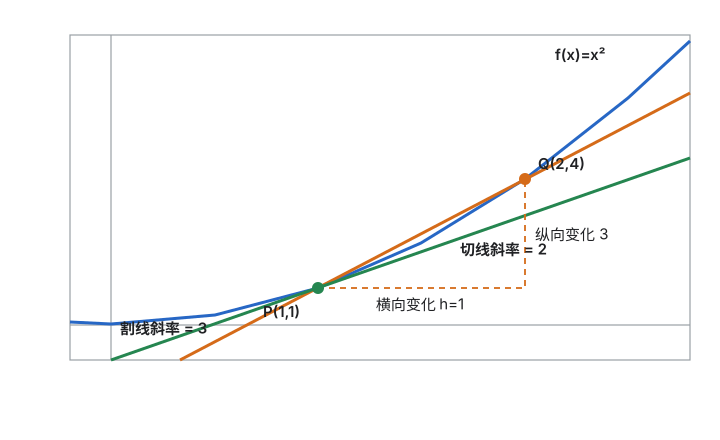

## 3. 完整例题：由定义求 \(f(x)=x^2\) 在 \(x=1\) 处的导数

\[
\begin{aligned}
f'(1)
&=\lim_{h\to0}\frac{f(1+h)-f(1)}{h}\\
&=\lim_{h\to0}\frac{(1+h)^2-1}{h}\\
&=\lim_{h\to0}\frac{1+2h+h^2-1}{h}\\
&=\lim_{h\to0}\frac{2h+h^2}{h}\\
&=\lim_{h\to0}(2+h)\\
&=2
\end{aligned}
\]

因此：

\[
\boxed{f'(1)=2}
\]

点 \(P(1,1)\) 处的切线斜率为 \(2\)，切线方程为：

\[
y-1=2(x-1)
\]

即：

\[
\boxed{y=2x-1}
\]

## 当前掌握状态

- [ ] 能用自己的话解释割线斜率与切线斜率的关系。
- [ ] 能识别差商中的横向变化与纵向变化。
- [ ] 能从导数定义独立计算一个二次函数在指定点的导数。
- [ ] 能从点和导数写出切线方程。

## 4. 幂函数求导公式

> 掌握状态：学习者确认已非常熟悉，跳过当堂重复练习；保留跨日抽查，不把自述熟练直接等同于长期 Mastered。

先从导数定义推导 \(f(x)=x^3\)：

\[
\begin{aligned}
f'(x)
&=\lim_{h\to0}\frac{(x+h)^3-x^3}{h}\\
&=\lim_{h\to0}
\frac{x^3+3x^2h+3xh^2+h^3-x^3}{h}\\
&=\lim_{h\to0}
\left(3x^2+3xh+h^2\right)\\
&=3x^2
\end{aligned}
\]

因此：

\[
\boxed{(x^3)'=3x^2}
\]

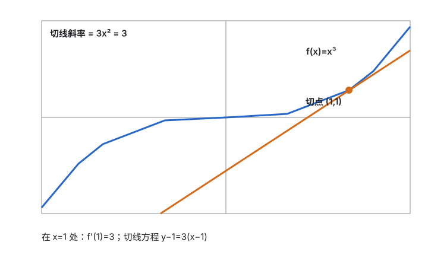

对于一般正整数 \(n\)，二项式展开的开头为：

\[
(x+h)^n=x^n+nx^{n-1}h+\text{含 }h^2\text{ 及更高次幂的项}
\]

代入导数定义，减去 \(x^n\) 并除以 \(h\) 后：

\[
\frac{(x+h)^n-x^n}{h}
=nx^{n-1}+\text{仍然含 }h\text{ 的项}
\]

当 \(h\to0\) 时，仍然含 \(h\) 的项全部趋近 \(0\)，因此得到幂函数求导公式：

\[
\boxed{(x^n)'=nx^{n-1}}
\]

使用规则：

1. 原指数 \(n\) 移到前面成为系数。
2. 原指数减去 \(1\)。

例如：

\[
(x^5)'=5x^4
\]

## 5. 导数的线性运算法则

> 掌握状态：学习者确认已非常熟练，跳过当堂重复练习；保留跨日抽查。

设函数 \(u(x)\)、\(v(x)\) 在当前点可导，\(c\) 是常数，则：

\[
\boxed{(u+v)'=u'+v'}
\]

\[
\boxed{(u-v)'=u'-v'}
\]

\[
\boxed{(cu)'=cu'}
\]

### 5.1 从导数定义推导加法法则

令 \(F(x)=u(x)+v(x)\)，根据导数定义：

\[
\begin{aligned}
F'(x)
&=\lim_{h\to0}\frac{F(x+h)-F(x)}{h}\\
&=\lim_{h\to0}\frac{u(x+h)+v(x+h)-u(x)-v(x)}{h}\\
&=\lim_{h\to0}
\left[
\frac{u(x+h)-u(x)}{h}
+\frac{v(x+h)-v(x)}{h}
\right]\\
&=u'(x)+v'(x)
\end{aligned}
\]

减法法则同理，只需把中间的加号换成减号。

### 5.2 从导数定义推导常数倍法则

令 \(G(x)=cu(x)\)：

\[
\begin{aligned}
G'(x)
&=\lim_{h\to0}\frac{cu(x+h)-cu(x)}{h}\\
&=c\lim_{h\to0}\frac{u(x+h)-u(x)}{h}\\
&=cu'(x)
\end{aligned}
\]

### 5.3 几何直观

函数相加时，在同一个横坐标 \(x_0\) 处，两个函数的纵向变化相加，所以它们的切线斜率也相加：

\[
m_{u+v}=m_u+m_v
\]

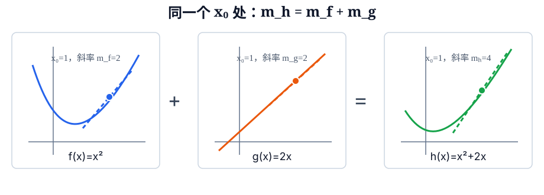

### 5.4 完整例题

求：

\[
y=3x^4-2x^2+7
\]

逐项求导：

\[
\begin{aligned}
y'
&=(3x^4)'-(2x^2)'+(7)'\\
&=3(x^4)'-2(x^2)'+0\\
&=3\cdot4x^3-2\cdot2x\\
&=\boxed{12x^3-4x}
\end{aligned}
\]

其中常数 \(7\) 不随 \(x\) 改变，因此变化率为 \(0\)：

\[
\boxed{(7)'=0}
\]

## 6. 乘积求导法则

> 掌握状态：学习者确认已比较熟练，跳过当堂重复练习；保留跨日抽查。

设 \(u(x)\)、\(v(x)\) 都可导，则：

\[
\boxed{(uv)'=u'v+uv'}
\]

注意：不能写成 \(u'v'\)。

### 6.1 几何直观：长方形面积变化

把 \(u\) 和 \(v\) 看成长方形的两条边，面积为 \(uv\)。当两条边分别增加
\(\Delta u\) 和 \(\Delta v\) 时，新增面积为：

\[
\Delta(uv)=v\Delta u+u\Delta v+\Delta u\Delta v
\]

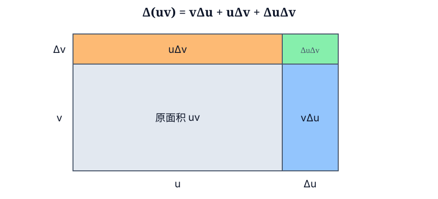

最后一块 \(\Delta u\Delta v\) 同时含有两个很小的变化量。除以输入变化量并令其趋近于 \(0\) 时，这一项的贡献趋近于 \(0\)，留下另外两项。

### 6.2 从导数定义严格推导

令 \(F(x)=u(x)v(x)\)：

\[
F'(x)=\lim_{h\to0}\frac{u(x+h)v(x+h)-u(x)v(x)}{h}
\]

在分子中加上再减去 \(u(x+h)v(x)\)：

\[
\begin{aligned}
F'(x)
&=\lim_{h\to0}
\frac{u(x+h)v(x+h)-u(x+h)v(x)}{h}\\
&\quad+\lim_{h\to0}
\frac{u(x+h)v(x)-u(x)v(x)}{h}\\
&=\lim_{h\to0}
u(x+h)\frac{v(x+h)-v(x)}{h}\\
&\quad+\lim_{h\to0}
v(x)\frac{u(x+h)-u(x)}{h}\\
&=u(x)v'(x)+v(x)u'(x)
\end{aligned}
\]

所以：

\[
\boxed{(uv)'=u'v+uv'}
\]

### 6.3 完整例题

求：

\[
y=x^2(x+3)
\]

令：

\[
u=x^2,\qquad v=x+3
\]

那么：

\[
u'=2x,\qquad v'=1
\]

使用乘积法则：

\[
\begin{aligned}
y'
&=u'v+uv'\\
&=2x(x+3)+x^2\cdot1\\
&=2x^2+6x+x^2\\
&=\boxed{3x^2+6x}
\end{aligned}
\]

## 7. 商法则

设 \(u(x)\)、\(v(x)\) 都可导，并且 \(v(x)\ne0\)，则：

\[
\boxed{
\left(\frac uv\right)'
=\frac{u'v-uv'}{v^2}
}.
\]

分子顺序不能颠倒：先写“分子的导数乘分母”，再减“分子乘分母的导数”；分母整体
平方。

### 7.1 从乘积法则推出商法则

令

\[
y=\frac uv.
\]

不直接背商法则，而是改写为 \(u=yv\)，再使用已经学过的乘积法则：

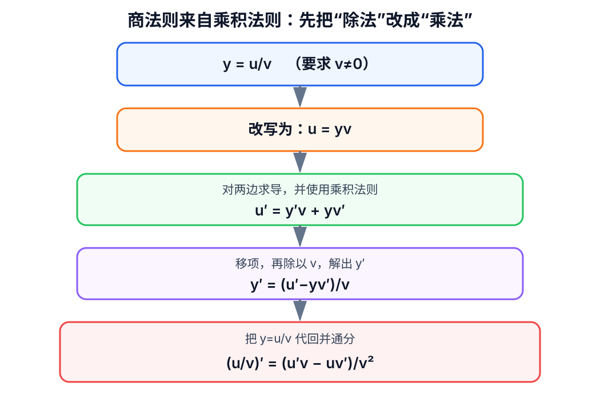

\[
u'=y'v+yv'.
\]

移项并除以 \(v\)：

\[
\begin{aligned}
u'-yv'&=y'v,\\
y'&=\frac{u'-yv'}{v}.
\end{aligned}
\]

把 \(y=u/v\) 代回。这里不省略复合分式的通分过程：

\[
\begin{aligned}
y'
&=\frac{u'-\dfrac uvv'}{v}\\[4pt]
&=\frac{\dfrac{u'v}{v}-\dfrac{uv'}{v}}{v}\\[4pt]
&=\frac{\dfrac{u'v-uv'}{v}}{v}\\[4pt]
&=\frac{u'v-uv'}{v\cdot v}\\[4pt]
&=\frac{u'v-uv'}{v^2}.
\end{aligned}
\]

倒数第二步使用的是：

\[
\frac{A/v}{v}=\frac{A}{v\cdot v}.
\]

因此分母是 \(v^2\)：代回 \(y=u/v\) 后先出现一层 \(v\)，外面原来还除以一层
\(v\)。

### 7.2 完整例题

求：

\[
y=\frac{x^2+1}{x+1},\qquad x\ne-1.
\]

令 \(u=x^2+1\)、\(v=x+1\)，则 \(u'=2x\)、\(v'=1\)。因此：

\[
\begin{aligned}
y'
&=\frac{2x(x+1)-(x^2+1)\cdot1}{(x+1)^2}\\
&=\frac{x^2+2x-1}{(x+1)^2}.
\end{aligned}
\]

### 7.3 第一道练习：已独立完成

学习者独立求导：

\[
\boxed{y=\frac{x^2+3}{x-1}},\qquad x\ne1.
\]

作答为：

\[
\begin{aligned}
y'
&=\frac{(x^2+3)'(x-1)-(x^2+3)(x-1)'}{(x-1)^2}\\
&=\frac{2x(x-1)-(x^2+3)}{(x-1)^2}\\
&=\boxed{\frac{x^2-2x-3}{(x-1)^2}}.
\end{aligned}
\]

公式顺序、分母平方、两个导数和化简均正确。

### 7.4 独立变式：已完成

求：

\[
\boxed{y=\frac{2x+1}{x^2+1}}.
\]

这次分母的导数不再是 \(1\)，需要保留完整的 \(v'=2x\)。

学习者独立得到：

\[
\begin{aligned}
y'
&=\frac{2(x^2+1)-(2x+1)\cdot2x}{(x^2+1)^2}\\
&=\boxed{\frac{-2x^2-2x+2}{(x^2+1)^2}}.
\end{aligned}
\]

公式代入、分母求导和最终化简均正确。商法则当堂练习通过，保持 `Developing`，等待
跨日复测。

## 8. 反函数求导

### 8.1 定义和条件

若函数 \(f\) 在相关区间上一一对应，则存在反函数 \(g=f^{-1}\)。若

\[
b=f(a),
\]

那么反函数会交换输入与输出：

\[
g(b)=g(f(a))=a.
\]

当 \(f\) 在 \(a\) 处可导、\(f'(a)\ne0\)，且反函数在 \(b=f(a)\) 附近存在并连续
时，有：

\[
\boxed{(f^{-1})'(b)=\frac1{f'(a)}}.
\]

等价地：

\[
\boxed{(f^{-1})'(x)=\frac1{f'(f^{-1}(x))}}.
\]

### 8.2 图像直观

函数与反函数的图像关于直线 \(y=x\) 对称。点 \((a,b)\) 交换成 \((b,a)\)，切线
的“上升量/水平移动量”也交换，所以斜率从 \(m\) 变为 \(1/m\)：

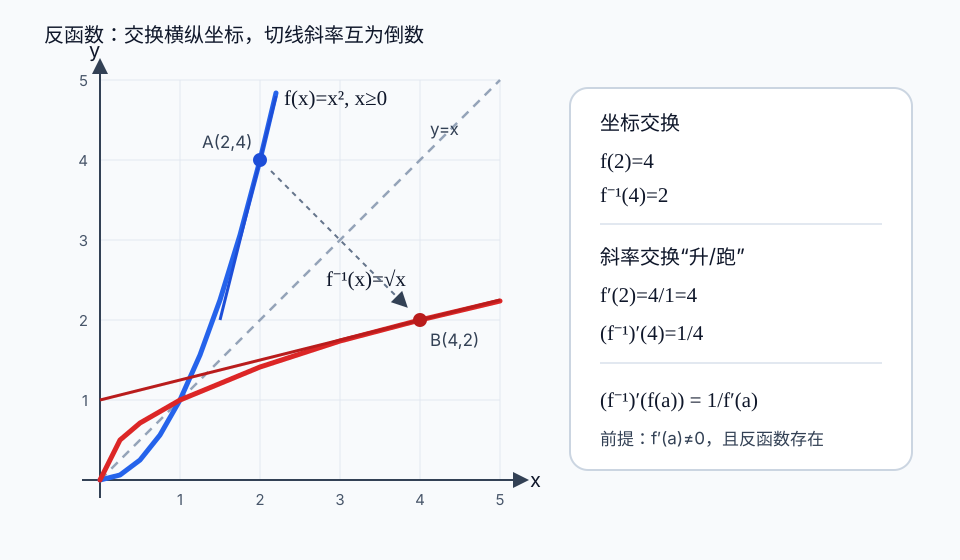

### 8.3 用导数定义推导

记 \(g=f^{-1}\)，并设 \(b=f(a)\)，所以 \(g(b)=a\)。由导数定义：

\[
g'(b)=\lim_{x\to b}\frac{g(x)-g(b)}{x-b}.
\]

令 \(t=g(x)\)。由于 \(x=f(t)\)，并且当 \(x\to b\) 时 \(t\to a\)，于是：

\[
\begin{aligned}
g'(b)
&=\lim_{t\to a}\frac{t-a}{f(t)-f(a)}\\[4pt]
&=\frac{1}{\displaystyle\lim_{t\to a}\frac{f(t)-f(a)}{t-a}}\\[6pt]
&=\boxed{\frac1{f'(a)}}.
\end{aligned}
\]

这里要求 \(f'(a)\ne0\)，因为最后需要取倒数。

### 8.4 第二种证明：复合恒等式与链式法则

这是一种更短的证明，但它依赖下一节将正式推导的链式法则。

仍记

\[
g=f^{-1}.
\]

函数与反函数连续作用会回到原来的输入，因此：

\[
f(g(x))=x.
\]

两边同时对 \(x\) 求导。左边是复合函数，使用链式法则：

\[
\frac{d}{dx}f(g(x))=f'(g(x))\cdot g'(x),
\]

右边为：

\[
\frac{d}{dx}x=1.
\]

所以：

\[
f'(g(x))\,g'(x)=1.
\]

当 \(f'(g(x))\ne0\) 时，两边除以 \(f'(g(x))\)：

\[
\boxed{g'(x)=\frac1{f'(g(x))}}
=\boxed{\frac1{f'(f^{-1}(x))}}.
\]

若 \(b=f(a)\)，那么 \(g(b)=a\)。把 \(x=b\) 代入，就得到：

\[
\boxed{(f^{-1})'(b)=\frac1{f'(a)}}.
\]

### 8.5 完整例题

令

\[
f(x)=x^2,\qquad x\ge0.
\]

它的反函数是 \(g(x)=\sqrt{x}\)。求 \(g'(4)\)。因为

\[
f(2)=4,
\]

所以 \(a=2\)、\(b=4\)。又有 \(f'(x)=2x\)，因此：

\[
g'(4)=\frac1{f'(2)}=\frac1{4}.
\]

### 8.6 第一道练习：已订正

设 \(f(x)=x^3\)，反函数为 \(g=f^{-1}\)。求：

\[
\boxed{g'(8)}.
\]

学习者先正确得到 \(g(8)=2\)，但首次把公式误写成 \(1/g(8)=1/2\)。订正时分清：

\[
\begin{aligned}
f'(x)&=3x^2,\\
f'(g(8))&=f'(2)=12,\\
g'(8)&=\frac1{f'(g(8))}=\boxed{\frac1{12}}.
\end{aligned}
\]

### 8.7 独立变式：经分步提示完成

设

\[
f(x)=x^3+x,
\]

反函数为 \(g=f^{-1}\)。不必求出 \(g(x)\) 的解析式，直接求：

\[
\boxed{g'(2)}.
\]

学习者首次遗漏 \(g(2)\) 这一层；经反向箭头提示后确认：

\[
f(1)=2\quad\Longrightarrow\quad g(2)=1.
\]

随后在计算 \(f'(1)=3\cdot1^2+1\) 时提前取倒数，并出现一次 \(3+1=5\) 的算术
错误；经提示订正为：

\[
\begin{aligned}
f'(1)&=4,\\
g'(2)&=\frac1{f'(1)}=\boxed{\frac14}.
\end{aligned}
\]

最终结果由 Tutor 带领完成，不计作独立通过。

### 8.8 矫正变式

设

\[
f(x)=2x+3,
\]

反函数为 \(g=f^{-1}\)。求 \(g'(7)\)。仍按固定顺序：先求 \(g(7)\)，再求原函数
在该点的导数，最后取倒数。

学习者正确得到 \(g(7)=2\)，但在第二步求 \(f'(x)\) 时回答 \(1/2\)，把第三步的
最终倒数提前写入第二步。新增三格流程图：

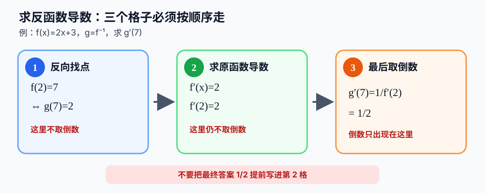

必须分别保存三个中间状态：

\[
\boxed{g(7)=2}
\quad\longrightarrow\quad
\boxed{f'(2)=2}
\quad\longrightarrow\quad
\boxed{g'(7)=\frac1{f'(2)}=\frac12}.
\]

#### 为什么本题看起来可以“原函数直接求导再取倒数”

本题的原函数是线性函数：

\[
f'(x)=2.
\]

它在每个点的导数都相同，因此无论写 \(f'(2)\) 还是 \(f'(g(7))\)，值都是 \(2\)。
所以本题确实可以快速得到 \(g'(7)=1/2\)。

但一般情况下不能把

\[
\frac1{f'(g(x))}
\]

错误地简写成

\[
\frac1{f'(x)}.
\]

例如 \(f(x)=x^2\)、\(x\ge0\)，其反函数 \(g(x)=\sqrt{x}\)。求 \(g'(4)\) 时，
反向对应点是 \(g(4)=2\)，所以：

\[
g'(4)=\frac1{f'(2)}=\frac14,
\]

而不是 \(1/f'(4)=1/8\)。必须在原图上的对应点 \(x=g(4)=2\) 取斜率，再求倒数。

学习者首次选择了 \(f'(4)\)。结合对称图，将反函数点 \((4,2)\) 交换为原函数点
\((2,4)\) 后，正确改选 \(f'(2)\)；计算 \(f'(2)\) 时先答 \(3\)，随即自行订正为
\(4\)，最终正确得到：

\[
g'(4)=\frac1{f'(2)}=\boxed{\frac14}.
\]

### 8.9 独立复测

设

\[
f(x)=x^2+1,\qquad x\ge0,
\]

反函数为 \(g=f^{-1}\)。不写出反函数解析式，直接求：

\[
\boxed{g'(10)}.
\]

学习者直接回答 \(6\)，说明已经正确定位 \(g(10)=3\) 并计算出 \(f'(3)=6\)，但漏掉
最后取倒数；经一次提示后正确订正为：

\[
g'(10)=\frac1{f'(3)}=\boxed{\frac16}.
\]

### 8.10 再复测

设

\[
f(x)=x^3+1,\qquad g=f^{-1}.
\]

不写中间提示，直接求：

\[
\boxed{g'(9)}.
\]

学习者首次回答 \(1/4\)：已找到 \(g(9)=2\)，但只对 \(2^2\) 取倒数，漏掉
\(f'(x)=3x^2\) 中的系数 \(3\)。经提示正确完成：

\[
f'(2)=12,
\qquad
g'(9)=\boxed{\frac1{12}}.
\]

### 8.11 无提示完成检查

设

\[
f(x)=2x^3-1,\qquad g=f^{-1}.
\]

直接求：

\[
\boxed{g'(15)}.
\]

学习者首次回答 \(1/16\)，即把 \(2\cdot2^3\) 当作分母，使用了原函数值而非原函数
导数；随后把 \((2x^3-1)'\) 首次写成 \(4x^2\)。经幂函数求导提示后订正：

\[
f'(x)=6x^2,
\qquad
f'(2)=24,
\qquad
g'(15)=\boxed{\frac1{24}}.
\]

最终答案正确，但经过求导提示，不计作无提示通过。

### 8.12 纯概念检查

已知 \(g=f^{-1}\)，并且：

\[
g(5)=3,
\qquad
f'(3)=7.
\]

不需要找点或求导，只使用反函数导数公式求 \(g'(5)\)。

学习者首次回答 \(1/21\)，把 \(g(5)=3\) 中已经用作 \(f'\) 输入的 \(3\) 再次与
\(f'(3)=7\) 相乘。当前按最小提示原则，只把分母替换为已经给出的函数值：

\[
f'(g(5))=f'(3)=7.
\]

学习者在提示后仍回答 \(1/21\)，于是暂时移除反函数与导数符号，用新函数 \(h\) 隔离
检查函数取值记号：

\[
h(3)=7
\quad\Longrightarrow\quad
\frac1{h(3)}=\frac17.
\]

学习者正确完成该替换，随后映射回原式并正确得到：

\[
g'(5)=\frac1{f'(g(5))}
=\frac1{f'(3)}
=\boxed{\frac17}.
\]

### 8.13 函数记号独立复测

已知 \(g=f^{-1}\)，并且：

\[
g(4)=-2,
\qquad
f'(-2)=5.
\]

直接求 \(g'(4)\)。

学习者无提示正确回答：

\[
g'(4)=\frac1{f'(g(4))}
=\frac1{f'(-2)}
=\boxed{\frac15}.
\]

### 8.14 完整计算迁移

设

\[
f(x)=x^3+2x,
\qquad
g=f^{-1}.
\]

不写中间提示，直接求：

\[
\boxed{g'(3)}.
\]

学习者无提示一次完成：

\[
f(1)=3,
\qquad
f'(1)=5,
\qquad
g'(3)=\boxed{\frac15}.
\]

反向找点、求原函数导数和最后取倒数的完整流程当堂独立通过。

### 8.15 关闭答案后的证明重写

关闭本节上方证明，不查看原文。设 \(g=f^{-1}\)，独立重写反函数导数公式的证明。
证明必须包含：

- 函数与反函数的复合恒等式；
- 两边求导后的等式；
- 解出 \(g'(x)\)；
- 可以除以 \(f'(g(x))\) 所需的条件。

重写完成后，再进行反例与隐含条件检查。

学习者评估当前尚不能独立完成该证明，请求后置。由于这条证明依赖尚未正式学习的
链式法则，证明重写合理延期到链式法则完成后；不视为失败，也不视为通过。反函数导数
的计算保持当堂通过，理论证明保持 `Developing`。

链式法则完成应用训练后已返回本任务。学习者由

\[
f(g(x))=x
\]

出发，在提示下完成：

\[
f'(g(x))g'(x)=1,
\]

继而独立解出：

\[
\boxed{g'(x)=\frac1{f'(g(x))}}.
\]

过程中第一次和第二次都把内层导数因子写成 \(g(x)\)，经明确区分“函数值 \(g(x)\)”
与“导数 \(g'(x)\)”后订正；又在只求等号右侧 \(x\) 的导数时重复写了左侧结果，经
恢复等式上下文后正确得到 \(1\)。最后正确指出解出 \(g'(x)\) 需要

\[
\boxed{f'(g(x))\ne0}.
\]

延期证明现已在微型提示下完成，状态仍为 `Developing`；后续安排一次整段无提示重写，
不能把本次跟随完成记为独立证明通过。

## 9. 链式法则

### 9.1 前置诊断：复合函数的内外层

进入动机与正式定义前，先检查能否识别复合函数的内层和外层。对

\[
y=(3x+1)^2,
\]

应能写成 \(u=3x+1\)、\(y=u^2\)。当前只做识别，不求导。

学习者正确识别内层为 \(3x+1\)；外层先回答 \(2\)，把指数当作函数，又写成
\(x^2\)，出现哑变量混用。经一级提示后自行订正为：

\[
u(x)=3x+1,
\qquad
F(u)=u^2.
\]

错误分别标记为 `Conceptual Error`（指数不是函数）和 `Notation Error`（\(F(u)\)
右侧应使用同一输入符号 \(u\)）。

### 9.2 动机与直观：变化率经过两道机器

复合函数不是一步完成：输入 \(x\) 先经过内层 \(g\) 变成 \(u=g(x)\)，再经过外层
\(f\) 变成 \(y=f(u)\)。如果内层把变化放大 \(g'(x)\) 倍，外层又把中间变化放大
\(f'(u)\) 倍，总倍率应相乘：

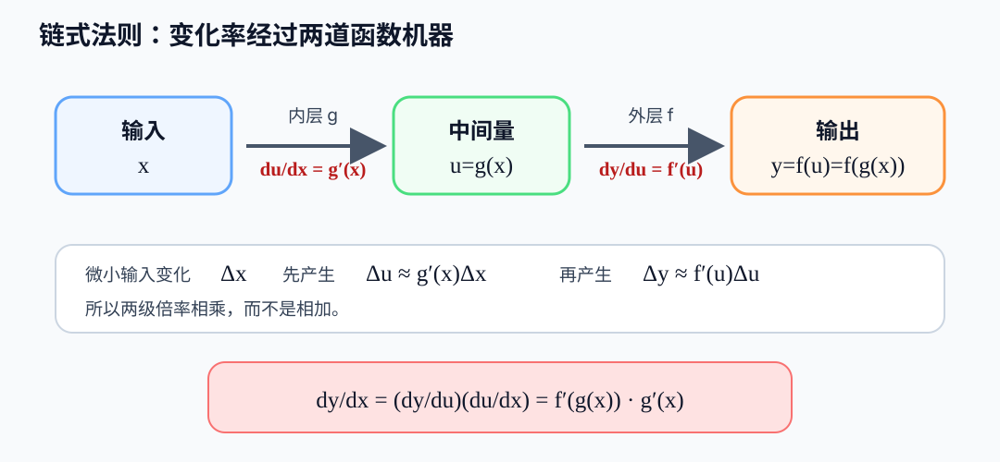

用微小变化记号表达：

\[
\Delta u\approx g'(x)\Delta x,
\qquad
\Delta y\approx f'(u)\Delta u.
\]

把第一式代入第二式：

\[
\Delta y\approx f'(u)g'(x)\Delta x.
\]

这说明链式法则中为什么会出现两个变化率的乘积。这里是动机与直观，严格定理和证明
将在定义、例子与反例之后进行。

学习者对“两级倍率分别为 \(2\) 和 \(3\)，总倍率是多少”的直观检查回复 `go`，明确
选择继续。该题结果为 \(6\)，但未形成学习者作答证据，不计作通过或错误。

### 9.3 复合函数的定义与条件

设内层函数为 \(g\)，外层函数为 \(f\)。复合函数记作：

\[
(f\circ g)(x)=f(g(x)).
\]

读法是“\(f\) 复合 \(g\)”。运算顺序从右向左：先计算 \(g(x)\)，再把结果作为输入
交给 \(f\)。

复合有两个定义域条件：

1. \(x\) 必须属于内层 \(g\) 的定义域；
2. 内层输出 \(g(x)\) 必须属于外层 \(f\) 的定义域。

#### 正例

取

\[
g(x)=3x+1,
\qquad
f(u)=u^2.
\]

则：

\[
(f\circ g)(x)=f(3x+1)=(3x+1)^2.
\]

#### 条件例

取

\[
g(x)=x-2,
\qquad
f(u)=\sqrt{u}.
\]

形式上：

\[
(f\circ g)(x)=\sqrt{x-2}.
\]

但外层平方根要求输入 \(u\ge0\)，因此必须检查内层输出 \(g(x)=x-2\ge0\)。当前由
学习者独立求复合函数的定义域。

学习者首次写成 \([2,0]\)，随即在 Tutor 反馈前自行订正为：

\[
\boxed{[2,+\infty)}.
\]

由 \(x-2\ge0\) 得 \(x\ge2\)。首次回答记为即时自纠的 `Notation Error`，不追加
同类矫正题。

### 9.4 反例目标：复合顺序一般不能交换

需要检查下面这个看似自然但通常错误的猜想：

\[
f\circ g\stackrel{?}=g\circ f.
\]

取

\[
f(t)=t^2,
\qquad
g(x)=x+1.
\]

当前由学习者分别计算 \((f\circ g)(x)\) 与 \((g\circ f)(x)\)，用具体反例判断两者
是否相等。

学习者手写得到：

\[
(f\circ g)(x)=(x+1)^2=x^2+2x+1,
\]

以及最终结果

\[
(g\circ f)(x)=x^2+1,
\]

并正确判断两者不相等。第二行中间曾写成 \(g(x^2+1)\)，但由于 \(f(x)=x^2\)，正确
代入应是：

\[
g(f(x))=g(x^2)=x^2+1.
\]

该处标记为 `Notation Error` + `Composition Substitution Error`；最终结果和反例结论
正确。当前只要求学习者关闭上方答案，独立重写订正后的第二行。

重写过程中，学习者指出第一个问号 \(g(\,?\,)\) 令人迷惑。将 \(f(t)=t^2\) 中的
\(t\) 解释为输入占位符后，学习者确认 \(f(x)=x^2\)；随后正确完成
\(g(x^2)=x^2+1\)，并补出中间项，最终独立重写：

\[
\boxed{g(f(x))=g(x^2)=x^2+1}.
\]

### 9.5 链式法则定理

设内层函数 \(g\) 在 \(x\) 处可导，并且外层函数 \(f\) 在对应的内层输出
\(g(x)\) 处可导，则复合函数

\[
F(x)=f(g(x))
\]

在 \(x\) 处可导，并且：

\[
\boxed{F'(x)=f'(g(x))\,g'(x)}.
\]

若令 \(u=g(x)\)、\(y=f(u)\)，也可写成：

\[
\boxed{\frac{dy}{dx}=\frac{dy}{du}\cdot\frac{du}{dx}}.
\]

两个条件不能省略：内层要在 \(x\) 处可导，外层要在 \(g(x)\) 处可导，而不一定是在
同一个数值 \(x\) 处可导。当前在定理陈述后暂停，先检查符号理解，再进入证明尝试。

学习者用“剥笋，层层往里剥”概括链式法则并确认理解。这个类比正确抓住了执行方向：
从最外层向内层逐层处理。需要保留的关键补充是：每剥一层都留下该层的导数因子，最后
把所有因子相乘；不能只得到最内层，也不能把已经剥过的外层丢掉。

### 9.6 费曼检查点：完善“剥笋”类比

当前不要求公式推导。学习者需要用自己的话补充说明：为什么“剥掉”的每一层还必须
留下一个变化率因子，以及为什么这些因子最终相乘而不是相加。

学习者提出：“相加的话是不是就不是复合函数了。”这个判断抓住了核心方向，但需要加上
边界说明：

- 层与层串联时，前一层的输出成为后一层的输入，倍率相乘；
- 两个独立分支都接收同一个输入，最后把输出合并时，贡献相加；
- 复合函数的导数表达式内部仍可能出现加号，因为某一层自身可能是和函数；固定相乘的
  是相邻层之间的变化率。

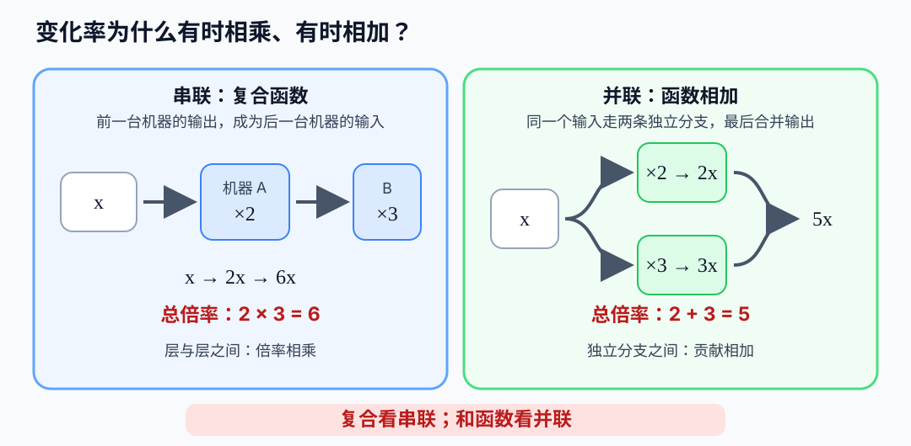

例如，串联的两台机器先放大 \(2\) 倍、再放大 \(3\) 倍，总倍率是
\(2\times3=6\)；并联的两个分支分别产生 \(2x\) 和 \(3x\)，合并后是 \(5x\)，
总倍率是 \(2+3=5\)。

学习者确认理解“复合看串联、和函数看并联”，费曼直观检查通过。

### 9.7 证明尝试：只写第一步

现在开始证明链式法则，但不要求一次完成。设

\[
F(x)=f(g(x)).
\]

当前只使用导数定义，写出 \(F'(x)\) 的差商极限；暂不变形、不插入中间因子，也不
查看完整证明。完成这一行后再获得下一级提示。

学习者在一级提示后正确写出：

\[
F'(x)=\lim_{h\to0}\frac{f(g(x+h))-f(g(x))}{h}.
\]

随后正确识别

\[
\Delta u=g(x+h)-g(x),
\]

并在提示下插入 \(\Delta u/\Delta u\)，得到：

\[
\frac{f(g(x+h))-f(g(x))}{g(x+h)-g(x)}
\cdot
\frac{g(x+h)-g(x)}{h}.
\]

其中曾把 \(\Delta u/\Delta u\) 的分母写成 \(u\)，经“分子分母必须完全相同”提示后
订正。学习者正确确认第二因子的极限为 \(g'(x)\)，并由可导推出连续，得到
\(g(x+h)\to g(x)\)。

下一步询问 \(\Delta u\to?\) 时，学习者反馈 `lost`，并指出微型问题有时上下文不足。
这不是新的数学错误，而是教学呈现缺少局部目标。后续每一步增加四项上下文卡片。

在上下文卡片下重新说明：\(h\) 是原输入 \(x\) 的增量，而

\[
\Delta u=g(x+h)-g(x)
\]

是内层输出的增量。由于 \(g\) 在 \(x\) 处可导，所以 \(g\) 在 \(x\) 处连续；当
\(h\to0\) 时，\(g(x+h)\to g(x)\)，从而

\[
\Delta u=g(x+h)-g(x)\to0.
\]

若令 \(u=g(x)\)，则

\[
g(x+h)=u+\Delta u.
\]

学习者先把右侧增量误写成 \(g(x)\)，经一级提示后订正为 \(\Delta u\)，并正确写出
外层差商：

\[
\frac{f(u+\Delta u)-f(u)}{\Delta u}.
\]

当 \(\Delta u\to0\) 时，学习者正确识别其极限为 \(f'(u)\)，再代回
\(u=g(x)\)，得到 \(f'(g(x))\)。至此，学习者已经在提示下走完直观证明的全部关键
环节；随后明确要求比较完整证明。

### 9.8 完整证明比较：先看直观拆分

先把刚才走过的路线连起来。设

\[
F(x)=f(g(x)),\qquad u=g(x),\qquad
\Delta u=g(x+h)-g(x).
\]

当 \(\Delta u\ne0\) 时，可以乘上 \(\Delta u/\Delta u=1\)：

\[
\begin{aligned}
F'(x)
&=\lim_{h\to0}\frac{f(g(x+h))-f(g(x))}{h}\\[4pt]
&=\lim_{h\to0}
\frac{f(g(x+h))-f(g(x))}{g(x+h)-g(x)}
\cdot
\frac{g(x+h)-g(x)}{h}\\[4pt]
&=\lim_{h\to0}
\frac{f(u+\Delta u)-f(u)}{\Delta u}
\cdot
\frac{\Delta u}{h}.
\end{aligned}
\]

由于 \(g\) 在 \(x\) 处可导，它在该点连续，所以 \(h\to0\) 时
\(\Delta u\to0\)。因此两个因子分别趋于

\[
\lim_{\Delta u\to0}
\frac{f(u+\Delta u)-f(u)}{\Delta u}=f'(u)=f'(g(x))
\]

和

\[
\lim_{h\to0}\frac{\Delta u}{h}
=\lim_{h\to0}\frac{g(x+h)-g(x)}{h}=g'(x).
\]

于是

\[
\boxed{F'(x)=f'(g(x))g'(x)}.
\]

这条拆分路线最能说明“内外两层变化率相乘”，但还藏着一个必须检查的条件：我们除以了
\(\Delta u\)。如果某些很小的 \(h\ne0\) 恰好使 \(g(x+h)=g(x)\)，那么
\(\Delta u=0\)，上面的中间分式在这些 \(h\) 上没有定义。链式法则本身仍然成立，
所以还需要一个不除以 \(\Delta u\) 的严格修补。

### 9.9 严格证明：余项法处理 \(\Delta u=0\)

记

\[
a=g(x).
\]

因为 \(f\) 在 \(a\) 处可导，可以定义

\[
\varepsilon(t)=
\begin{cases}
\dfrac{f(a+t)-f(a)-f'(a)t}{t},&t\ne0,\\[8pt]
0,&t=0.
\end{cases}
\]

按照导数定义，当 \(t\to0\) 时：

\[
\varepsilon(t)\to0.
\]

把定义移项，无论 \(t\ne0\) 还是 \(t=0\)，都有：

\[
f(a+t)-f(a)=f'(a)t+\varepsilon(t)t.
\]

现在取

\[
t=\Delta u=g(x+h)-g(x).
\]

因为 \(a=g(x)\)，所以 \(a+\Delta u=g(x+h)\)。代入上式：

\[
f(g(x+h))-f(g(x))
=f'(a)\Delta u+\varepsilon(\Delta u)\Delta u.
\]

两边除以 \(h\ne0\)：

\[
\frac{F(x+h)-F(x)}{h}
=f'(a)\frac{\Delta u}{h}
+\varepsilon(\Delta u)\frac{\Delta u}{h}.
\]

分别看右侧两项：

\[
\frac{\Delta u}{h}
=\frac{g(x+h)-g(x)}{h}\to g'(x).
\]

同时，\(g\) 可导推出 \(g\) 连续，所以 \(\Delta u\to0\)，从而
\(\varepsilon(\Delta u)\to0\)。又因为 \(\Delta u/h\to g'(x)\)，该因子在
\(h=0\) 附近有界，于是

\[
\varepsilon(\Delta u)\frac{\Delta u}{h}\to0.
\]

因此

\[
\begin{aligned}
F'(x)
&=f'(a)g'(x)+0\\
&=\boxed{f'(g(x))g'(x)}.
\end{aligned}
\]

这个版本从头到尾没有除以 \(\Delta u\)，所以即使 \(\Delta u=0\) 也成立。

### 9.10 具体函数的独立核验

取

\[
F(x)=(3x+1)^2.
\]

直接展开后求导：

\[
\begin{aligned}
F(x)&=9x^2+6x+1,\\
F'(x)&=18x+6.
\end{aligned}
\]

再用链式法则。令 \(u=3x+1\)、\(F=u^2\)，则

\[
\frac{dF}{du}=2u,
\qquad
\frac{du}{dx}=3.
\]

所以

\[
F'(x)=2u\cdot3=2(3x+1)\cdot3=18x+6.
\]

两种计算结果一致。这只能核验这个具体例子，不能代替上面的普遍证明。

### 9.11 首道应用与双重核验

求

\[
y=(2x-1)^3.
\]

令

\[
u=2x-1,\qquad y=u^3.
\]

学习者最初把两层导数回答为“\(2\)”和“\(3^2\)”，说明幂函数的指数与内层一次函数的
系数发生了串位。经一次只处理一层的提示后，分别正确得到：

\[
\frac{dy}{du}=3u^2,
\qquad
\frac{du}{dx}=2.
\]

随后正确完成：

\[
\boxed{y'=3u^2\cdot2=6(2x-1)^2}.
\]

再用展开法独立核验。学习者正确使用立方差公式，但最后一行首次漏写常数项 \(-1\)，
经定位后补全：

\[
(2x-1)^3=8x^3-12x^2+6x-1.
\]

逐项求导得到：

\[
24x^2-24x+6.
\]

而链式法则的结果展开为：

\[
6(2x-1)^2
=6(4x^2-4x+1)
=24x^2-24x+6.
\]

两种方法一致。首道应用在一级提示后完成，保持 `Developing`，下一题使用非线性内层
检查能否独立识别并保留两个导数因子。

### 9.12 非线性内层迁移

第一题：

\[
y=(x^2+1)^4.
\]

学习者首次写成 \(3(x^2+1)^3\cdot2x\)：内层导数 \(2x\) 和降幂后的指数 \(3\)
正确，但把“降幂后的指数 \(3\)”误当成了外层导数的系数。经只指出这一处后订正为：

\[
\boxed{y'=4(x^2+1)^3\cdot2x=8x(x^2+1)^3}.
\]

随后做同层级无提示复测：

\[
y=(3x^2-2)^5.
\]

学习者一次正确写出：

\[
\boxed{y'=5(3x^2-2)^4\cdot6x=30x(3x^2-2)^4}.
\]

这说明“原指数移到系数、指数减一”和“保留内层导数因子”已经完成当堂迁移。当前进入
三层复合，检查能否按由外到内的顺序留下三个导数因子。

### 9.13 三层复合应用

对

\[
y=\left[(2x+1)^3+4\right]^2,
\]

学习者无提示一次写出三个导数因子：

\[
\begin{aligned}
y'
&=2\left[(2x+1)^3+4\right]
\cdot3(2x+1)^2\cdot2\\
&=\boxed{12\left[(2x+1)^3+4\right](2x+1)^2}.
\end{aligned}
\]

由外到内的三层顺序、三个因子和系数化简均正确，三层应用当堂无提示通过。

### 9.14 关闭答案后的证明重写与隐藏条件

学习者关闭完整证明后，最初反馈“写不出来”并自我评价“好笨”。这次闭卷提取准确暴露
出：整条证明尚不能作为一个整体主动提取，但不代表各组成步骤不会。Tutor 将任务缩小为
单个方框后，学习者依次重建：

\[
F'(x)=\lim_{h\to0}\frac{f(g(x+h))-f(g(x))}{h},
\]

\[
\Delta u=g(x+h)-g(x),
\]

以及

\[
\frac{f(u+\Delta u)-f(u)}{\Delta u}
\cdot
\frac{\Delta u}{h}
\longrightarrow
f'(u)g'(x)
=f'(g(x))g'(x).
\]

重建过程中有两个真实停点：一度把外层变化
\(f(g(x+h))-f(g(x))\) 当成 \(\Delta u\)；又把
\(g(x+h)=u+\Delta u\) 的增量填成 \(h\)。经区分
“\(h\) 是输入 \(x\) 的变化、\(\Delta u\) 是内层输出的变化”后完成订正。

随后检查直观拆分中的隐藏条件。学习者首次回答“连续”，经“分母何时允许相除”提示后
正确指出必须有：

\[
\Delta u\ne0.
\]

取常数内层 \(g(x)=5\) 时，学习者正确算出 \(\Delta u=0\)，因此
\(\Delta u/\Delta u=0/0\) 没有定义；但 \(F(x)=f(5)\) 是常数，经一级提示后正确
得到 \(F'(x)=0\)。同时链式法则右侧为

\[
f'(g(x))g'(x)=f'(5)\cdot0=0.
\]

这说明失效的是直接相除的证明步骤，不是链式法则。严格余项证明已保存供比较，本阶段
暂不要求学习者独立重建余项函数。链式法则保持 `Developing`：计算应用通过，直观证明
在微型提示下完成，整段闭卷提取和严格证明仍待间隔复测。

## 10. 三角函数导数桥接

### 10.1 动机：为什么先从 \(\sin x\) 开始

后续求 \(\tan,\cot,\sec,\csc\) 的导数，需要先知道 \(\sin x\) 与 \(\cos x\) 的
导数；再结合反函数求导，才能推出 \(\arcsin,\arccos,\arctan,\arccot\) 的导数。
这些结论又会反复出现在换元积分、三角积分和含根式积分中。

知识链为：

\[
\text{单位圆与弧度}
\longrightarrow
\boxed{(\sin x)'\text{ 与 }(\cos x)'}
\longrightarrow
\tan,\cot,\sec,\csc
\longrightarrow
\text{反三角函数导数}
\longrightarrow
\text{积分换元}.
\]

### 10.2 几何直观：正弦是圆上点的高度

在单位圆上，角度为 \(x\) 的点是

\[
P(x)=(\cos x,\sin x).
\]

因此 \(\sin x\) 就是点 \(P\) 的纵坐标。角度 \(x\) 增加时，点沿圆周切线方向运动；
\((\sin x)'\) 描述的正是这个运动的竖直速度。

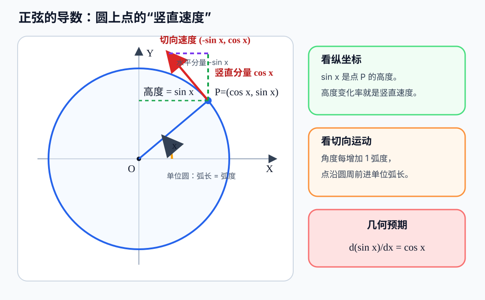

图中切向速度的竖直分量为 \(\cos x\)，所以几何上预期

\[
(\sin x)'=\cos x.
\]

这只是直观预告，严格证明将在下一步从导数定义和两个基本三角极限推出。

### 10.3 为什么必须使用弧度

单位圆上，弧度数恰好等于对应弧长。输入增加 \(h\) 弧度时，点沿圆周移动的弧长也是
\(h\)，不会额外出现换算倍率。

如果输入使用角度制，则每增加 \(1^\circ\) 只相当于增加 \(\pi/180\) 弧度，因此：

\[
\frac{d}{dx}\sin(x^\circ)
=\frac{\pi}{180}\cos(x^\circ).
\]

所以教材中的简洁公式 \((\sin x)'=\cos x\) 默认 \(x\) 使用弧度。

当前先做几何方向检查：在 \(x=0\) 附近，单位圆上的点从 \((1,0)\) 开始向上运动，
判断 \(\sin x\) 的瞬时变化率为正、负还是零；暂不进入代数证明。

学习者首次回答 \(0\)，把函数值 \(\sin0=0\) 当成了变化率。经区分“当前位置的高度”
与“高度正在怎样变化”后，正确判断变化率为正，并进一步得到：

\[
(\sin x)'\big|_{x=0}=\cos0=1.
\]

### 10.4 从导数定义严格证明 \((\sin x)'=\cos x\)

由导数定义：

\[
(\sin x)'
=\lim_{h\to0}\frac{\sin(x+h)-\sin x}{h}.
\]

使用正弦和角公式：

\[
\sin(x+h)=\sin x\cos h+\cos x\sin h.
\]

代入并逐项整理：

\[
\begin{aligned}
\frac{\sin(x+h)-\sin x}{h}
&=\frac{\sin x\cos h+\cos x\sin h-\sin x}{h}\\[4pt]
&=\frac{\sin x(\cos h-1)+\cos x\sin h}{h}\\[4pt]
&=\sin x\frac{\cos h-1}{h}
+\cos x\frac{\sin h}{h}.
\end{aligned}
\]

利用两个基本极限：

\[
\lim_{h\to0}\frac{\cos h-1}{h}=0,
\qquad
\lim_{h\to0}\frac{\sin h}{h}=1,
\]

得到：

\[
\begin{aligned}
(\sin x)'
&=\sin x\cdot0+\cos x\cdot1\\
&=\boxed{\cos x}.
\end{aligned}
\]

学习者正确写出导数定义差商、正弦和角展开、提取 \(\sin x\) 公因子，独立回答两个
基本极限并得到最终结论。证明经过逐级问题引导，因此记为 `Developing`，后续需关闭
答案整段重写。

该结论已用两条路线核验：单位圆切向速度给出几何直观，导数定义与基本三角极限给出
严格证明。两条路线都依赖弧度制。

### 10.5 下一目标：余弦是圆上点的横坐标

同一个单位圆点

\[
P(x)=(\cos x,\sin x)
\]

的横坐标是 \(\cos x\)。图中切向速度的水平分量为 \(-\sin x\)，因此几何上预期：

\[
(\cos x)'=-\sin x.
\]

当前先取 \(x=\pi/2\)：点位于圆顶 \((0,1)\)，角度继续增加时点向左运动，只判断
余弦的瞬时变化率为正、负还是零。

学习者正确判断为负，并进一步得到：

\[
(\cos x)'\big|_{x=\pi/2}
=-\sin\frac{\pi}{2}
=-1.
\]

### 10.6 从导数定义严格证明 \((\cos x)'=-\sin x\)

由导数定义：

\[
(\cos x)'
=\lim_{h\to0}\frac{\cos(x+h)-\cos x}{h}.
\]

使用余弦和角公式：

\[
\cos(x+h)=\cos x\cos h-\sin x\sin h.
\]

代入并整理：

\[
\begin{aligned}
\frac{\cos(x+h)-\cos x}{h}
&=\frac{\cos x\cos h-\sin x\sin h-\cos x}{h}\\[4pt]
&=\cos x\frac{\cos h-1}{h}
-\sin x\frac{\sin h}{h}.
\end{aligned}
\]

使用

\[
\lim_{h\to0}\frac{\cos h-1}{h}=0,
\qquad
\lim_{h\to0}\frac{\sin h}{h}=1,
\]

得到：

\[
\begin{aligned}
(\cos x)'
&=\cos x\cdot0-\sin x\cdot1\\
&=\boxed{-\sin x}.
\end{aligned}
\]

学习者正确写出导数定义与余弦和角展开；`conh` 为输入时的符号拼写问题，数学结构和
负号均正确。最后正确完成 \((\cos x)'=-\sin x\)。单位圆水平速度与极限推导形成双重
核验；证明仍是在逐级引导下完成，保持 `Developing`。

### 10.7 正切导数的动机与图像

在单位圆右侧作切线 \(X=1\)。从圆心沿角度 \(x\) 发出的射线与这条切线交于 \(T\)，
则 \(T\) 的高度就是 \(\tan x\)：

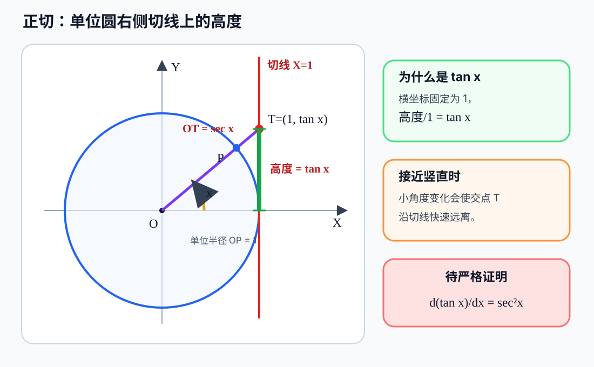

当射线接近竖直方向时，切线交点会迅速向上远离，所以 \(\tan x\) 的变化率越来越大；
这与后续公式中的 \(\sec^2x\) 一致。图像直观不代替证明，严格推导将使用：

\[
\tan x=\frac{\sin x}{\cos x},
\qquad \cos x\ne0,
\]

再应用已经掌握的商法则和刚推出的正弦、余弦导数。

当前由学习者先写商法则的未化简结果，不提前给出 \(\sec^2x\)。

学习者先写出 \((\sin x/\cos x)'\)，尚未执行商法则；随后直接给出正确最终结果
\(1/\cos^2x\)，并说明已在纸上完成推导。完整对照为：

\[
\begin{aligned}
(\tan x)'
&=\left(\frac{\sin x}{\cos x}\right)'\\[4pt]
&=\frac{(\sin x)'\cos x-\sin x(\cos x)'}{\cos^2x}\\[4pt]
&=\frac{\cos^2x+\sin^2x}{\cos^2x}\\[4pt]
&=\frac1{\cos^2x}\\[4pt]
&=\boxed{\sec^2x}.
\end{aligned}
\]

定义域条件来自分母：

\[
\cos x\ne0
\quad\Longleftrightarrow\quad
x\ne\frac\pi2+k\pi,qquad k\in\mathbb Z.
\]

学习者首次写成“\(\cos x\ne\pi/2\)”，把函数值与输入角度混在一起；随后在零点间隔
\(3\pi/2-\pi/2\) 中回答 \(1\)，漏掉共同因子 \(\pi\)。逐步计算后确认间隔为
\(\pi\)，最终正确补出 \(k\in\mathbb Z\)。

### 10.8 下一目标：正割函数的导数

上一张单位圆切线图中的线段 \(OT\) 长度为 \(\sec x\)。当射线接近竖直方向时，
\(OT\) 与切线高度 \(\tan x\) 一起快速增大。严格推导从倒数定义开始：

\[
\sec x=\frac1{\cos x},
\qquad \cos x\ne0.
\]

当前由学习者使用商法则或倒数求导法写出 \((\sec x)'\)，再尝试把结果整理成只含
\(\sec x\) 与 \(\tan x\) 的乘积。

学习者在纸上完整推导并正确得到：

\[
\begin{aligned}
(\sec x)'
&=\left(\frac1{\cos x}\right)'\\
&=\frac{0\cdot\cos x-1\cdot(-\sin x)}{\cos^2x}\\
&=\frac{\sin x}{\cos^2x}\\
&=\frac{\sin x}{\cos x}\cdot\frac1{\cos x}\\
&=\boxed{\sec x\tan x}.
\end{aligned}
\]

对应地，学习者又独立完成余割函数：

\[
\begin{aligned}
(\csc x)'
&=\left(\frac1{\sin x}\right)'\\
&=-\frac{\cos x}{\sin^2x}\\
&=\boxed{-\csc x\cot x}.
\end{aligned}
\]

### 10.9 余切函数的导数

从

\[
\cot x=\frac{\cos x}{\sin x}
\]

使用商法则：

\[
\begin{aligned}
(\cot x)'
&=\frac{(\cos x)'\sin x-\cos x(\sin x)'}{\sin^2x}\\[4pt]
&=\frac{(-\sin x)\sin x-\cos x(\cos x)}{\sin^2x}\\[4pt]
&=-\frac{\sin^2x+\cos^2x}{\sin^2x}\\[4pt]
&=-\frac1{\sin^2x}\\[4pt]
&=\boxed{-\csc^2x}.
\end{aligned}
\]

学习者的商法则结构正确，但首次在代入 \((\cos x)'\) 时漏掉负号，把分子写成
\(\sin^2x+\cos^2x\)；同时把 \(1/\sin^2x\) 误写成 \(\sec^2x\)。经只处理第一处
符号后，正确得到分子 \(-1\)，再正确转换为 \(-\csc^2x\)。

六个基本三角函数导数至此已经全部推出；整体保持 `Developing`，需要跨日闭卷复测。

## 11. 反三角函数导数

### 11.1 动机与知识链

反三角函数不是新的孤立公式，而是“反函数求导 + 三角函数导数”的直接汇合点：

\[
\boxed{\text{三角函数导数}}
+\boxed{\text{反函数导数}}
\longrightarrow
\boxed{\text{反三角函数导数}}
\longrightarrow
\text{含根式积分与换元}.
\]

正弦函数在整个实数轴上不是一一对应，因此不能直接拥有单值反函数。把正弦限制在

\[
\left[-\frac\pi2,\frac\pi2\right]
\]

后，它严格递增且覆盖 \([-1,1]\)，于是定义：

\[
y=\arcsin x
\quad\Longleftrightarrow\quad
\sin y=x,
\]

其中

\[
x\in[-1,1],
\qquad
y\in\left[-\frac\pi2,\frac\pi2\right].
\]

### 11.2 \(\arcsin\) 的三角形直观

先看代表性的 \(0<x<1\)。令 \(y=\arcsin x\)，在单位斜边直角三角形中，角 \(y\)
的对边为 \(x\)，邻边由勾股定理得到 \(\sqrt{1-x^2}\)：

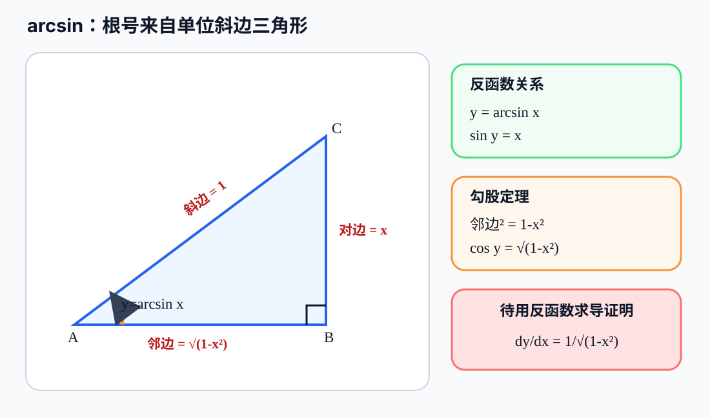

因此：

\[
\sin y=x,
\qquad
\cos y=\sqrt{1-x^2}.
\]

由于 \(y\in[-\pi/2,\pi/2]\)，这个区间内 \(\cos y\ge0\)，所以取正平方根。公式会
延伸到全部 \(-1<x<1\)；端点 \(x=\pm1\) 时邻边变成 \(0\)，导数分母也会变成
\(0\)，对应竖直切线。

当前只从恒等式 \(\sin y=x\) 两边求导。左侧是复合函数，需要使用链式法则；暂不直接
给出最终公式。

学习者在链式求导时先回答 \(\cos y\)，经提示补出内层导数因子 \(y'\)，随后正确得到：

\[
\cos y\,y'=1,
\qquad
y'=\frac1{\cos y}.
\]

在下一步把 \(\cos y\) 换成 \(x\) 时，学习者反馈从“\(\arcsin\)”到“\(\sin\)”的
反函数关系令人迷惑，并把起始式复述为 \(\arcsin y=x\)。当前暂停求导，先订正变量位置：

\[
\boxed{y=\arcsin x}
\quad\Longleftrightarrow\quad
\boxed{\sin y=x}.
\]

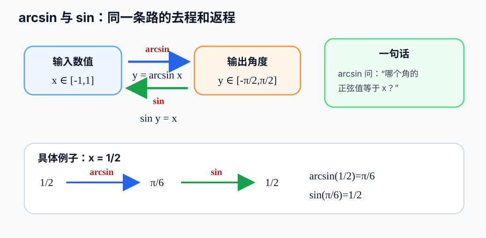

这里 \(x\) 是送入 \(\arcsin\) 的数值，\(y\) 是返回的角度；再把这个角度送入
\(\sin\)，就回到原来的数值 \(x\)。学习者随后主动要求先补齐 \(\cot,\sec,\csc\)
以及 \(\arcsin,\arccos,\arctan,\operatorname{arccot}\) 的性质和图像，因此暂停本节
求导，转入
[三角函数与反三角函数：性质和图像检查门](../lessons/trig-functions-and-inverses-graphs.md)。
图像检查门通过后，再返回 \(\cos y=\sqrt{1-x^2}\)。

## 当前执行位置

- [x] 导数定义与基础差商计算已经学习。
- [x] 幂函数、线性运算和乘积法则已由学习者确认熟悉。
- [ ] 商法则当堂两道练习均独立正确，保持 `Developing`，等待跨日复测。
- [ ] 反函数求导的完整计算已无提示通过；延期的链式法则证明已在微型提示下完成，并
  正确写出非零条件，仍待整段无提示重写。
- [ ] 链式法则的复合定义、定义域条件、顺序反例与费曼直观均已通过；定义证明在逐级
  提示下完成，并已比较直观拆分法和不除以 \(\Delta u\) 的严格余项证明。首道应用
  \(y=(2x-1)^3\) 已经双重核验；非线性内层无提示复测
  \(y=(3x^2-2)^5\) 与三层复合均已无提示通过。直观证明在微型提示下重建，并已用
  常数内层反例发现 \(\Delta u\ne0\) 的隐含条件；严格余项证明暂不要求独立重写。
  六个基本三角函数导数已经推出；当前进入“三角函数性质与图像检查门”，之后再返回
  反三角函数导数。
- [ ] 点斜式切线方程仍需跨日抽查，重点区分导数函数与指定点的斜率。
- [ ] 链式法则完成后返回反函数导数证明重写与条件/反例检查。
