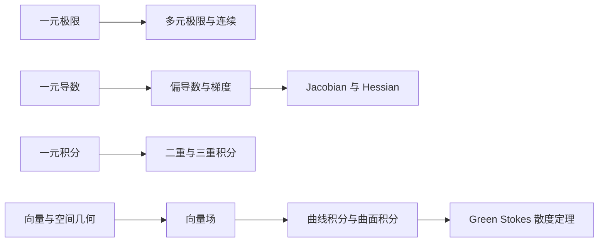

# 多元微积分课程入口

> 状态：已纳入正式课程计划，尚未开始。
>
> 启动时间：完成第一阶段 90 天复盘与一元微积分补全检查后确定。
>
> 主教材：《斯图尔特微积分》第 9 版多元微积分部分。

## 课程定位

多元微积分研究多个变量共同变化时的局部变化、整体累积和空间结构。它不是一元微积分之后孤立的一组新公式，而是把已经学过的极限、导数和积分推广到平面、空间和高维问题。

学习主线：

## 为什么必须学习

- 机器学习中的损失函数通常依赖许多参数，训练需要梯度、Jacobian 和 Hessian。
- 计算机视觉与机器人需要空间坐标、曲面、坐标变换和向量场。
- 多维概率密度、期望和变量替换需要重积分与 Jacobian 行列式。
- 物理与工程中的流量、通量、旋度和散度需要向量微积分。

## 启动前置检查

只有以下基础留下复测证据后，才正式开始本课程：

- [ ] 能解释一元函数的极限与连续。
- [ ] 能独立使用乘积、商和链式法则求导。
- [ ] 能解释导数是局部线性近似。
- [ ] 能计算基础定积分，并说明微积分基本定理。
- [ ] 能读懂基础参数方程，并由参数描述平面曲线或运动。
- [ ] 能在直角坐标与极坐标之间完成基础转换。
- [ ] 能使用向量、点积和基本空间坐标。
- [ ] 能看懂直线、平面和基础矩阵运算。
- [ ] 相关主题在间隔复习后仍达到 80%。

未通过的项目先回到对应章节补强，不因计划日期而跳过。

## 八周学习路线

### Week M1：三维空间与向量

- 三维坐标、距离和球面。
- 向量、点积、叉积及几何意义。
- 空间直线、平面和常见曲面。
- 使用图形识别柱面、二次曲面和截面。

**核心问题：**方程如何描述三维空间中的形状与位置？

### Week M2：向量值函数与空间曲线

- 向量值函数的极限、导数和积分。
- 空间曲线、切向量和弧长。
- 速度、加速度、切向与法向分量。

**核心问题：**如何描述一个点在空间中的运动轨迹与变化？

### Week M3：多元函数、极限与连续

- 二元和多元函数的定义域、图像与等高线。
- 从不同路径靠近一点时的极限。
- 多元连续与一元连续的联系和差别。

**核心问题：**为什么多元极限必须同时控制所有靠近路径？

### Week M4：偏导数、切平面与链式法则

- 偏导数及其截面意义。
- 切平面、全微分和线性近似。
- 多元链式法则、隐函数求导和 Jacobian 初步。

**核心问题：**只改变一个变量与同时改变所有变量有什么区别？

### Week M5：梯度、极值与约束优化

- 方向导数与梯度。
- 梯度和等高线的几何关系。
- 二阶偏导数、Hessian 初步和局部极值。
- 拉格朗日乘数与约束优化。

**核心问题：**怎样在高维空间中找到上升最快方向和约束下的最优点？

### Week M6：二重积分与三重积分

- 通过多重黎曼和理解重积分。
- 迭代积分、积分顺序和区域描述。
- 极坐标、柱坐标与球坐标。
- 变量替换与 Jacobian 行列式。

**核心问题：**面积、体积、质量和概率如何通过高维累积得到？

### Week M7：向量场、曲线积分与 Green 定理

- 向量场、流线、功和环流。
- 标量曲线积分与向量曲线积分。
- 保守场、势函数和路径无关性。
- Green 定理。

**核心问题：**沿边界的累积如何反映区域内部的变化？

### Week M8：曲面积分与三大积分定理

- 参数曲面、曲面面积和曲面积分。
- 通量、散度和旋度。
- Stokes 定理与散度定理。
- Green、Stokes 和散度定理的统一理解。
- 闭卷综合检查与间隔复测安排。

**核心问题：**局部变化、区域内部和边界信息为什么能够互相转换？

## 每个主题的学习顺序

从本课程开始继续采用“先讲后练、图形优先、掌握后推进”：

重要公式使用醒目的展示形式；空间图形、曲面、等高线、梯度场和向量场必须随笔记一起保存在相对路径资源目录中，保证 Typora 和 GitHub 都能复习。

## 阶段输出

- [ ] 一份持续更新的多元微积分主笔记。
- [ ] 至少 60 道基础题、变式题和综合题。
- [ ] 曲面与等高线可视化。
- [ ] 梯度与方向导数可视化。
- [ ] 二重积分区域与坐标变换可视化。
- [ ] 向量场、通量和积分定理可视化。
- [ ] 一个可重复运行的多元微积分代码实验。
- [ ] 一次闭卷综合检查和一次间隔复测。

## 掌握标准

一个主题只有满足以下证据才标记为“已通过”：

1. 能用自己的话解释概念和几何意义。
2. 能写出定义，并说明变量、方向和适用条件。
3. 能独立完成基础计算、变式和综合问题。
4. 能借助图形预测结果，再用代数或数值验证。
5. 能指出自己的真实错误和错误产生原因。
6. 间隔一周后仍能通过无提示复测。

## 复习档案

正式开课后在本节记录：

- 实际学习日期；
- 每个单元的诊断结果；
- 错题、错因和订正；
- 下一次复习日期；
- 闭卷检查和间隔复测结果。

## 教材配合

- 主教材：《斯图尔特微积分》第 9 版，以手中版本目录的多元部分为覆盖基准。
- 辅助教材：普林斯顿微积分读本，用于补充适用的一元直觉、代数卡点和学习方法。
- Python：用于曲面、等高线、梯度、积分区域和向量场的数值验证与可视化。
- 关键定义、定理条件和方向约定以教材核验为准。
