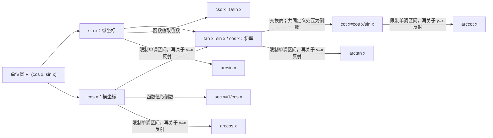
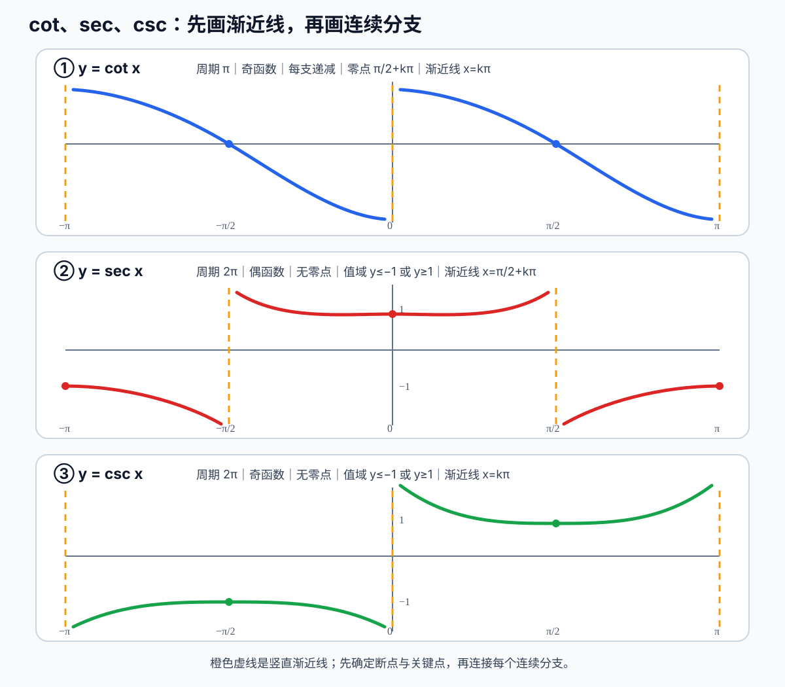

# 三角函数性质与反三角函数图像桥接

## 为什么暂停导数补这一课

导数和积分不仅需要公式，还需要先判断函数在哪里有定义、分成几支、是否有渐近线，
以及反函数选取了原函数的哪一段。若这些图像性质不清楚，容易把函数值与输入角度混写，
也容易在反三角函数中丢失主值区间。

本单元完成后再返回 [反三角函数导数](../02_derivatives/README.md)。

## 统一学习逻辑：母函数、倒数函数、反函数

不把这些名称拆成两张孤立的背诵表。先用单位圆恢复
\(\sin,\cos,\tan\) 三个母函数，再沿每个家族做两种图像变换：

必须持续区分：

- \(\csc x=1/\sin x\) 是**倒数函数**；
- \(\arcsin x\) 是 \(\sin x\) 限制到一一对应区间后的**反函数**；
- 某些教材把 \(\arcsin x\) 写作 \(\sin^{-1}x\)，这里的 \(-1\) 不表示倒数。

## 调整后的学习顺序

1. 用同一单位圆和同一坐标轴复习 \(\sin,\cos\)：定义、值域、周期、奇偶性、
   零点、极值、单调区间和图像；
2. 由 \(\tan x=\sin x/\cos x\) 恢复定义域、值域、周期、奇偶性、零点、
   竖直渐近线和单调分支；
3. 学习正弦家族：\(\sin\rightarrow\csc\)，再由受限的 \(\sin\) 得到
   \(\arcsin\)；
4. 学习余弦家族：\(\cos\rightarrow\sec\)，再由受限的 \(\cos\) 得到
   \(\arccos\)；
5. 学习正切家族：比较 \(\tan\) 与 \(\cot\)，再得到
   \(\arctan\) 与 \(\operatorname{arccot}\)；
6. 横向比较定义域、值域、周期、奇偶性、零点、渐近线与单调性；
7. 关闭图册，独立画草图并口述性质；随后返回反三角函数导数与积分桥接。

## 第一层：先恢复 \(\sin,\cos,\tan\) 的性质与图像

这一步不是重新背三张表，而是从同一个动态画面恢复图像：角 \(x\) 增加时，单位圆上的
点 \(P=(\cos x,\sin x)\) 转动；横坐标随角度的记录形成余弦图像，纵坐标随角度的
记录形成正弦图像，两坐标之比形成正切图像。

当前从 \(\sin x\) 与 \(\cos x\) 的共同单位圆定义开始，先建立两张波形图的对应关系；
定义、图像直观和完整例子讲完以前，不直接测试性质表。

## 第二层预告：\(\cot,\sec,\csc\)

| 函数 | 定义 | 定义域 | 值域 | 周期 | 奇偶性 | 零点 | 竖直渐近线 |
| --- | --- | --- | --- | --- | --- | --- | --- |
| \(\cot x\) | \(\cos x/\sin x\) | \(x\ne k\pi\) | \(\mathbb R\) | \(\pi\) | 奇 | \(\pi/2+k\pi\) | \(x=k\pi\) |
| \(\sec x\) | \(1/\cos x\) | \(x\ne\pi/2+k\pi\) | \(( -\infty,-1]\cup[1,\infty)\) | \(2\pi\) | 偶 | 无 | \(x=\pi/2+k\pi\) |
| \(\csc x\) | \(1/\sin x\) | \(x\ne k\pi\) | \(( -\infty,-1]\cup[1,\infty)\) | \(2\pi\) | 奇 | 无 | \(x=k\pi\) |

其中 \(k\in\mathbb Z\)。这张表是核验表，不作为第一遍死记材料；课堂中每一格都从
定义、单位圆或图像恢复。

## 1. \(\cot x\)：先看分母和一个周期

### 动机与定义

\[
\cot x=\frac{\cos x}{\sin x}.
\]

分母控制断点：当 \(\sin x=0\) 时，\(\cot x\) 没有定义。单位圆上正弦为零的位置是
横轴两端，对应 \(x=k\pi\)，这些位置成为竖直渐近线。

### 一个周期内的锚点

在 \((0,\pi)\) 上：

- \(x\to0^+\) 时，\(\cot x\to+\infty\)；
- \(x=\pi/2\) 时，\(\cot x=0\)；
- \(x\to\pi^-\) 时，\(\cot x\to-\infty\)；
- 因为 \((\cot x)'=-\csc^2x<0\)，整个连续分支严格递减。

### 当前检查点

只从定义判断 \(x=0\) 时的分母以及 \(\cot0\) 是否有定义；暂不背完整性质表。

## 第二组预告：反三角函数的主值约定

| 反函数 | 原函数采用的限制区间 | 定义域 | 值域（主值区间） | 单调性 |
| --- | --- | --- | --- | --- |
| \(\arcsin x\) | \(\sin y,\ y\in[-\pi/2,\pi/2]\) | \([-1,1]\) | \([-\pi/2,\pi/2]\) | 递增 |
| \(\arccos x\) | \(\cos y,\ y\in[0,\pi]\) | \([-1,1]\) | \([0,\pi]\) | 递减 |
| \(\arctan x\) | \(\tan y,\ y\in(-\pi/2,\pi/2)\) | \(\mathbb R\) | \((-\pi/2,\pi/2)\) | 递增 |
| \(\operatorname{arccot}x\) | \(\cot y,\ y\in(0,\pi)\) | \(\mathbb R\) | \((0,\pi)\) | 递减 |

本课程暂用国内高等数学常见的 \(\operatorname{arccot}:\mathbb R\to(0,\pi)\) 约定。
不同教材可能选择其他主值区间，使用前必须检查教材定义。
