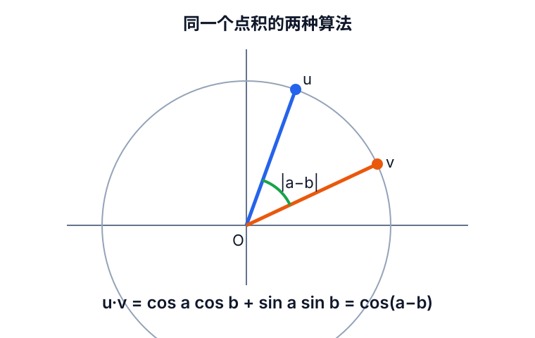

# 三角恒等式的证明与练习

## 学习目标

不是孤立背诵公式，而是建立以下证明链：

\[
\text{平方关系}
\rightarrow\text{和差角}
\rightarrow\text{倍角}
\rightarrow\text{半角与降幂}
\rightarrow\text{积化和差}.
\]

弧度、单位圆和基础特殊角此前已经学习，本课不重复展开，只在需要时抽查。

## 1. 平方关系的两个派生式

从

\[
\sin^2x+\cos^2x=1
\]

两边除以 \(\cos^2x\)，在 \(\cos x\ne0\) 时得到：

\[
\boxed{1+\tan^2x=\sec^2x}.
\]

两边除以 \(\sin^2x\)，在 \(\sin x\ne0\) 时得到：

\[
\boxed{1+\cot^2x=\csc^2x}.
\]

## 2. 余弦差角公式的证明

取单位向量：

\[
\mathbf u=(\cos a,\sin a),\qquad
\mathbf v=(\cos b,\sin b).
\]

按坐标计算点积：

\[
\mathbf u\cdot\mathbf v
=\cos a\cos b+\sin a\sin b.
\]

两向量长度均为 \(1\)，夹角为 \(|a-b|\)。按长度和夹角计算：

\[
\mathbf u\cdot\mathbf v
=\cos(a-b).
\]

两种算法计算的是同一个点积，因此：

\[
\boxed{\cos(a-b)=\cos a\cos b+\sin a\sin b}.
\]

## 3. 余弦和角公式

将差角公式中的 \(b\) 换成 \(-b\)，再使用
\(\cos(-b)=\cos b\)、\(\sin(-b)=-\sin b\)：

\[
\boxed{\cos(a+b)=\cos a\cos b-\sin a\sin b}.
\]

记忆结构：余弦和差角公式内部的符号与原来的加减号相反。

## 4. 已完成例题

\[
\begin{aligned}
\cos15^\circ
&=\cos(45^\circ-30^\circ)\\
&=\cos45^\circ\cos30^\circ
  +\sin45^\circ\sin30^\circ\\
&=\frac{\sqrt6+\sqrt2}{4}.
\end{aligned}
\]

## 5. 当前待答练习

使用和角公式计算：

\[
\boxed{\cos75^\circ=\cos(45^\circ+30^\circ)}.
\]

状态：等待学习者独立作答。不要提前写入答案。

## 6. 后续课程

- 正弦和差角公式及证明；
- 正弦、余弦倍角公式；
- 半角与降幂公式；
- 积化和差与和差化积；
- 返回三角极限与等价无穷小。
