# 三角恒等式的证明与练习

## 学习目标

不是孤立背诵公式，而是建立以下证明链：

\[
\text{平方关系}
\rightarrow\text{和差角}
\rightarrow\text{倍角}
\rightarrow\text{半角与降幂}
\rightarrow\text{积化和差}.
\]

弧度、单位圆和基础特殊角此前已经学习，本课不重复展开，只在需要时抽查。

## 1. 平方关系的两个派生式

从

\[
\sin^2x+\cos^2x=1
\]

两边除以 \(\cos^2x\)，在 \(\cos x\ne0\) 时得到：

\[
\boxed{1+\tan^2x=\sec^2x}.
\]

两边除以 \(\sin^2x\)，在 \(\sin x\ne0\) 时得到：

\[
\boxed{1+\cot^2x=\csc^2x}.
\]

## 2. 余弦差角公式的证明

取单位向量：

\[
\mathbf u=(\cos a,\sin a),\qquad
\mathbf v=(\cos b,\sin b).
\]

按坐标计算点积：

\[
\mathbf u\cdot\mathbf v
=\cos a\cos b+\sin a\sin b.
\]

两向量长度均为 \(1\)，夹角为 \(|a-b|\)。按长度和夹角计算：

\[
\mathbf u\cdot\mathbf v
=\cos(a-b).
\]

两种算法计算的是同一个点积，因此：

\[
\boxed{\cos(a-b)=\cos a\cos b+\sin a\sin b}.
\]

## 3. 余弦差角公式的三角形证明

如果点积还不直观，可以在单位圆中直接使用三角形证明。令

\[
A=(\cos a,\sin a),\qquad B=(\cos b,\sin b),
\]

圆心为 \(O\)。此时 \(OA=OB=1\)，圆心角
\(\angle AOB=|a-b|\)。

在三角形 \(OAB\) 中用余弦定理计算边 \(AB\)：

\[
AB^2=1^2+1^2-2\cos(a-b)=2-2\cos(a-b).
\]

再用坐标距离公式计算同一条边：

\[
\begin{aligned}
AB^2
&=(\cos a-\cos b)^2+(\sin a-\sin b)^2\\
&=2-2(\cos a\cos b+\sin a\sin b).
\end{aligned}
\]

两式相等，消去相同项后得到：

\[
\boxed{\cos(a-b)=\cos a\cos b+\sin a\sin b}.
\]

当前检查只聚焦第一步：解释为什么
\(\angle AOB=|a-b|\)，并用余弦定理写出 \(AB^2\)。
不要在这一步通过前跳到数值例题。

## 4. 余弦差角公式的另一种三角形证明：投影法

为了让图中的长度都为正，先画 \(0<b<a<90^\circ\) 的情形。取单位线段
\(OP=1\)，它与水平线的夹角是 \(a\)；再作一条与水平线夹角为
\(b\) 的射线 \(OH\)。从 \(P\) 向 \(OH\) 作垂线，垂足为 \(H\)。

### 第一次算 \(OH\)：直接看大直角三角形

因为

\[
\angle POH=a-b,
\]

所以在直角三角形 \(OPH\) 中：

\[
OH=OP\cos(a-b)=\cos(a-b).
\]

### 第二次算 \(OH\)：先把 \(OP\) 拆成横边和竖边

从 \(P\) 向水平线作垂线，垂足为 \(Q\)。在单位直角三角形
\(OPQ\) 中：

\[
OQ=\cos a,\qquad QP=\sin a.
\]

从 \(Q\) 向 \(OH\) 作垂线，垂足为 \(R\)。在直角三角形
\(OQR\) 中：

\[
OR=OQ\cos b=\cos a\cos b,
\]

为了完全用三角形说明第二段，再过 \(R\) 作 \(RS\parallel QP\)，
交 \(PH\) 于 \(S\)。因为 \(QR\parallel PS\)、\(QP\parallel RS\)，
四边形 \(QPSR\) 是平行四边形，所以

\[
RS=QP=\sin a.
\]

在直角三角形 \(RSH\) 中，\(\angle SRH=90^\circ-b\)，于是

\[
RH=RS\cos(90^\circ-b)=\sin a\sin b.
\]

而图上 \(OH=OR+RH\)，因此：

\[
\boxed{\cos(a-b)=\cos a\cos b+\sin a\sin b}.
\]

这条证明只用了平行四边形和直角三角形中的“邻边 \(=\) 斜边乘余弦”。
图中先选锐角，
是为了避免有向线段的符号干扰；推广到其他象限时，使用带正负号的投影，
公式保持不变。

### 完整数值例子

取 \(a=60^\circ,b=30^\circ\)：

\[
\begin{aligned}
\cos(60^\circ-30^\circ)
&=\cos30^\circ=\frac{\sqrt3}{2},\\
\cos60^\circ\cos30^\circ+\sin60^\circ\sin30^\circ
&=\frac12\cdot\frac{\sqrt3}{2}
 +\frac{\sqrt3}{2}\cdot\frac12
=\frac{\sqrt3}{2}.
\end{aligned}
\]

当前只检查第二次计算中的第一小步：长度为
\(\cos a\) 的水平边，与 \(b\) 方向夹角是 \(b\)，它在 \(b\) 方向上的投影是多少？

## 5. 余弦和角公式

### 几何直观：把 \(b\) 翻到横轴下方

角 \(b\) 关于横轴反射以后变成 \(-b\)。反射前后：

\[
\cos(-b)=\cos b,\qquad \sin(-b)=-\sin b.
\]

也就是横坐标不变，纵坐标变号。此时角 \(a\) 与角 \(-b\) 之间的夹角
正好是 \(a+b\)。

### 严格推导

将差角公式中的第二个角换成 \(-b\)：

\[
\begin{aligned}
\cos(a+b)
&=\cos[a-(-b)]\\
&=\cos a\cos(-b)+\sin a\sin(-b)\\
&=\cos a\cos b-\sin a\sin b.
\end{aligned}
\]

\[
\boxed{\cos(a+b)=\cos a\cos b-\sin a\sin b}.
\]

减号不是硬记出来的，而是来自
\(\sin(-b)=-\sin b\)。

### 完整例题：计算 \(\cos75^\circ\)

\[
\begin{aligned}
\cos75^\circ
&=\cos(45^\circ+30^\circ)\\
&=\cos45^\circ\cos30^\circ
 -\sin45^\circ\sin30^\circ\\
&=\frac{\sqrt2}{2}\cdot\frac{\sqrt3}{2}
 -\frac{\sqrt2}{2}\cdot\frac12\\
&=\boxed{\frac{\sqrt6-\sqrt2}{4}}.
\end{aligned}
\]

记忆结构：余弦和差角公式中间的符号与括号里的符号相反。

当前带提示练习：

\[
\cos105^\circ=\cos(60^\circ+45^\circ).
\]

第一步只需要按和角公式展开，不急着化简。

首次作答写成
\(\cos60\cos45+\sin60\sin45\)。角度符号为提高输入速度可以省略；
经一次“和角公式中间为减号”的提示后，已正确订正为
\(\cos60\cos45-\sin60\sin45\)。下一步只代入四个特殊角函数值，
暂不化简。学习者已独立正确给出
\(\cos60=1/2\)、\(\cos45=\sqrt2/2\)、
\(\sin60=\sqrt3/2\)、\(\sin45=\sqrt2/2\)；当前等待完成乘法与合并。

最终正确得到：

\[
\cos105^\circ=\frac{\sqrt2-\sqrt6}{4}.
\]

结果为负，与 \(105^\circ\) 位于第二象限的余弦符号一致。当前独立变式是
使用 \(\cos(60^\circ-45^\circ)\) 计算 \(\cos15^\circ\)。

学习者给出正确最终结果 \((\sqrt2+\sqrt6)/4\)，但没有按题意写计算过程；
由于该结果此前出现过，当前只补查差角公式的展开行，再判断是否完成独立变式。

## 6. 已完成例题

\[
\begin{aligned}
\cos15^\circ
&=\cos(45^\circ-30^\circ)\\
&=\cos45^\circ\cos30^\circ
  +\sin45^\circ\sin30^\circ\\
&=\frac{\sqrt6+\sqrt2}{4}.
\end{aligned}
\]

## 7. 后续独立练习

使用和角公式计算：

\[
\boxed{\cos75^\circ=\cos(45^\circ+30^\circ)}.
\]

状态：已作为余弦和角公式的完整例题讲解；后续安排独立变式复测。

## 8. 后续课程

- 正弦和差角公式及证明；
- 正弦、余弦倍角公式；
- 半角与降幂公式；
- 积化和差与和差化积；
- 返回三角极限与等价无穷小。

## 9. 正弦和差角公式

### 9.1 严格表述与条件

对于任意实数角 \(a,b\)，只要二者使用相同的角度单位，就有：

\[
\boxed{\sin(a+b)=\sin a\cos b+\cos a\sin b},
\]

\[
\boxed{\sin(a-b)=\sin a\cos b-\cos a\sin b}.
\]

这里没有分母，所以不存在“分母不能为零”一类的额外限制；公式对所有实数角成立。
正弦公式的中间符号与括号里的符号相同：和角用加号，差角用减号。

### 9.2 几何直观：正弦是高度

单位圆上角 \(\theta\) 对应点的纵坐标是 \(\sin\theta\)。在下面的单位直角三角形中，
竖边 \(PQ=\sin\theta\)，斜边 \(OP=1\)。从顶点 \(P\) 看，夹角是
\(90^\circ-\theta\)，竖边又是这个角的邻边，所以：

\[
\cos(90^\circ-\theta)=\frac{PQ}{OP}=\sin\theta.
\]

直观上，求 \(\sin(a+b)\) 就是在求转到角 \(a+b\) 后的最终高度；
余函数关系把“高度问题”转换成了已经掌握的余弦差角问题。

### 9.3 和角公式的逐步推导

第一步使用余函数关系：

\[
\sin(a+b)=\cos[90^\circ-(a+b)].
\]

第二步整理括号：

\[
90^\circ-(a+b)=(90^\circ-a)-b.
\]

第三步对 \((90^\circ-a)-b\) 使用余弦差角公式：

\[
\begin{aligned}
\sin(a+b)
&=\cos[(90^\circ-a)-b]\\
&=\cos(90^\circ-a)\cos b
  +\sin(90^\circ-a)\sin b\\
&=\sin a\cos b+\cos a\sin b.
\end{aligned}
\]

最后一步使用了
\(\cos(90^\circ-a)=\sin a\) 和
\(\sin(90^\circ-a)=\cos a\)。

### 9.4 差角公式的来源

把和角公式中的 \(b\) 换成 \(-b\)：

\[
\begin{aligned}
\sin(a-b)
&=\sin[a+(-b)]\\
&=\sin a\cos(-b)+\cos a\sin(-b)\\
&=\sin a\cos b-\cos a\sin b.
\end{aligned}
\]

依据是 \(\cos(-b)=\cos b\)（偶函数）和
\(\sin(-b)=-\sin b\)（奇函数）。

### 9.5 完整例题：计算 \(\sin75^\circ\)

\[
\begin{aligned}
\sin75^\circ
&=\sin(45^\circ+30^\circ)\\
&=\sin45^\circ\cos30^\circ
  +\cos45^\circ\sin30^\circ\\
&=\frac{\sqrt2}{2}\cdot\frac{\sqrt3}{2}
  +\frac{\sqrt2}{2}\cdot\frac12\\
&=\boxed{\frac{\sqrt6+\sqrt2}{4}}.
\end{aligned}
\]

几何检查：\(75^\circ\) 位于第一象限，所以结果应为正；而且正弦不超过 \(1\)，
上面的结果也符合这个范围。

### 9.6 当前带提示练习

\[
\sin15^\circ=\sin(45^\circ-30^\circ).
\]

第一步只按正弦差角公式展开，不代入数值。

学习者已正确写出：

\[
\sin(45^\circ-30^\circ)
=\sin45^\circ\cos30^\circ-\cos45^\circ\sin30^\circ.
\]

当前下一步只代入四个特殊角函数值，暂不化简。

学习者随后直接给出正确结果：

\[
\sin15^\circ=\frac{\sqrt6-\sqrt2}{4}.
\]

由于前一步已经正确展示差角公式，接受跳过机械代入行。当前独立变式：

\[
\sin(x+60^\circ),
\]

要求展开并代入 \(60^\circ\) 的特殊角值，不提供分步提示。

学习者已正确完成公式展开：

\[
\sin(x+60^\circ)=\sin x\cos60^\circ+\cos x\sin60^\circ.
\]

当前只等待把 \(\cos60^\circ\) 与 \(\sin60^\circ\) 换成具体数值。

首次代入写成
\(\tfrac12\sin x+\tfrac{2}{\sqrt3}\cos x\)。其中
\(\cos60^\circ=1/2\) 正确，但 \(\sin60^\circ\) 被误取成倒数；当前只用
“正弦值必须在 \([-1,1]\) 内”作最小提示，等待自行订正第二个系数。

学习者随后正确订正 \(\sin60^\circ=\sqrt3/2\)，所以：

\[
\sin(x+60^\circ)=\frac12\sin x+\frac{\sqrt3}{2}\cos x.
\]

正弦和差角公式的带提示练习与独立变式当堂完成，状态保持 `Developing`，
等待间隔复测。

## 10. 倍角公式

### 10.1 严格表述与条件

倍角 \(2a\) 就是同一个角相加：\(2a=a+a\)。对于任意实数角 \(a\)，有：

\[
\boxed{\sin2a=2\sin a\cos a},
\]

\[
\boxed{\cos2a=\cos^2a-\sin^2a}.
\]

利用 \(\sin^2a+\cos^2a=1\)，余弦倍角公式还有两个等价形式：

\[
\boxed{\cos2a=2\cos^2a-1=1-2\sin^2a}.
\]

这些式子没有分母，对所有实数角都成立。

### 10.2 几何直观

从横轴先转过角 \(a\)，再沿同一方向转过一个角 \(a\)，最终方向就是
\(a+a=2a\)。单位圆上最终点的横坐标是 \(\cos2a\)，纵坐标是
\(\sin2a\)。

因此倍角公式不是凭空出现的新公式，而是把和角公式里的两个角取成相同的角。

### 10.3 正弦倍角公式的推导

在正弦和角公式中令 \(b=a\)：

\[
\begin{aligned}
\sin2a
&=\sin(a+a)\\
&=\sin a\cos a+\cos a\sin a\\
&=2\sin a\cos a.
\end{aligned}
\]

最后一步的依据是两个加数完全相同。

### 10.4 余弦倍角公式的推导与三种形式

在余弦和角公式中令 \(b=a\)：

\[
\begin{aligned}
\cos2a
&=\cos(a+a)\\
&=\cos a\cos a-\sin a\sin a\\
&=\cos^2a-\sin^2a.
\end{aligned}
\]

若要只保留余弦，用 \(\sin^2a=1-\cos^2a\)：

\[
\cos2a=\cos^2a-(1-\cos^2a)=2\cos^2a-1.
\]

若要只保留正弦，用 \(\cos^2a=1-\sin^2a\)：

\[
\cos2a=(1-\sin^2a)-\sin^2a=1-2\sin^2a.
\]

三种形式数值相同；根据题目给的是 \(\sin a\)、\(\cos a\)，还是两者都有，
选择最方便的一种。

### 10.5 完整例题

已知 \(a\) 在第一象限，\(\sin a=3/5\)、\(\cos a=4/5\)，求
\(\sin2a\) 与 \(\cos2a\)。

\[
\sin2a=2\sin a\cos a
=2\cdot\frac35\cdot\frac45
=\boxed{\frac{24}{25}}.
\]

\[
\cos2a=\cos^2a-\sin^2a
=\left(\frac45\right)^2-\left(\frac35\right)^2
=\boxed{\frac7{25}}.
\]

检验：

\[
\left(\frac{24}{25}\right)^2+\left(\frac7{25}\right)^2=1,
\]

符合单位圆上的平方关系。

### 10.6 当前带提示练习

已知 \(a\) 在第一象限，\(\sin a=5/13\)、\(\cos a=12/13\)。第一步只求
\(\sin2a\)，暂不求 \(\cos2a\)。

学习者已独立正确计算：

\[
\sin2a=2\cdot\frac5{13}\cdot\frac{12}{13}=\frac{120}{169}.
\]

当前下一步求同题的 \(\cos2a\)，由学习者自行选择三种等价形式中最方便的一种。

学习者正确选择并计算：

\[
\cos2a=\left(\frac{12}{13}\right)^2-\left(\frac5{13}\right)^2
=\frac{119}{169}.
\]

带提示练习完成。当前独立变式：已知 \(a\) 在第二象限且
\(\sin a=3/5\)，只求 \(\sin2a\)；不提示 \(\cos a\) 的符号。
学习者已正确判断第二象限中 \(\cos a<0\)，当前等待利用平方关系求出具体值。
随后由 \(\sin^2a+\cos^2a=1\) 正确得到 \(\cos a=-4/5\)。当前等待代入
\(\sin2a=2\sin a\cos a\) 完成独立变式。首次计算得到 \(-6/25\)：
符号与分母正确，但分子漏算了因子；当前只提示重新计算
\(2\times3\times(-4)\)。

学习者随后正确订正分子为 \(-24\)，并准确说明错因是把公式前面的 \(2\)
误当成分母约掉，因此：

\[
\sin2a=-\frac{24}{25}.
\]

倍角公式的带提示练习与独立变式当堂完成；公式运用正确，保留轻量算术复测。

## 11. 为什么 \(1-\cos x=2\sin^2(x/2)\)

### 11.1 严格表述与条件

对任意实数角 \(x\)，都有：

\[
\boxed{1-\cos x=2\sin^2\frac{x}{2}}.
\]

其中 \(\sin^2(x/2)\) 表示 \([\sin(x/2)]^2\)，不是 \(\sin(x^2/2)\)。
公式没有分母，所以对所有实数 \(x\) 成立。

### 11.2 几何直观：整角对应一条弦，弦的一半对应半角

单位圆中取 \(OA=OP=1\)，圆心角 \(\angle AOP=x\)。连接弦 \(AP\)，
从圆心向弦作中线 \(OM\)。等腰三角形 \(OAP\) 被分成两个全等直角三角形，
因此每一半的圆心角是 \(x/2\)。

在其中一个直角三角形中，半条弦 \(AM=\sin(x/2)\)，所以整条弦
\(AP=2\sin(x/2)\)。另一方面，余弦定理给出
\(AP^2=2(1-\cos x)\)。两种方法算同一条弦，便得到目标公式。

这条几何证明只用于建立直观，不要求学习者完整复述。

### 11.3 从倍角公式的一行推导

最短的代数来源是刚学过的余弦倍角公式：

\[
\cos2a=1-2\sin^2a.
\]

令 \(a=x/2\)，于是 \(2a=x\)：

\[
\cos x=1-2\sin^2\frac{x}{2}.
\]

把 \(\cos x\) 移到右边、平方项移到左边：

\[
\boxed{1-\cos x=2\sin^2\frac{x}{2}}.
\]

所以这不是一条突然出现的新公式，而是余弦倍角公式把角 \(a\) 改名为
\(x/2\) 后的直接改写。

### 11.4 完整例题：取 \(x=60^\circ\)

左边：

\[
1-\cos60^\circ=1-\frac12=\frac12.
\]

右边：

\[
2\sin^230^\circ=2\left(\frac12\right)^2=\frac12.
\]

左右相等，验证了公式。

### 11.5 当前带提示练习

取 \(x=90^\circ\)，分别计算
\(1-\cos90^\circ\) 与 \(2\sin^245^\circ\)，检查两边是否相等。

学习者正确得到左右两边均为 \(1\)。当前无提示变式：取
\(x=120^\circ\)，分别计算恒等式左右两边并判断是否相等。首次回答两边均为
\(1/2\)：相等关系判断正确，但将第二象限中的 \(\cos120^\circ\) 误作正值；
当前只订正左边。学习者能调用“奇变偶不变，符号看象限”，但写成
\(\cos(90^\circ+30^\circ)=\sin30^\circ\)，漏掉第二象限负号；正确结构应为
\(-\sin30^\circ\)。

经提示后，学习者正确计算左边：

\[
1-\cos120^\circ=1-\left(-\frac12\right)=\frac32.
\]

当前只等待计算右边 \(2\sin^260^\circ\)。

学习者随后正确得到右边也是 \(3/2\)，恒等式验证完成。由于左边曾在第二象限
余弦符号上出错，本项保持 `Developing` 并安排跨日复测，不继续阻塞主线。

## 12. 半角公式与降幂公式

### 12.1 严格表述与条件

对于任意实数角 \(x\)，半角的平方公式为：

\[
\boxed{\sin^2\frac{x}{2}=\frac{1-\cos x}{2}},
\qquad
\boxed{\cos^2\frac{x}{2}=\frac{1+\cos x}{2}}.
\]

如果要求的是 \(\sin(x/2)\) 或 \(\cos(x/2)\) 本身，需要开平方：

\[
\boxed{\sin\frac{x}{2}=\pm\sqrt{\frac{1-\cos x}{2}}},
\]

\[
\boxed{\cos\frac{x}{2}=\pm\sqrt{\frac{1+\cos x}{2}}}.
\]

这里的正负号不能随意选，必须由半角 \(x/2\) 所在象限决定，而不是由 \(x\)
所在象限决定。平方形式对所有实数 \(x\) 成立；开平方形式也成立，但必须选对符号。

把半角公式中的 \(x\) 换成 \(2x\)，得到降幂公式：

\[
\boxed{\sin^2x=\frac{1-\cos2x}{2}},
\qquad
\boxed{\cos^2x=\frac{1+\cos2x}{2}}.
\]

“降幂”是把二次方的 \(\sin^2x\)、\(\cos^2x\) 变成一次的余弦；代价是角变成
\(2x\)。

### 12.2 公式地图

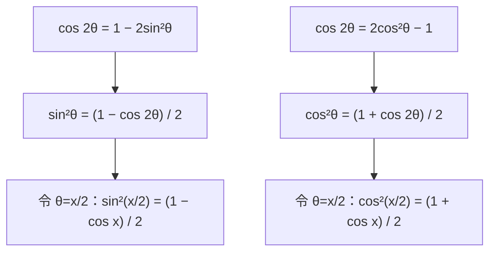

上半部分是“降幂”：从倍角公式中直接把平方项单独留下；下半部分令
\(\theta=x/2\)，便是“半角”。两套名称描述的是同一次代数变形。

### 12.3 逐步推导

从：

\[
\cos x=1-2\sin^2\frac{x}{2}
\]

移项并除以 \(2\)：

\[
\sin^2\frac{x}{2}=\frac{1-\cos x}{2}.
\]

再从余弦倍角的另一种形式：

\[
\cos x=2\cos^2\frac{x}{2}-1
\]

移项并除以 \(2\)：

\[
\cos^2\frac{x}{2}=\frac{1+\cos x}{2}.
\]

若从平方得到函数本身，必须使用
\(u^2=A\Rightarrow u=\pm\sqrt A\)，因此半角公式前面会出现 \(\pm\)。

### 12.4 几何直观

上一节的弦图中，圆心角是 \(x\)，中线把等腰三角形分成两个角为 \(x/2\)
的直角三角形。因此“整角余弦”与“半角正弦的平方”自然同时出现：

平方会丢失方向信息：正数和负数平方后相同。这就是从平方公式开根号时，必须回到
单位圆看 \(x/2\) 象限的原因。

### 12.5 完整例题：用半角公式计算 \(\sin60^\circ\)

把 \(60^\circ\) 看成 \(120^\circ/2\)。因为半角 \(60^\circ\) 在第一象限，
正弦取正号：

\[
\begin{aligned}
\sin60^\circ
&=+\sqrt{\frac{1-\cos120^\circ}{2}}\\
&=\sqrt{\frac{1-(-1/2)}{2}}\\
&=\sqrt{\frac34}\\
&=\boxed{\frac{\sqrt3}{2}}.
\end{aligned}
\]

注意：决定正号的是 \(60^\circ\) 所在的第一象限，而不是整角
\(120^\circ\) 所在的第二象限。

### 12.6 当前带提示练习

已知 \(x=300^\circ\)，使用半角公式求 \(\cos(x/2)=\cos150^\circ\)。
第一步只判断 \(x/2=150^\circ\) 所在象限以及最终应取正号还是负号，暂不计算根式。
学习者已正确判断第二象限、取负号。当前下一步只求整角
\(\cos300^\circ\) 的值。手写证据显示：

- 正确得到 \(\cos2\alpha=\cos^2\alpha-\sin^2\alpha=1-2\sin^2\alpha\)；
- 学习者明确说明另一条路径也正确保留了
  \(2\cos^2\alpha-1\)；此前 Tutor 因手写辨认错误误判为漏项，现已更正；
- 用半角公式中的 \(\cos300^\circ\) 去求 \(\cos150^\circ\)，再反求
  \(\cos300^\circ\) 会循环，当前改用
  \(300^\circ=360^\circ-60^\circ\) 直接求特殊角值。

循环的具体结构是：

\[
\cos300^\circ=2\cos^2150^\circ-1
=2\cdot\frac{1+\cos300^\circ}{2}-1
=\cos300^\circ.
\]

这不是算错，而是半角公式本来就由同一个倍角公式移项得到；把等价式代回原式，
只会得到恒等式，无法确定未知数。

随后使用独立信息
\(\cos300^\circ=\cos(360^\circ-60^\circ)=1/2\)，正确得到：

\[
\cos150^\circ
=-\sqrt{\frac{1+\cos300^\circ}{2}}
=-\frac{\sqrt3}{2}.
\]

带提示练习完成。当前独立变式：令 \(x=420^\circ\)，使用半角公式求
\(\cos(x/2)=\cos210^\circ\)，不提供分步提示。

学习者首次文本回答为 \(\sqrt3/2\)，绝对值正确但漏掉第三象限的负号；经象限提示
后订正。随后提交完整手写过程，其推导链为：

\[
\cos2\alpha=2\cos^2\alpha-1
\quad\Longrightarrow\quad
\cos^2\alpha=\frac{1+\cos2\alpha}{2},
\]

\[
\cos420^\circ=\cos60^\circ=\frac12,
\qquad
\cos^2210^\circ=\frac{1+1/2}{2}=\frac34.
\]

因为 \(210^\circ\) 在第三象限，最终选择负根：

\[
\boxed{\cos210^\circ=-\frac{\sqrt3}{2}}.
\]

手写证据表明学习者能够独立寻找 \(\cos420^\circ\) 的值，没有再次循环代入等价公式。
因最终符号曾需一次提示，本项保持 `Developing`，安排间隔复测。

### 12.7 下一步：降幂公式的实际使用

降幂公式把平方降成一次余弦，同时把角变成两倍：

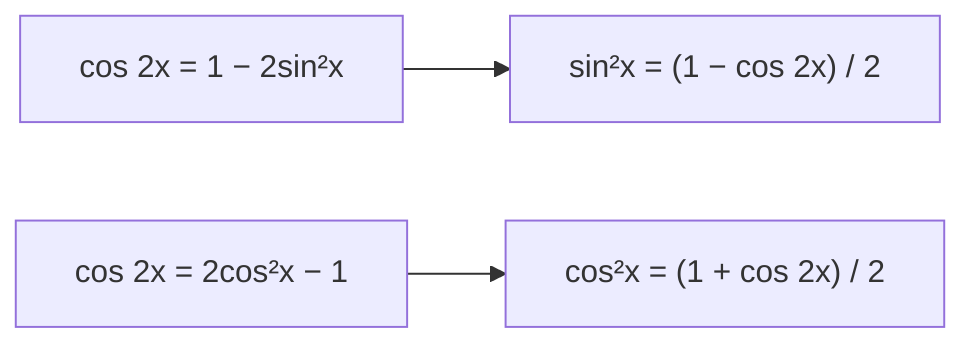

完整例题：

\[
\sin^215^\circ
=\frac{1-\cos30^\circ}{2}
=\boxed{\frac{2-\sqrt3}{4}}.
\]

带提示练习 \(\cos^230^\circ\) 中，学习者首次只给出最终值 \(3/4\)；经要求补写
公式证据后，正确指出分子为 \(1+\cos60^\circ\)：

\[
\cos^230^\circ
=\frac{1+\cos60^\circ}{2}
=\boxed{\frac34}.
\]

无提示独立变式：使用降幂公式计算 \(\sin^275^\circ\)。学习者直接正确回答：

\[
\boxed{\sin^275^\circ=\frac{2+\sqrt3}{4}}.
\]

这表明学习者能使用正弦降幂公式，并正确处理
\(\cos150^\circ=-\sqrt3/2\)。降幂公式当堂练习完成，保持 `Developing`，等待
间隔复测。

## 13. 下一步：积化和差与和差化积

### 13.1 第一条：余弦乘积化和差

“积化和差”是把两个三角函数的乘积，改写为两个三角函数的和或差。第一条公式对任意
实数角 \(a,b\) 都成立：

\[
\boxed{\cos a\cos b
=\frac{\cos(a-b)+\cos(a+b)}{2}}.
\]

它不需要单独死记，来源是已经学过的两条余弦公式。下面的图把重复结构暂记为
\(C=\cos a\cos b\)、\(S=\sin a\sin b\)：

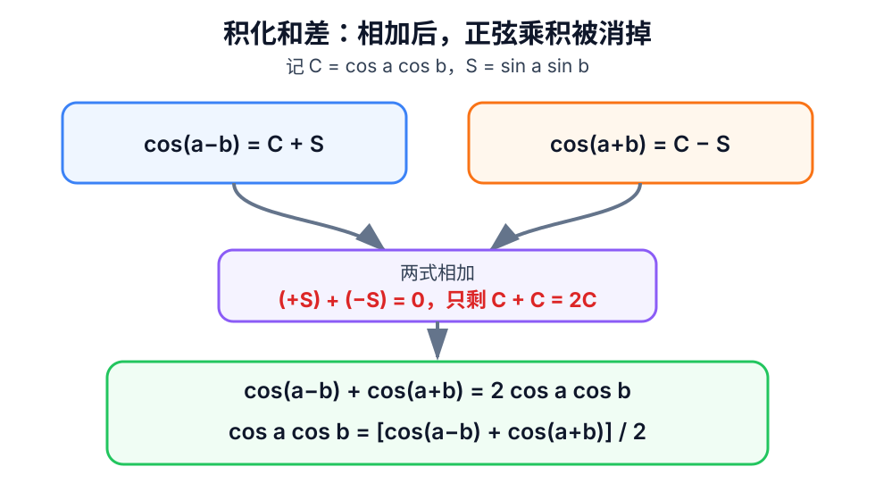

从：

\[
\cos(a-b)=\cos a\cos b+\sin a\sin b,
\]

\[
\cos(a+b)=\cos a\cos b-\sin a\sin b
\]

开始。两式相加时，\(+\sin a\sin b\) 与 \(-\sin a\sin b\) 抵消：

\[
\cos(a-b)+\cos(a+b)=2\cos a\cos b.
\]

两边除以 \(2\)，便得到目标公式。

### 13.2 完整例题

计算 \(\cos75^\circ\cos15^\circ\)：

\[
\begin{aligned}
\cos75^\circ\cos15^\circ
&=\frac{\cos(75^\circ-15^\circ)+\cos(75^\circ+15^\circ)}{2}\\
&=\frac{\cos60^\circ+\cos90^\circ}{2}\\
&=\frac{1/2+0}{2}\\
&=\boxed{\frac14}.
\end{aligned}
\]

### 13.3 当前带提示练习

使用同一条积化和差公式计算：

\[
\boxed{\cos60^\circ\cos30^\circ}.
\]

第一步只把乘积改写成包含 \(60^\circ-30^\circ\) 与
\(60^\circ+30^\circ\) 的形式，暂不计算特殊角值。

学习者正确写出：

\[
\cos60^\circ\cos30^\circ
=\frac{\cos30^\circ+\cos90^\circ}{2}
=\boxed{\frac{\sqrt3}{4}}.
\]

当前独立变式为 \(\cos75^\circ\cos45^\circ\)。首次最终结果写成含
\((1+\sqrt3)/4\) 的形式，错误来自把第二象限的 \(\cos120^\circ\) 当作正数；
经象限图提示后，学习者正确指出
\(\cos120^\circ=-\sin30^\circ=-1/2\)，并订正为：

\[
\cos75^\circ\cos45^\circ
=\frac{\cos30^\circ+\cos120^\circ}{2}
=\boxed{\frac{\sqrt3-1}{4}}.
\]

第一条余弦乘积化和差公式的当堂练习完成；因独立变式的象限符号需要一次提示，保持
`Developing` 并安排间隔复测。

### 13.4 第二条：正弦乘积化和差

对任意实数角 \(a,b\)：

\[
\boxed{\sin a\sin b
=\frac{\cos(a-b)-\cos(a+b)}{2}}.
\]

这一次不是把两条余弦公式相加，而是用差角公式减去和角公式：

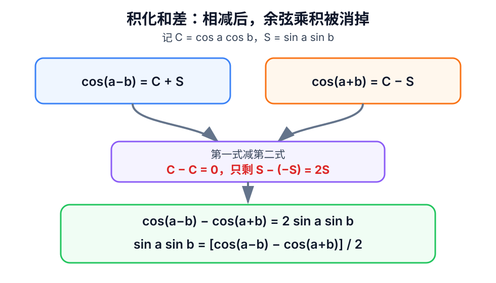

\[
\begin{aligned}
&\cos(a-b)-\cos(a+b)\\
&=(\cos a\cos b+\sin a\sin b)
 -(\cos a\cos b-\sin a\sin b)\\
&=2\sin a\sin b.
\end{aligned}
\]

两边除以 \(2\)，得到目标公式。括号很重要：减去第二个整体时，里面的负号会再次
改变符号，所以 \(\sin a\sin b\) 最终保留为正的两倍。

### 13.5 完整例题

\[
\begin{aligned}
\sin75^\circ\sin15^\circ
&=\frac{\cos(75^\circ-15^\circ)-\cos(75^\circ+15^\circ)}{2}\\
&=\frac{\cos60^\circ-\cos90^\circ}{2}\\
&=\boxed{\frac14}.
\end{aligned}
\]

### 13.6 当前带提示练习

使用正弦乘积化和差公式计算：

\[
\boxed{\sin60^\circ\sin30^\circ}.
\]

第一步只改写成含差角与和角的式子，暂不计算特殊角值。

学习者正确完成带提示练习：

\[
\sin60^\circ\sin30^\circ
=\frac{\cos30^\circ-\cos90^\circ}{2}
=\boxed{\frac{\sqrt3}{4}}.
\]

无提示独立变式为 \(\sin75^\circ\sin45^\circ\)。手写过程正确给出：

\[
\begin{aligned}
\sin75^\circ\sin45^\circ
&=\frac{\cos30^\circ-\cos120^\circ}{2}\\
&=\frac{\sqrt3/2-(-1/2)}{2}\\
&=\boxed{\frac{\sqrt3+1}{4}}.
\end{aligned}
\]

本题无提示正确处理 \(\cos120^\circ=-1/2\) 以及减去负数，说明上一题的象限符号
问题得到当堂迁移订正。正弦乘积化和差公式的当堂练习完成，保持 `Developing`，等待
间隔复测。

### 13.7 第三条：正弦乘余弦化和差

对任意实数角 \(a,b\)：

\[
\boxed{\sin a\cos b
=\frac{\sin(a+b)+\sin(a-b)}{2}}.
\]

这次从正弦和角公式与差角公式出发。两式相加时，\(\cos a\sin b\) 项抵消：

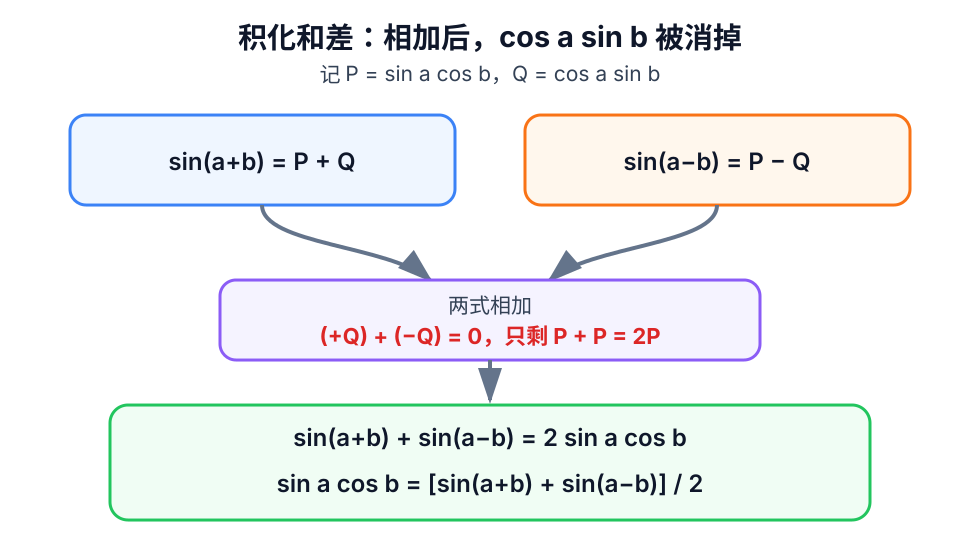

\[
\begin{aligned}
\sin(a+b)&=\sin a\cos b+\cos a\sin b,\\
\sin(a-b)&=\sin a\cos b-\cos a\sin b.
\end{aligned}
\]

两式相加并除以 \(2\)，得到目标公式。

### 13.8 完整例题

\[
\begin{aligned}
\sin75^\circ\cos15^\circ
&=\frac{\sin90^\circ+\sin60^\circ}{2}\\
&=\boxed{\frac{2+\sqrt3}{4}}.
\end{aligned}
\]

### 13.9 当前带提示练习

使用第三条公式计算：

\[
\boxed{\sin60^\circ\cos30^\circ}.
\]

第一步只改写成两个正弦的和，暂不计算特殊角值。

学习者正确完成带提示练习：

\[
\sin60^\circ\cos30^\circ
=\frac{\sin90^\circ+\sin30^\circ}{2}
=\boxed{\frac34}.
\]

第一道独立变式 \(\sin15^\circ\cos45^\circ\) 能无提示正确改写为
\([\sin60^\circ+\sin(-30^\circ)]/2\)；Tutor 随后提醒正弦的奇函数性质，学习者
得到 \((\sqrt3-1)/4\)。因为中间出现提示，再追加一道真正无提示的短变式。

第二道独立变式 \(\sin75^\circ\cos45^\circ\) 中，学习者无提示正确写出：

\[
\sin75^\circ\cos45^\circ
=\frac{\sin120^\circ+\sin30^\circ}{2}
=\boxed{\frac{\sqrt3+1}{4}}.
\]

第三条正弦乘余弦化和差公式的当堂练习完成，保持 `Developing`，等待间隔复测。

### 13.10 第四条：余弦乘正弦化和差

对任意实数角 \(a,b\)：

\[
\boxed{\cos a\sin b
=\frac{\sin(a+b)-\sin(a-b)}{2}}.
\]

它与上一条使用同一对正弦公式，但这次用和角公式减去差角公式，使
\(\sin a\cos b\) 抵消：

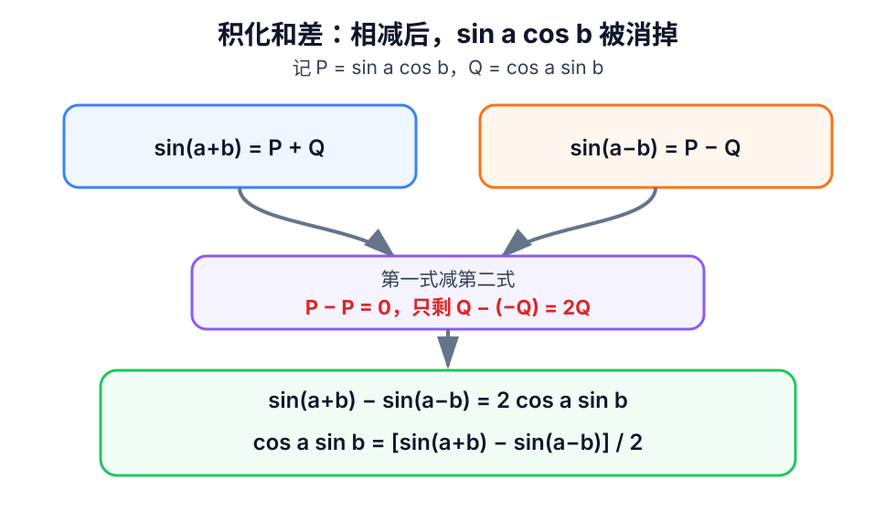

\[
\begin{aligned}
&\sin(a+b)-\sin(a-b)\\
&=(\sin a\cos b+\cos a\sin b)
 -(\sin a\cos b-\cos a\sin b)\\
&=2\cos a\sin b.
\end{aligned}
\]

两边除以 \(2\)，得到目标公式。

### 13.11 完整例题

\[
\begin{aligned}
\cos75^\circ\sin15^\circ
&=\frac{\sin90^\circ-\sin60^\circ}{2}\\
&=\boxed{\frac{2-\sqrt3}{4}}.
\end{aligned}
\]

### 13.12 当前带提示练习

使用第四条公式计算：

\[
\boxed{\cos60^\circ\sin30^\circ}.
\]

第一步只改写成两个正弦的差，暂不计算特殊角值。

学习者正确改写为：

\[
\cos60^\circ\sin30^\circ
=\frac{\sin90^\circ-\sin30^\circ}{2}.
\]

首次最终回答为 \(1/2\)：这只是分子 \(1-1/2\) 的值，漏掉了公式最外层的除以
\(2\)。经最小提示后订正为：

\[
\cos60^\circ\sin30^\circ=\boxed{\frac14}.
\]

第一道独立变式 \(\cos75^\circ\sin45^\circ\) 的公式改写正确：

\[
\cos75^\circ\sin45^\circ
=\frac{\sin120^\circ-\sin30^\circ}{2}.
\]

首次最终回答为 \(\sqrt3/4\)，在化简时漏掉了 \(-\sin30^\circ=-1/2\) 这一项；
经提示后正确订正为：

\[
\boxed{\cos75^\circ\sin45^\circ=\frac{\sqrt3-1}{4}}.
\]

公式选择与角度改写均正确，但连续出现最终化简漏项，因此当前追加一道无提示确认题：

\[
\boxed{\cos15^\circ\sin45^\circ}.
\]

在该题完整通过前，不进入和差化积。

学习者正确改写确认题：

\[
\cos15^\circ\sin45^\circ
=\frac{\sin60^\circ-\sin(-30^\circ)}{2}.
\]

特殊角和负号处理正确，但首次最终回答为 \((\sqrt3+1)/2\)，再次只写出了大分数的
分子结果，漏掉最外层除以 \(2\)；经提示后订正为 \((\sqrt3+1)/4\)。由于同一错误
已经在三道题中出现，暂不进入和差化积，先完成最小化简训练：

\[
\boxed{\frac{\frac{\sqrt2}{2}-\frac12}{2}}.
\]

本题只检查双层分数化简，不涉及新的三角公式。

学习者无提示正确化简为 \((\sqrt2-1)/4\)，最小双层分数练习通过。随后完整确认题
\(\cos30^\circ\sin60^\circ\) 的最终值 \(3/4\) 正确，但学习者未补写积化和差
改写行，并明确表示已经会了、请求通过并继续下一知识点。按学习者要求结束当堂重复训练；
由于完整公式证据和重复错误后的无提示闭环仍不足，本项保持 `Developing`，留待跨日抽查，
不标记为 `Mastered`。

### 13.13 四条积化和差公式的统一证明

学习者在进入和差化积后回问“积化和差公式怎么证明”。四条公式不是独立结论，而是把
余弦或正弦的和差角公式两两组成一组，再通过相加或相减消元：

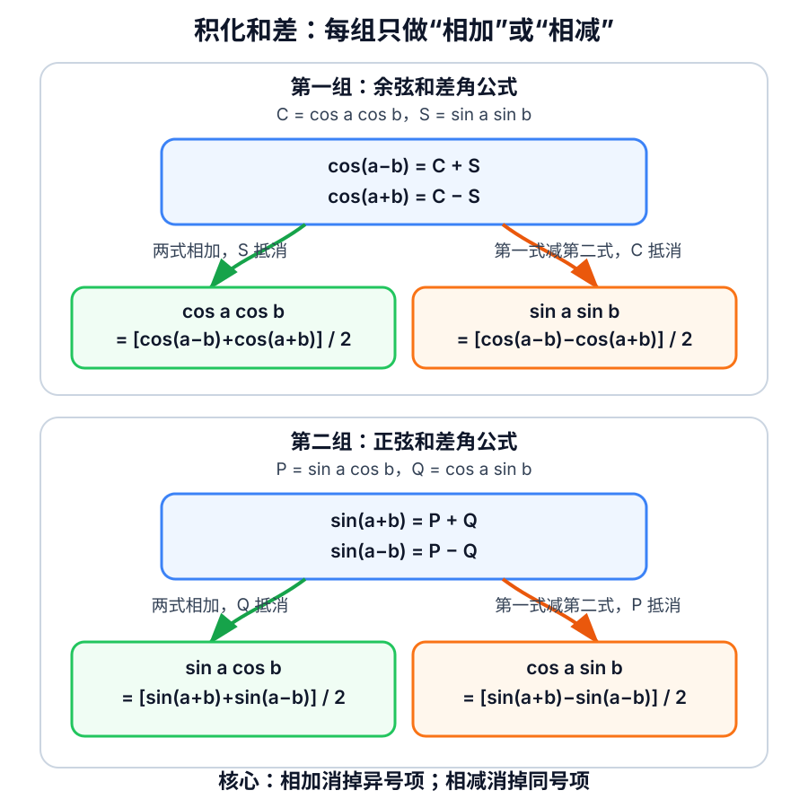

第一组令 \(C=\cos a\cos b\)、\(S=\sin a\sin b\)：

\[
\cos(a-b)=C+S,\qquad \cos(a+b)=C-S.
\]

- 两式相加消去 \(S\)，解出 \(C\)，得到余弦乘余弦公式；
- 第一式减第二式消去 \(C\)，解出 \(S\)，得到正弦乘正弦公式。

第二组令 \(P=\sin a\cos b\)、\(Q=\cos a\sin b\)：

\[
\sin(a+b)=P+Q,\qquad \sin(a-b)=P-Q.
\]

- 两式相加消去 \(Q\)，解出 \(P\)，得到正弦乘余弦公式；
- 第一式减第二式消去 \(P\)，解出 \(Q\)，得到余弦乘正弦公式。

当前先检查第一组的减法为什么留下 \(2S\)，理解后再返回第 14 节和差化积练习。

检查时，学习者首次把
\((C+S)-(C-S)\) 回答为 \(2C\)。经提示括号前的减号必须同时改变两项符号后，
正确展开为 \(C+S-C+S\) 并订正为 \(2S\)。随后对第二组的相加
\((P+Q)+(P-Q)\) 无提示正确回答 \(2P\)。四公式的“相加或相减消元”核心已经理解，
保持 `Developing`，以后复测括号前负号；现在返回第 14 节。

## 14. 和差化积

“和差化积”是积化和差的反向使用：把两个三角函数的和或差改写成乘积。它的角度结构
不是凭空出现的，而是由两个原角的平均值与一半差值组成。

### 14.1 第一条：余弦和化积

对任意实数角 \(x,y\)：

\[
\boxed{\cos x+\cos y
=2\cos\frac{x+y}{2}\cos\frac{x-y}{2}}.
\]

图中令平均角 \(u=(x+y)/2\)，半差 \(v=(x-y)/2\)。于是
\(x=u+v\)、\(y=u-v\)：

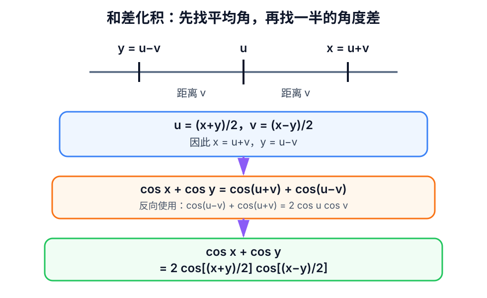

反向使用已经学过的余弦乘积化和差公式：

\[
2\cos u\cos v=\cos(u-v)+\cos(u+v),
\]

代回 \(u=(x+y)/2\)、\(v=(x-y)/2\)，便得到目标公式。

### 14.2 完整例题

\[
\begin{aligned}
\cos90^\circ+\cos30^\circ
&=2\cos\frac{90^\circ+30^\circ}{2}
       \cos\frac{90^\circ-30^\circ}{2}\\
&=2\cos60^\circ\cos30^\circ\\
&=\boxed{\frac{\sqrt3}{2}}.
\end{aligned}
\]

### 14.3 当前带提示练习

使用余弦和化积公式改写并计算：

\[
\boxed{\cos60^\circ+\cos0^\circ}.
\]

第一步只求平均角 \((60^\circ+0^\circ)/2\) 和半差
\((60^\circ-0^\circ)/2\)，暂不计算最终值。

学习者首次把两个结果都回答为 \(60^\circ\)，说明暂时把原角直接保留下来，尚未执行
“先加或减，再除以 \(2\)”这一步。当前只重算平均角
\((60^\circ+0^\circ)/2\)，确认后再求半差。

经单步提示后，学习者正确得到平均角 \(30^\circ\)。当前继续单独计算半差
\((60^\circ-0^\circ)/2\)。

学习者随后也正确得到半差 \(30^\circ\)。角度代换当堂已订正，下一步把两个
\(30^\circ\) 代回余弦和化积公式，暂不跳到最终值。

学习者正确填写两个角均为 \(30^\circ\)，得到
\(2\cos30^\circ\cos30^\circ\)。当前只剩代入特殊角值并化简。

最终化简无误：

\[
2\cos30^\circ\cos30^\circ
=2\cdot\frac{\sqrt3}{2}\cdot\frac{\sqrt3}{2}
=\boxed{\frac32}.
\]

本题在分步提示后完成。下一题改为无提示独立变式，以确认能否自行保留平均角、半差
和外部因子 \(2\)。

### 14.4 独立变式

使用余弦和化积公式，完整计算：

\[
\boxed{\cos75^\circ+\cos15^\circ}.
\]

学习者首次写成 \(2\cos90^\circ\cos60^\circ=0\)：能够识别外部因子 \(2\) 和
两个余弦的乘积结构，但再次把原角的“和”与“差”直接当成平均角与半差，两个位置都
漏除了 \(2\)。因此本题未通过独立检查，回到具体数轴图订正：

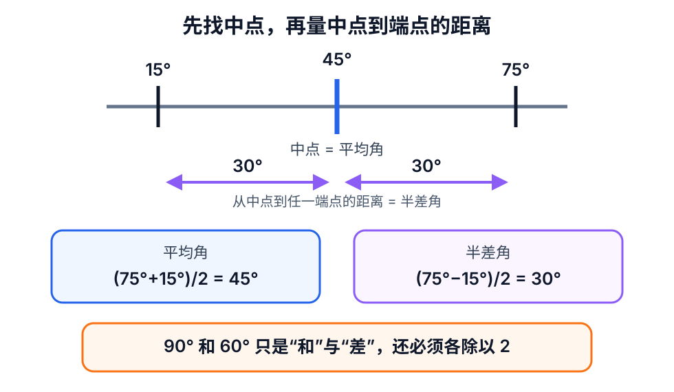

图上 \(15^\circ\) 与 \(75^\circ\) 关于 \(45^\circ\) 对称；中点是平均角
\(45^\circ\)，从中点到任一端点的距离是半差角 \(30^\circ\)。当前下一步只把这两个
角代回乘积形式，不先计算最终值。

根据数轴图，学习者正确订正两个角为 \(45^\circ,30^\circ\)，因此乘积形式为
\(2\cos45^\circ\cos30^\circ\)。当前只剩特殊角代入与最终化简。

最终正确得到：

\[
2\cdot\frac{\sqrt2}{2}\cdot\frac{\sqrt3}{2}
=\boxed{\frac{\sqrt6}{2}}.
\]

本题是在具体数轴图提示后完成，不能作为独立通过证据。换题无提示复测：

\[
\boxed{\cos105^\circ+\cos15^\circ}.
\]

要求自行写出平均角、半差角、乘积形式和最终值。

学习者无提示正确完成：平均角为 \(60^\circ\)，半差为 \(45^\circ\)，并写出

\[
\cos105^\circ+\cos15^\circ
=2\cos60^\circ\cos45^\circ
=\boxed{\frac{\sqrt6}{2}}.
\]

这说明前一题重复漏除以 \(2\) 的问题已当堂订正；由于此前重复发生，余弦和化积暂时
保持 `Developing`，安排跨日复测。

### 14.5 第二条：余弦差化积

对任意实数角 \(x,y\)：

\[
\boxed{\cos x-\cos y
=-2\sin\frac{x+y}{2}\sin\frac{x-y}{2}}.
\]

它与第一条使用同样的平均角、半差角；新难点只是最前面的负号。令
\(u=(x+y)/2\)、\(v=(x-y)/2\)，则 \(x=u+v\)、\(y=u-v\)。负号的来源见图：

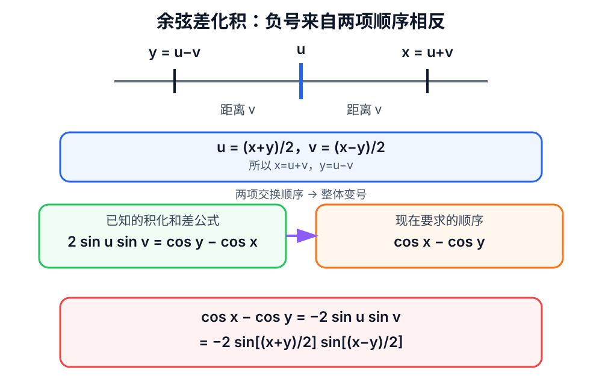

已经学过：

\[
2\sin u\sin v
=\cos(u-v)-\cos(u+v)
=\cos y-\cos x.
\]

而目标是 \(\cos x-\cos y\)，恰好把两项反过来，所以整体变号：

\[
\cos x-\cos y=-2\sin u\sin v.
\]

代回 \(u,v\) 就得到公式。

### 14.6 完整例题

\[
\begin{aligned}
\cos75^\circ-\cos15^\circ
&=-2\sin\frac{75^\circ+15^\circ}{2}
        \sin\frac{75^\circ-15^\circ}{2}\\
&=-2\sin45^\circ\sin30^\circ\\
&=-2\cdot\frac{\sqrt2}{2}\cdot\frac12\\
&=\boxed{-\frac{\sqrt2}{2}}.
\end{aligned}
\]

符号也可直接验算：\(75^\circ>15^\circ\)，且第一象限内余弦随角增大而减小，
所以 \(\cos75^\circ-\cos15^\circ<0\)。

### 14.7 当前带提示练习

使用余弦差化积公式计算：

\[
\boxed{\cos90^\circ-\cos30^\circ}.
\]

第一步只求平均角与半差角。

学习者未作答并明确表示“pass”。按要求结束正弦差化积的当堂练习；该公式只有讲解与
例题证据，保持 `Developing` 并留待跨日复测，不标记为 `Mastered`。积化和差与和差
化积的当前桥接单元到此结束，下一步返回三角极限与等价无穷小。

学习者未作答并明确表示“pass”。按要求结束正弦和化积的当堂练习，继续最后一条公式；
本公式只有讲解与例题证据，没有学习者独立作答证据，因此保持 `Developing`，留待跨日
复测，不标记为 `Mastered`。

### 14.11 第四条：正弦差化积

对任意实数角 \(x,y\)：

\[
\boxed{\sin x-\sin y
=2\cos\frac{x+y}{2}\sin\frac{x-y}{2}}.
\]

令 \(u=(x+y)/2\)、\(v=(x-y)/2\)，则 \(x=u+v\)、\(y=u-v\)。这次平均角
放进余弦，半差角放进正弦：

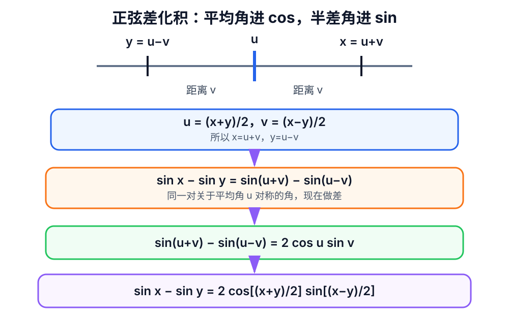

反向使用第四条积化和差公式：

\[
2\cos u\sin v=\sin(u+v)-\sin(u-v),
\]

所以：

\[
\sin x-\sin y
=\sin(u+v)-\sin(u-v)
=2\cos u\sin v.
\]

代回 \(u,v\) 即得目标公式。

### 14.12 完整例题

\[
\begin{aligned}
\sin75^\circ-\sin15^\circ
&=2\cos\frac{75^\circ+15^\circ}{2}
       \sin\frac{75^\circ-15^\circ}{2}\\
&=2\cos45^\circ\sin30^\circ\\
&=2\cdot\frac{\sqrt2}{2}\cdot\frac12\\
&=\boxed{\frac{\sqrt2}{2}}.
\end{aligned}
\]

### 14.13 当前带提示练习

使用正弦差化积公式计算：

\[
\boxed{\sin90^\circ-\sin30^\circ}.
\]

第一步只求平均角与半差角。

学习者无提示正确得到平均角 \(60^\circ\)、半差角 \(30^\circ\)。当前下一步只写
乘积形式，重点保留公式最前面的负号，暂不计算特殊角值。

学习者正确选择负号，得到
\(-2\sin60^\circ\sin30^\circ\)。当前只剩特殊角代入与最终化简。

最终正确完成：

\[
\cos90^\circ-\cos30^\circ
=-2\cdot\frac{\sqrt3}{2}\cdot\frac12
=\boxed{-\frac{\sqrt3}{2}}.
\]

带提示练习完成。当前无提示独立变式：

\[
\boxed{\cos105^\circ-\cos15^\circ}.
\]

要求自行写出平均角、半差角、带负号的乘积形式和最终值。

学习者未继续书写该独立变式，明确表示“已掌握，pass”。按学习者要求结束余弦差化积
的当堂重复训练并继续下一条；本公式保持 `Developing`，留待跨日无提示复测，不标记为
`Mastered`。

### 14.8 第三条：正弦和化积

对任意实数角 \(x,y\)：

\[
\boxed{\sin x+\sin y
=2\sin\frac{x+y}{2}\cos\frac{x-y}{2}}.
\]

记忆结构不是死背：平均角放进正弦，半差角放进余弦。令
\(u=(x+y)/2\)、\(v=(x-y)/2\)，则 \(x=u+v\)、\(y=u-v\)：

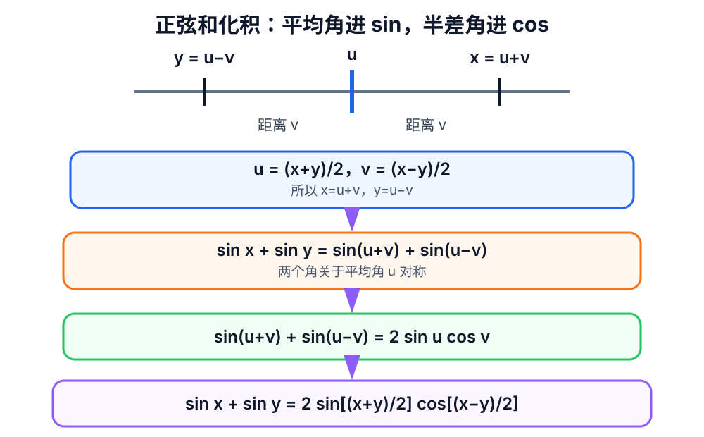

反向使用已经证明过的积化和差公式：

\[
2\sin u\cos v=\sin(u+v)+\sin(u-v),
\]

所以：

\[
\sin x+\sin y
=\sin(u+v)+\sin(u-v)
=2\sin u\cos v.
\]

代回 \(u,v\) 即得目标公式。

### 14.9 完整例题

\[
\begin{aligned}
\sin75^\circ+\sin15^\circ
&=2\sin\frac{75^\circ+15^\circ}{2}
       \cos\frac{75^\circ-15^\circ}{2}\\
&=2\sin45^\circ\cos30^\circ\\
&=2\cdot\frac{\sqrt2}{2}\cdot\frac{\sqrt3}{2}\\
&=\boxed{\frac{\sqrt6}{2}}.
\end{aligned}
\]

### 14.10 当前带提示练习

使用正弦和化积公式计算：

\[
\boxed{\sin90^\circ+\sin30^\circ}.
\]

第一步只求平均角与半差角。
